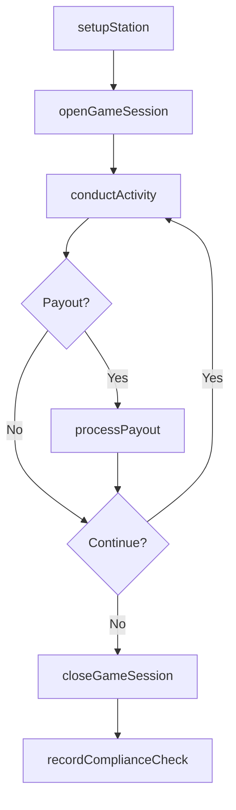
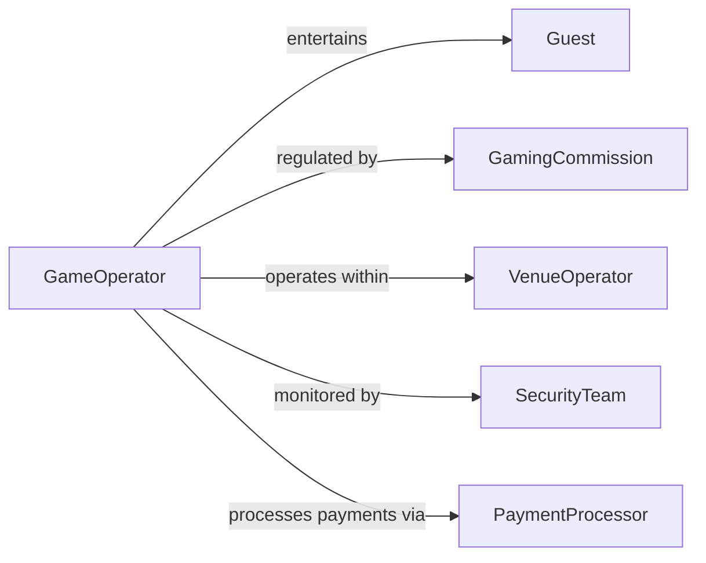

# Conduct Amusement Gaming Activities

> Business-as-Code definition for conducting amusement or gaming activities. Models the operation of entertainment and gaming sessions from setup and guest engagement through activity execution and compliance monitoring.

## Overview

Conducting amusement or gaming activities involves managing and facilitating entertainment experiences such as table games, carnival attractions, arcade operations, and interactive amusement activities for the public. This definition exposes actions for setting up activity stations, managing guest participation, enforcing rules and payouts, and tracking activity metrics. It supports workflows for casinos, amusement parks, entertainment venues, and gaming establishments.

## Actors

| Actor | Description |
|-------|-------------|
| Guest | Participates in amusement or gaming activities as a customer |
| GamingCommission | Regulates gaming operations and enforces compliance standards |
| VenueOperator | Provides the facility and infrastructure for amusement activities |
| EquipmentSupplier | Provides gaming tables, machines, and amusement devices |
| SecurityTeam | Monitors activity areas for safety and rule enforcement |
| PaymentProcessor | Handles financial transactions for wagers, tickets, and payouts |

## Roles

| Role | Description |
|------|-------------|
| GameOperator | Conducts and facilitates individual gaming or amusement activities |
| FloorSupervisor | Oversees multiple activity stations and resolves disputes |
| ComplianceOfficer | Ensures all activities meet regulatory and internal policy requirements |
| AttendantCoordinator | Manages staffing and rotation across activity stations |

## Entities

| Entity | Description |
|--------|-------------|
| Activity | A specific amusement or gaming event being conducted |
| ActivityStation | A designated location equipped for a particular game or attraction |
| GameSession | A time-bounded instance of play at a specific station |
| Payout | A prize, credit, or monetary disbursement awarded to a participant |
| ComplianceRecord | Documentation of regulatory adherence for an activity or session |
| ActivityLog | A chronological record of events, transactions, and outcomes at a station |

## Actions

| Action | Description |
|--------|-------------|
| setupStation | Prepare an activity station with equipment, supplies, and signage |
| openGameSession | Begin a new gaming or amusement session at a station |
| conductActivity | Facilitate the active play or amusement experience for guests |
| processPayout | Award prizes, credits, or monetary payouts to participants |
| closeGameSession | End a session and reconcile activity outcomes |
| recordComplianceCheck | Document a regulatory or policy compliance verification |
| resolveDispute | Address and settle a disagreement about rules, payouts, or conduct |

## Events

| Event | Description |
|-------|-------------|
| stationSetup | An activity station has been prepared and is ready for operation |
| gameSessionOpened | A new gaming or amusement session has started |
| activityConducted | A play or amusement interaction has been facilitated |
| payoutProcessed | A prize or monetary award has been disbursed |
| gameSessionClosed | A session has ended and outcomes have been reconciled |
| complianceCheckRecorded | A regulatory verification has been completed and documented |
| disputeResolved | A guest or operational dispute has been settled |

## Searches

| Search | Description |
|--------|-------------|
| findActivities | List amusement or gaming activities by type, station, or date |
| getSessionHistory | Retrieve game session records for a station or time period |
| getPayoutSummary | Query payout totals by activity, station, or date range |
| findComplianceRecords | Look up compliance checks by station, date, or inspector |
| getDisputeLog | Retrieve dispute records by status, type, or date |

## Workflow



## Actor Relationships



## Usage

### Calling Actions

```typescript
import { conductAmusementGamingActivities } from '@headlessly/conduct-amusement-gaming-activities'

const gaming = conductAmusementGamingActivities()

// Setup a gaming station
await gaming.setupStation({
  stationId: 'table-blackjack-04',
  type: 'Blackjack',
  minBet: 25,
  maxBet: 500,
  decks: 6
})

// Open a game session
const session = await gaming.openGameSession({
  stationId: 'table-blackjack-04',
  operatorId: 'dealer-012',
  startTime: '2026-03-10T19:00:00Z'
})

// Process a payout
await gaming.processPayout({
  sessionId: session.id,
  guestId: 'guest-789',
  amount: 150,
  type: 'winnings'
})
```

### Event-Driven Automation

```typescript
// Alert supervisor on high-value payout
gaming.payoutProcessed(async ({ sessionId, amount, stationId }) => {
  if (amount > 10000) {
    await notify({
      to: 'floor-supervisor',
      message: `High-value payout of $${amount} at station ${stationId}`
    })
  }
})

// Auto-record compliance at session close
gaming.gameSessionClosed(async ({ sessionId, stationId }) => {
  await gaming.recordComplianceCheck({
    sessionId,
    stationId,
    checkType: 'session-close',
    timestamp: new Date().toISOString()
  })
})
```
