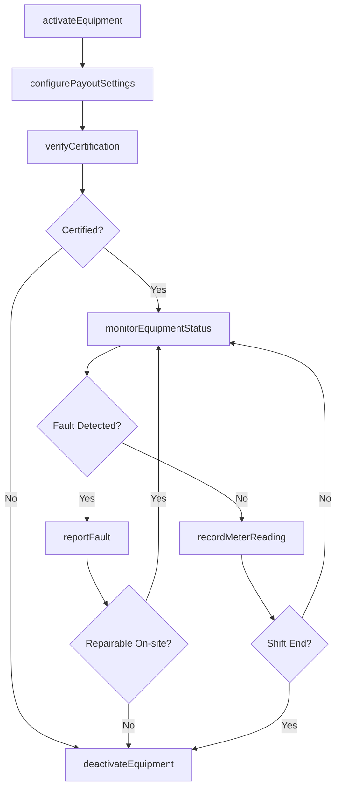
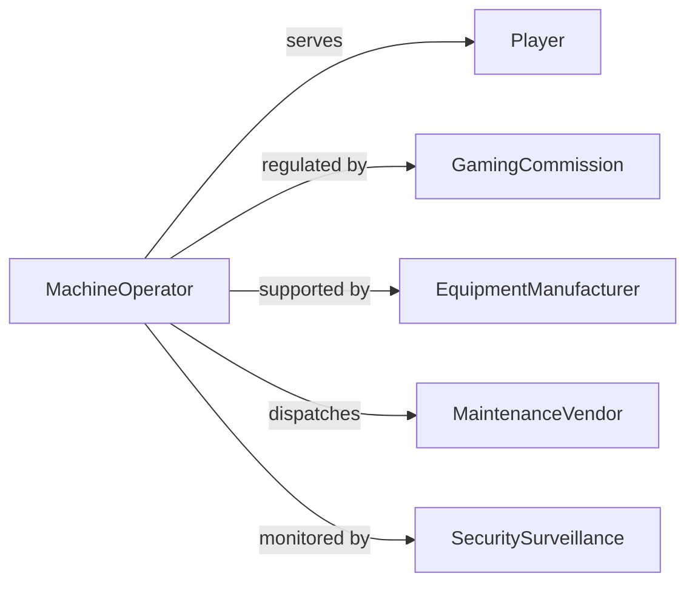

# Operate Gaming Equipment

> Business-as-Code definition for operating gaming equipment. Models the setup, operation, maintenance, and monitoring of gaming machines and devices from activation through performance tracking and compliance verification.

## Overview

Operating gaming equipment involves activating, monitoring, and maintaining electronic and mechanical gaming devices such as slot machines, video poker terminals, roulette wheels, and other casino or amusement gaming hardware. This definition exposes actions for equipment configuration, operational monitoring, fault handling, and regulatory compliance. It supports workflows for casinos, gaming floors, amusement arcades, and entertainment facilities.

## Actors

| Actor | Description |
|-------|-------------|
| Player | Interacts with gaming equipment as a paying customer |
| GamingCommission | Regulates equipment standards, payout ratios, and operational compliance |
| EquipmentManufacturer | Provides gaming hardware, firmware updates, and technical documentation |
| MaintenanceVendor | Performs specialized repairs and calibration on gaming devices |
| SecuritySurveillance | Monitors gaming equipment areas for tampering and irregularities |

## Roles

| Role | Description |
|------|-------------|
| MachineOperator | Activates, monitors, and manages gaming equipment during operation |
| FloorTechnician | Performs on-site troubleshooting and minor repairs |
| ComplianceAuditor | Verifies equipment meets regulatory standards and payout requirements |
| SlotManager | Oversees the gaming equipment fleet and performance metrics |

## Entities

| Entity | Description |
|--------|-------------|
| GamingMachine | A specific piece of gaming hardware identified by serial and location |
| OperationalSession | A time-bounded period during which equipment is active and accepting play |
| FaultReport | A record of equipment malfunction, error code, and resolution |
| PayoutConfiguration | The configured odds, denominations, and payout percentages for a machine |
| MeterReading | Recorded financial and usage counters from gaming equipment |
| ComplianceCertificate | Documentation confirming equipment meets regulatory requirements |

## Actions

| Action | Description |
|--------|-------------|
| activateEquipment | Power on and initialize gaming equipment for operation |
| configurePayoutSettings | Set denomination, odds, and payout parameters for a machine |
| monitorEquipmentStatus | Check real-time operational status and performance indicators |
| recordMeterReading | Capture financial and usage counter data from the equipment |
| reportFault | Log an equipment malfunction with error details and severity |
| deactivateEquipment | Shut down gaming equipment and secure it from play |
| verifyCertification | Confirm equipment compliance with current regulatory standards |

## Events

| Event | Description |
|-------|-------------|
| equipmentActivated | A gaming machine has been powered on and is accepting play |
| payoutSettingsConfigured | Machine denomination and payout parameters have been set |
| equipmentStatusMonitored | A real-time status check has been completed |
| meterReadingRecorded | Financial and usage counters have been captured |
| faultReported | An equipment malfunction has been logged |
| equipmentDeactivated | A gaming machine has been shut down |
| certificationVerified | Equipment compliance has been confirmed |

## Searches

| Search | Description |
|--------|-------------|
| findEquipment | List gaming machines by type, location, or operational status |
| getFaultHistory | Retrieve fault reports for a specific machine or time period |
| getMeterReadings | Query meter data by machine, date range, or reading type |
| getComplianceStatus | Look up certification and compliance status for equipment |

## Workflow



## Actor Relationships



## Usage

### Calling Actions

```typescript
import { operateGamingEquipment } from '@headlessly/operate-gaming-equipment'

const equipment = operateGamingEquipment()

// Activate a gaming machine
await equipment.activateEquipment({
  machineId: 'slot-2847',
  location: 'Floor B - Row 12',
  type: 'Video Slots'
})

// Configure payout settings
await equipment.configurePayoutSettings({
  machineId: 'slot-2847',
  denomination: 0.25,
  payoutPercentage: 92.5,
  maxPayout: 10000
})

// Record end-of-shift meter readings
await equipment.recordMeterReading({
  machineId: 'slot-2847',
  coinIn: 48250,
  coinOut: 44631,
  jackpotsPaid: 0,
  gamesPlayed: 19300
})
```

### Event-Driven Automation

```typescript
// Alert technician on fault
equipment.faultReported(async ({ machineId, errorCode, severity }) => {
  if (severity === 'critical') {
    await equipment.deactivateEquipment({ machineId })
    await notify({
      to: 'floor-technician',
      message: `Critical fault ${errorCode} on machine ${machineId}. Machine deactivated.`
    })
  }
})

// Compliance check on activation
equipment.equipmentActivated(async ({ machineId }) => {
  await equipment.verifyCertification({ machineId })
})
```
