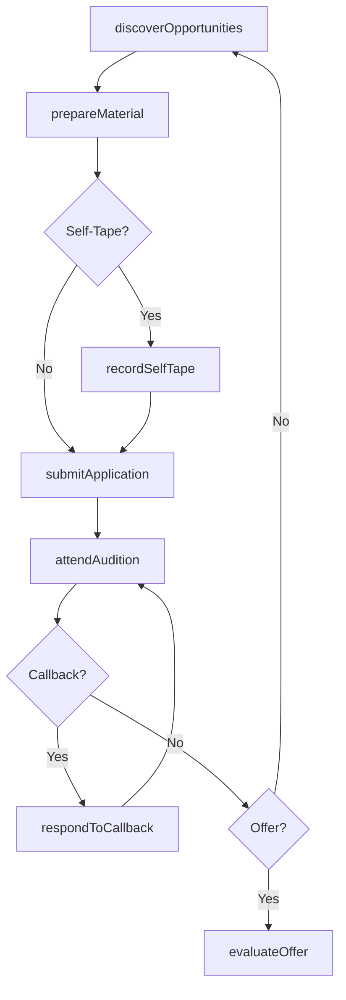
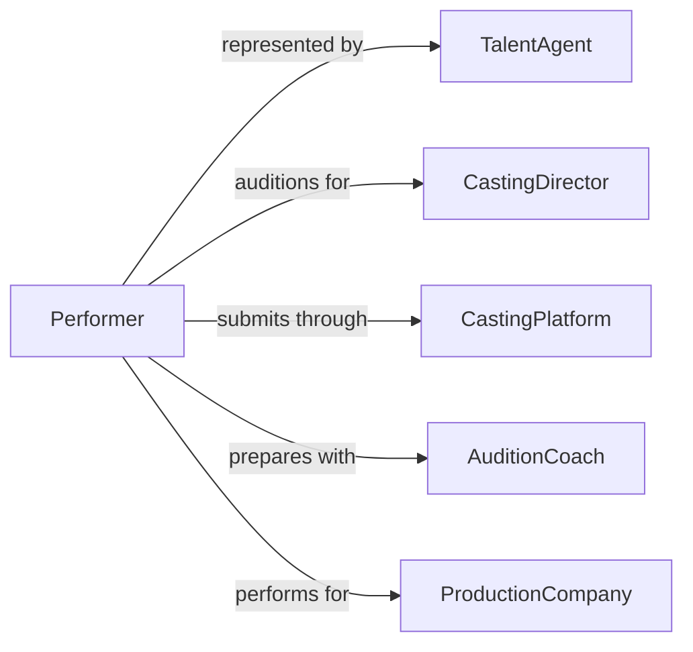

# Audition Roles

> Business-as-Code definition for auditioning for roles. Models the discovery, preparation, submission, and evaluation of audition processes for performers seeking roles in theater, film, television, and commercial productions.

## Overview

Auditioning for roles involves discovering casting opportunities, preparing audition materials such as monologues, songs, or choreography, submitting applications and self-tapes, attending in-person auditions, and receiving callbacks or offers. This definition exposes actions for opportunity tracking, audition preparation, submission management, and outcome recording, along with events for automated scheduling and follow-up.

## Actors

| Actor | Description |
|-------|-------------|
| CastingDirector | Evaluates performers and selects candidates for roles |
| ProductionCompany | Organization producing the show, film, or commercial |
| TalentAgent | Represents the performer and submits them for audition opportunities |
| Accompanist | Musician who provides live musical support during auditions |
| CastingPlatform | Online service listing audition calls and accepting submissions |

## Roles

| Role | Description |
|------|-------------|
| Performer | The actor, singer, or dancer auditioning for a role |
| AuditionCoach | Prepares performers with technique, material selection, and feedback |
| SubmissionManager | Tracks audition opportunities and manages application deadlines |
| SchedulingCoordinator | Manages audition time slots and callback logistics |

## Entities

| Entity | Description |
|--------|-------------|
| AuditionCall | A posted opportunity describing the role, requirements, and submission details |
| AuditionSubmission | The performer's application including headshot, resume, and demo reel |
| AuditionSlot | A scheduled time for the performer to audition in person |
| Callback | A second-round audition invitation for shortlisted candidates |
| RoleOffer | A formal offer extended to a performer for a specific role |
| AuditionMaterial | Prepared monologues, songs, sides, or choreography for the audition |

## Actions

| Action | Description |
|--------|-------------|
| discoverOpportunities | Search for audition calls matching performer profile and skills |
| prepareMaterial | Select and rehearse audition pieces appropriate for the role |
| submitApplication | Send headshot, resume, and audition materials to the casting team |
| attendAudition | Perform the prepared material at the scheduled audition |
| recordSelfTape | Create and upload a video audition for remote submission |
| respondToCallback | Confirm attendance and prepare for a second-round audition |
| evaluateOffer | Review and respond to a role offer with agent consultation |

## Events

| Event | Description |
|-------|-------------|
| opportunityDiscovered | A matching audition call has been identified |
| materialPrepared | Audition pieces have been selected and rehearsed |
| applicationSubmitted | Headshot, resume, and materials have been sent to casting |
| auditionAttended | The performer has completed an in-person audition |
| selfTapeRecorded | A video audition has been created and submitted |
| callbackReceived | The performer has been invited to a callback audition |
| offerReceived | A formal role offer has been extended to the performer |

## Searches

| Search | Description |
|--------|-------------|
| findAuditionCalls | List open audition opportunities by role type, genre, or location |
| getSubmissionStatus | Retrieve the status of submitted audition applications |
| findCallbacks | Query callback invitations by production or date |
| getAuditionHistory | Retrieve a performer's past auditions, callbacks, and outcomes |

## Workflow



## Actor Relationships



## Usage

### Calling Actions

```typescript
import { auditionRoles } from '@headlessly/audition-roles'

const auditions = auditionRoles()

// Discover matching audition opportunities
const calls = await auditions.discoverOpportunities({
  performerType: 'actor',
  genres: ['drama', 'comedy'],
  location: 'New York',
  unionStatus: 'SAG-AFTRA'
})

// Submit an application
await auditions.submitApplication({
  auditionCallId: calls[0].id,
  headshot: '/media/headshot-2026.jpg',
  resume: '/media/resume.pdf',
  demoReel: '/media/reel-dramatic.mp4'
})

// Respond to a callback
await auditions.respondToCallback({
  callbackId: 'cb-9921',
  confirmed: true,
  preparedMaterial: ['monologue-hamlet', 'cold-read']
})
```

### Event-Driven Automation

```typescript
// Alert performer and agent when a callback is received
auditions.callbackReceived(async ({ performerId, productionName, callbackDate }) => {
  const agent = await getTalentAgent(performerId)
  await notify({
    to: [performerId, agent.email],
    message: `Callback for ${productionName} scheduled for ${callbackDate}`
  })
})

// Auto-track new audition opportunities matching profile
auditions.opportunityDiscovered(async ({ auditionCallId, roleName, deadline }) => {
  await auditions.prepareMaterial({
    auditionCallId,
    roleName,
    deadline,
    status: 'pending-review'
  })
})
```
