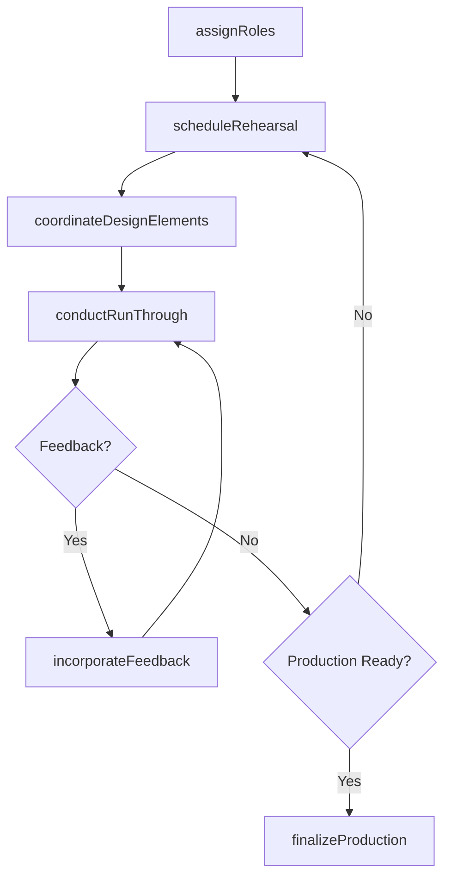
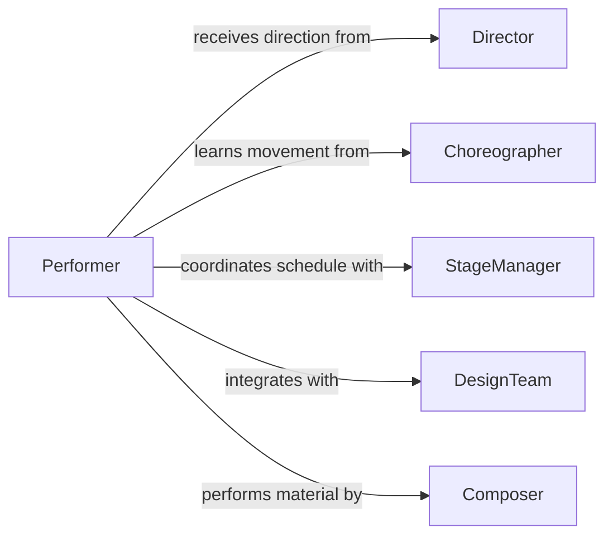

# Collaborate Others Prepare Perform Artistic

> Business-as-Code definition for collaborating with others to prepare or perform artistic productions. Models the coordination of creative teams from rehearsal scheduling through production execution.

## Overview

Collaborating with others to prepare or perform artistic productions involves coordinating among performers, directors, designers, and technical crews to bring creative works to life. This definition exposes actions for managing rehearsals, coordinating production elements, tracking creative contributions, and facilitating the iterative development of performances. It provides events for workflow automation across the production lifecycle.

## Actors

| Actor | Description |
|-------|-------------|
| Director | Provides artistic vision and guides the creative direction of the production |
| Choreographer | Designs and teaches movement sequences for performers |
| Composer | Creates or adapts musical scores and arrangements for the production |
| StageManager | Coordinates logistics, schedules, and communication during rehearsals and performances |
| DesignTeam | Provides set, costume, lighting, and sound design elements |
| Producer | Secures funding, manages budgets, and oversees business operations |

## Roles

| Role | Description |
|------|-------------|
| Performer | Executes the artistic material in rehearsals and performances |
| RehearsalCoordinator | Schedules and manages rehearsal sessions and space allocation |
| ProductionAssistant | Supports logistical coordination across departments |
| CreativeCollaborator | Contributes artistic ideas and adapts material through the production process |

## Entities

| Entity | Description |
|--------|-------------|
| Production | A creative work being prepared for performance or recording |
| RehearsalSession | A scheduled practice session with assigned participants and objectives |
| Script | The written material including dialogue, stage directions, and notes |
| CueSheet | A sequential list of technical and performance cues for execution |
| CastAssignment | The mapping of performers to roles within a production |
| ProductionSchedule | The master timeline of rehearsals, tech runs, and performances |

## Actions

| Action | Description |
|--------|-------------|
| scheduleRehearsal | Create a rehearsal session with time, location, and participant assignments |
| assignRoles | Map performers to specific parts within the production |
| coordinateDesignElements | Align set, costume, lighting, and sound requirements across departments |
| conductRunThrough | Execute a full or partial rehearsal of the production |
| incorporateFeedback | Apply directorial or collaborative notes to refine the production |
| finalizeProduction | Lock all creative and technical elements for performance readiness |
| logCreativeContribution | Record an individual contribution to the collaborative process |

## Events

| Event | Description |
|-------|-------------|
| rehearsalScheduled | A new rehearsal session has been created and participants notified |
| rolesAssigned | Performers have been mapped to their production roles |
| designElementsCoordinated | Cross-departmental design alignment has been completed |
| runThroughCompleted | A full or partial rehearsal run has finished |
| feedbackIncorporated | Directorial or collaborative notes have been applied |
| productionFinalized | All elements are locked and the production is performance-ready |
| conflictDetected | A scheduling or creative conflict has been identified |

## Searches

| Search | Description |
|--------|-------------|
| findRehearsals | List rehearsal sessions by date, production, or participant |
| getProductionStatus | Retrieve the current readiness state of a production |
| getCastAssignments | Look up performer-to-role mappings for a production |
| findAvailablePerformers | Query performer availability for scheduling purposes |

## Workflow



## Actor Relationships



## Usage

### Calling Actions

```typescript
import { collaborateOthersPreparePerformArtistic } from '@headlessly/collaborate-others-prepare-perform-artistic'

const productions = collaborateOthersPreparePerformArtistic()

// Assign roles for a new production
await productions.assignRoles({
  productionId: 'prod-hamlet-2026',
  assignments: [
    { performerId: 'perf-001', role: 'Hamlet' },
    { performerId: 'perf-002', role: 'Ophelia' },
    { performerId: 'perf-003', role: 'Claudius' }
  ]
})

// Schedule a rehearsal session
const rehearsal = await productions.scheduleRehearsal({
  productionId: 'prod-hamlet-2026',
  date: '2026-03-15',
  startTime: '10:00',
  endTime: '14:00',
  location: 'Main Stage',
  participants: ['perf-001', 'perf-002', 'perf-003'],
  objective: 'Act III blocking'
})

// Conduct a run-through and incorporate feedback
await productions.conductRunThrough({
  productionId: 'prod-hamlet-2026',
  type: 'full',
  rehearsalId: rehearsal.id
})
```

### Event-Driven Automation

```typescript
// Notify cast when rehearsal is scheduled
productions.rehearsalScheduled(async ({ productionId, date, participants }) => {
  for (const participant of participants) {
    await notify({
      to: participant,
      message: `Rehearsal scheduled for ${date} on production ${productionId}`
    })
  }
})

// Escalate unresolved conflicts
productions.conflictDetected(async ({ productionId, type, details }) => {
  await notify({
    to: 'stage-manager',
    message: `${type} conflict on ${productionId}: ${details}`
  })
})
```
