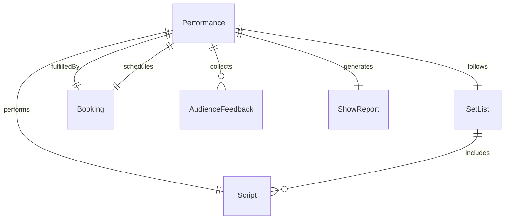
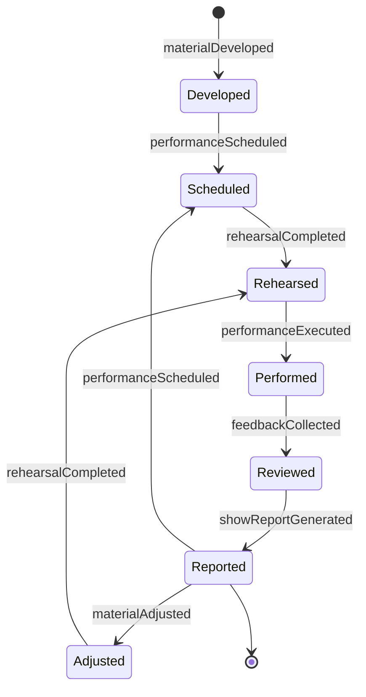
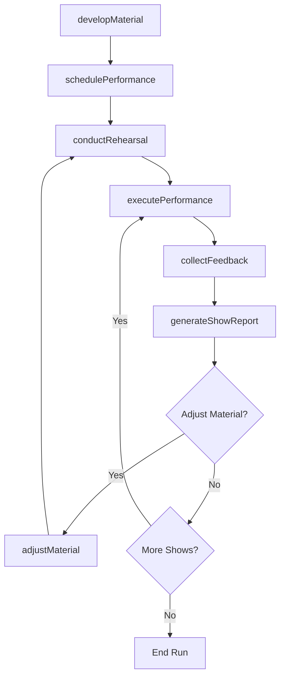
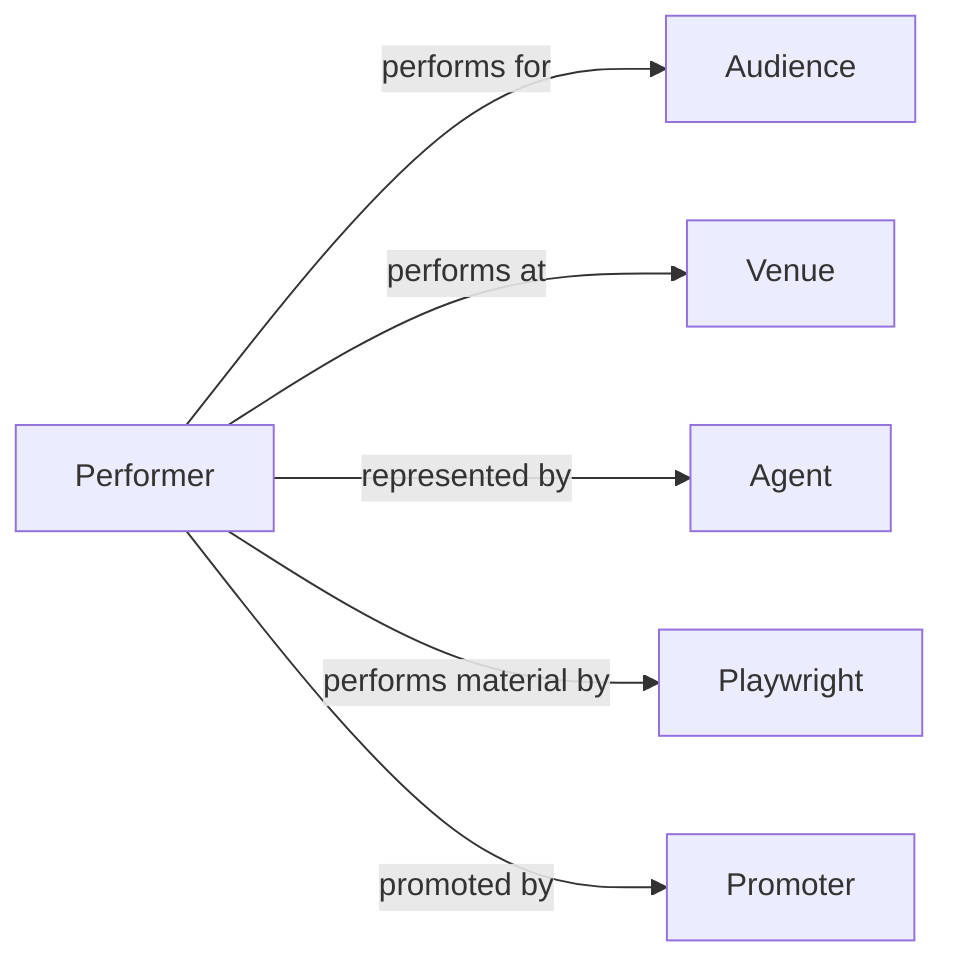

# Entertain Public Comedic Dramatic Performances

> Business-as-Code definition for entertaining the public with comedic or dramatic performances. Models the full performance lifecycle from material development through live execution and audience engagement.

## Overview

Entertaining the public with comedic or dramatic performances encompasses the preparation, rehearsal, and delivery of live theatrical, stand-up, improvisational, or dramatic presentations to audiences. This definition exposes actions for developing performance material, managing show logistics, executing live performances, and capturing audience feedback. It supports workflows for theaters, comedy clubs, touring companies, and corporate entertainment.

## Actors

| Actor | Description |
|-------|-------------|
| Audience | Attends and responds to live comedic or dramatic performances |
| Venue | Provides the physical space, seating, and technical infrastructure for performances |
| Agent | Represents performers and negotiates bookings and contracts |
| Playwright | Creates or licenses dramatic material for performance |
| Promoter | Markets performances and drives ticket sales |
| CriticsMedia | Reviews performances and publishes evaluations |

## Roles

| Role | Description |
|------|-------------|
| Performer | Delivers comedic or dramatic material to live audiences |
| Director | Shapes the artistic interpretation and staging of the performance |
| StageManager | Coordinates backstage logistics and cues during performances |
| MaterialDeveloper | Writes, adapts, or refines comedic or dramatic content |
| HouseManager | Manages front-of-house operations and audience experience |

## Entities

| Entity | Description |
|--------|-------------|
| Performance | A scheduled live presentation of comedic or dramatic material |
| SetList | The ordered sequence of material to be performed in a show |
| Script | The written text of a dramatic or comedic piece |
| Booking | A confirmed engagement at a specific venue and date |
| AudienceFeedback | Responses collected from attendees after a performance |
| ShowReport | A post-performance record of timing, issues, and observations |

## Actions

| Action | Description |
|--------|-------------|
| developMaterial | Create or refine comedic or dramatic performance content |
| schedulePerformance | Book a performance at a venue for a specific date and time |
| conductRehearsal | Practice and refine the performance before a live show |
| executePerformance | Deliver the live performance to an audience |
| collectFeedback | Gather audience reactions and satisfaction data after a show |
| generateShowReport | Document performance outcomes, timing, and incidents |
| adjustMaterial | Revise performance content based on audience response or direction |

## Events

| Event | Description |
|-------|-------------|
| materialDeveloped | New comedic or dramatic content has been finalized |
| performanceScheduled | A live show has been booked and confirmed |
| rehearsalCompleted | A practice session has concluded with notes recorded |
| performanceExecuted | A live show has been delivered to an audience |
| feedbackCollected | Audience responses have been gathered and recorded |
| showReportGenerated | Post-performance documentation has been completed |
| materialAdjusted | Performance content has been revised based on feedback |

## Searches

| Search | Description |
|--------|-------------|
| findPerformances | List performances by date, venue, or performer |
| getAudienceFeedback | Retrieve feedback data for a specific performance or period |
| getShowReports | Look up post-performance reports by date or venue |
| findBookings | Query confirmed engagements by date range or status |

## Entity Relationships



## State Diagram



## Workflow



## Actor Relationships



## Usage

### Calling Actions

```typescript
import { entertainPublicComedicDramaticPerformances } from '@headlessly/entertain-public-comedic-dramatic-performances'

const shows = entertainPublicComedicDramaticPerformances()

// Develop new material
const material = await shows.developMaterial({
  title: 'Evening of One Acts',
  type: 'dramatic',
  segments: ['Opening Monologue', 'Act I - The Visit', 'Act II - The Return'],
  estimatedDuration: 90
})

// Schedule a performance
const performance = await shows.schedulePerformance({
  materialId: material.id,
  venue: 'Downtown Theater',
  date: '2026-05-20',
  showTime: '19:30',
  capacity: 250
})

// Execute and collect feedback
await shows.executePerformance({ performanceId: performance.id })
await shows.collectFeedback({ performanceId: performance.id })
```

### Event-Driven Automation

```typescript
// Notify crew when performance is scheduled
shows.performanceScheduled(async ({ performanceId, venue, date }) => {
  await notify({
    to: 'stage-management',
    message: `Performance confirmed at ${venue} on ${date}`
  })
})

// Auto-generate show report after each performance
shows.performanceExecuted(async ({ performanceId }) => {
  await shows.generateShowReport({ performanceId })
})
```
