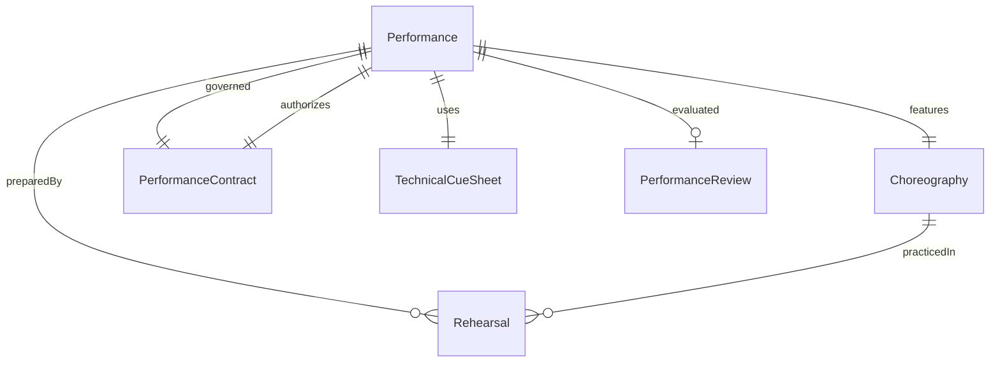
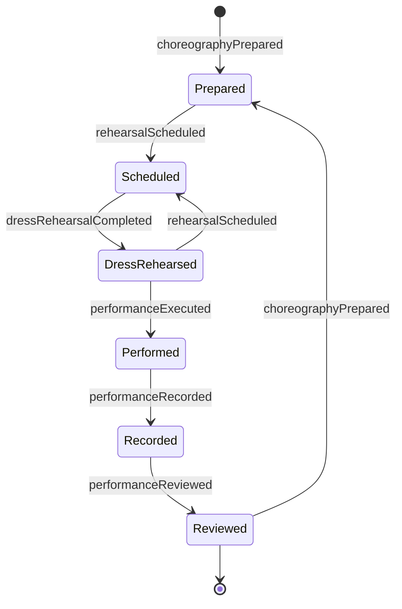
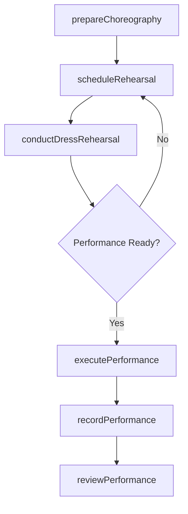
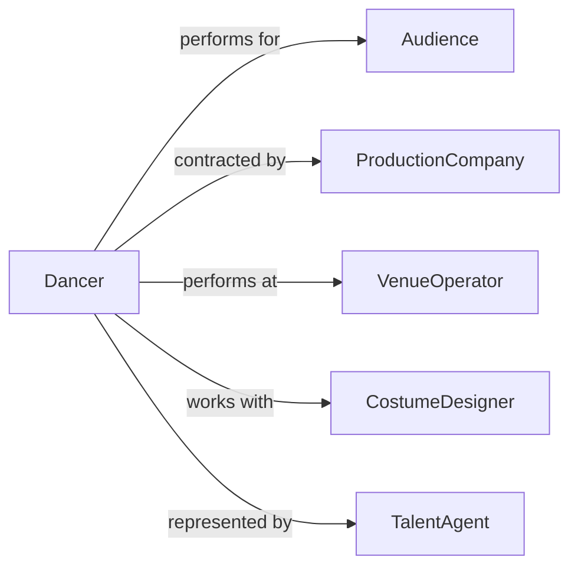

# Perform Dances

> Business-as-Code definition for performing dances. Models the preparation, rehearsal, execution, and post-performance review of dance performances across genres including ballet, contemporary, cultural, and commercial dance.

## Overview

Performing dances involves preparing choreography, rehearsing with fellow dancers and musicians, executing live or recorded performances, and receiving post-performance evaluations. This definition exposes actions for choreography preparation, rehearsal scheduling, performance execution, and audience engagement tracking, along with events for production coordination.

## Actors

| Actor | Description |
|-------|-------------|
| Audience | Viewers attending the dance performance in person or via broadcast |
| ProductionCompany | Organization producing and financing the dance event |
| VenueOperator | Facility providing the performance stage, lighting, and sound |
| CostumeDesigner | Creates and maintains costumes and wardrobe for performers |
| MusicDirector | Selects, arranges, or performs the musical accompaniment |
| TalentAgent | Represents dancers and negotiates performance contracts |

## Roles

| Role | Description |
|------|-------------|
| Dancer | Executes choreographed or improvised dance movements in performance |
| Choreographer | Creates and teaches dance sequences and staging |
| RehearsalDirector | Manages the rehearsal schedule and ensures performance readiness |
| StageManager | Coordinates technical cues, entrances, and transitions during shows |

## Entities

| Entity | Description |
|--------|-------------|
| Performance | A scheduled dance presentation before an audience |
| Choreography | A defined sequence of movements and formations for a dance piece |
| Rehearsal | A practice session preparing for a specific performance |
| PerformanceContract | A legal agreement defining terms, compensation, and obligations |
| TechnicalCueSheet | A document specifying lighting, sound, and stage cues |
| PerformanceReview | A post-show evaluation of artistic quality and execution |

## Actions

| Action | Description |
|--------|-------------|
| prepareChoreography | Learn, rehearse, and internalize dance sequences |
| scheduleRehearsal | Book rehearsal space and coordinate participant availability |
| conductDressRehearsal | Execute a full run-through with costumes, lighting, and music |
| executePerformance | Deliver the dance performance before a live or recorded audience |
| recordPerformance | Capture the performance on video for archival or distribution |
| reviewPerformance | Evaluate execution quality and gather feedback from directors |
| manageContracts | Negotiate and track performance agreements and compensation |

## Events

| Event | Description |
|-------|-------------|
| choreographyPrepared | Dance sequences have been learned and rehearsal-ready |
| rehearsalScheduled | A rehearsal session has been booked |
| dressRehearsalCompleted | A full technical run-through has been executed |
| performanceExecuted | A dance performance has been delivered |
| performanceRecorded | A performance has been captured on video |
| performanceReviewed | Post-show evaluation has been completed |
| contractManaged | Performance contract terms have been negotiated or updated |

## Searches

| Search | Description |
|--------|-------------|
| findPerformances | List dance performances by date, venue, genre, or company |
| getRehearsalSchedule | Retrieve rehearsal sessions by date, dancer, or production |
| findContractsByDancer | Query performance contracts for a specific dancer or period |
| getPerformanceReviews | Retrieve post-show evaluations by production or reviewer |

## Entity Relationships



## State Diagram



## Workflow



## Actor Relationships



## Usage

### Calling Actions

```typescript
import { performDances } from '@headlessly/perform-dances'

const dance = performDances()

// Prepare choreography for a production
const choreo = await dance.prepareChoreography({
  productionId: 'swan-lake-2026',
  piece: 'Act II - Lakeside',
  genre: 'ballet',
  dancers: ['dancer-01', 'dancer-02', 'dancer-03'],
  duration: 18
})

// Schedule a rehearsal
await dance.scheduleRehearsal({
  productionId: 'swan-lake-2026',
  date: '2026-05-10',
  time: '10:00',
  duration: 120,
  studio: 'Main Rehearsal Hall'
})

// Execute the performance
await dance.executePerformance({
  productionId: 'swan-lake-2026',
  venue: 'Grand Theater',
  date: '2026-06-15',
  showTime: '19:30'
})
```

### Event-Driven Automation

```typescript
// Notify production team when dress rehearsal is complete
dance.dressRehearsalCompleted(async ({ productionId, notes }) => {
  await notify({
    to: 'production-team',
    message: `Dress rehearsal for ${productionId} complete. Notes: ${notes}`
  })
})

// Auto-archive recording after performance review
dance.performanceReviewed(async ({ productionId, rating }) => {
  if (rating >= 4) {
    await dance.recordPerformance({
      productionId,
      archiveCategory: 'highlight-reel'
    })
  }
})
```
