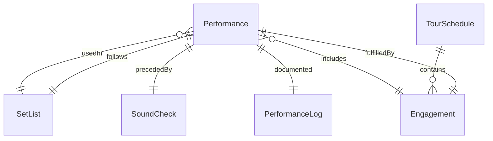
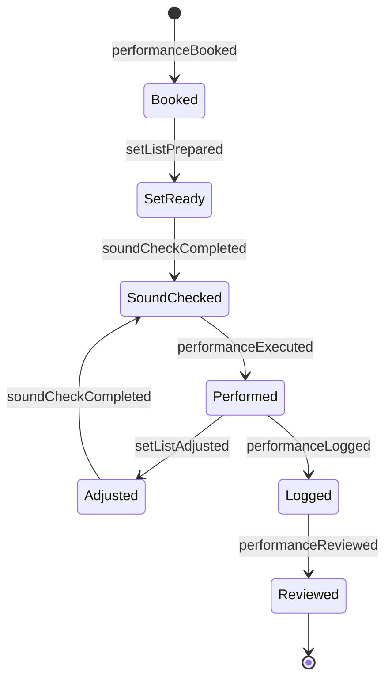
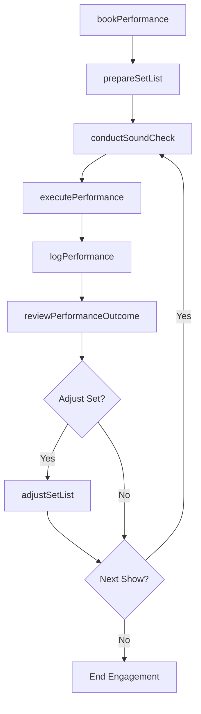
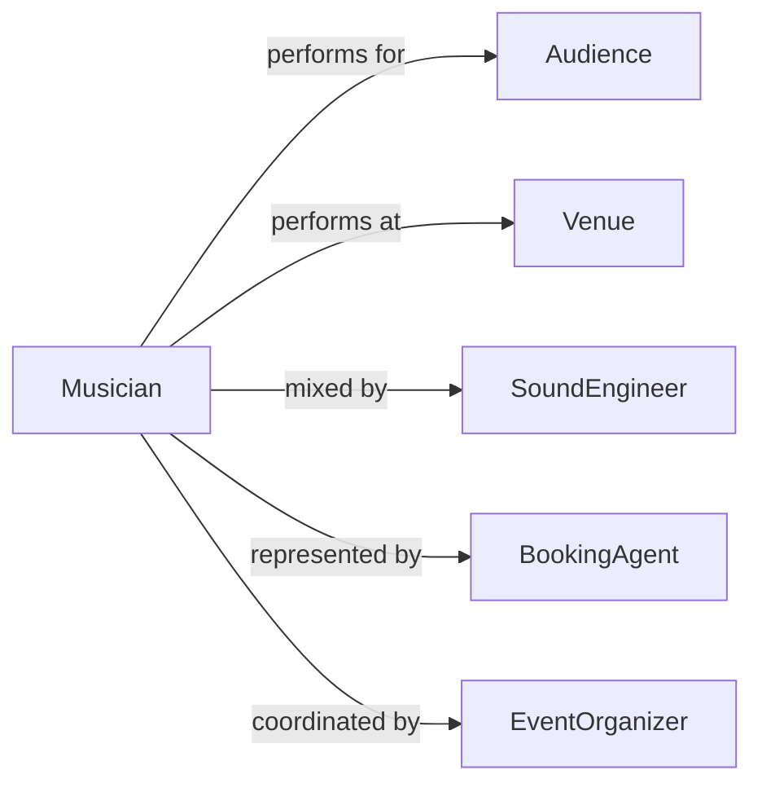

# Perform Music Public

> Business-as-Code definition for performing music for the public. Models the lifecycle of live musical performances from booking and preparation through execution and post-show review.

## Overview

Performing music for the public involves preparing, rehearsing, and delivering live musical performances to audiences in venues ranging from concert halls and clubs to outdoor festivals and corporate events. This definition exposes actions for managing setlists, coordinating with venues and sound engineers, executing live shows, and tracking performance outcomes. It supports workflows for solo artists, ensembles, orchestras, and touring acts.

## Actors

| Actor | Description |
|-------|-------------|
| Audience | Attends live musical performances and provides real-time response |
| Venue | Provides the performance space, stage, and technical infrastructure |
| SoundEngineer | Manages audio mixing, monitors, and amplification during performances |
| BookingAgent | Secures performance engagements and negotiates contracts |
| EventOrganizer | Coordinates the broader event in which the performance takes place |
| Composer | Creates or licenses musical works performed by the artist |

## Roles

| Role | Description |
|------|-------------|
| Musician | Performs musical material live for the public |
| BandLeader | Directs the ensemble and manages on-stage coordination |
| TourManager | Oversees logistics for multi-date performance schedules |
| Conductor | Leads orchestral or large ensemble performances |

## Entities

| Entity | Description |
|--------|-------------|
| Performance | A scheduled live musical event at a specific venue and time |
| SetList | The ordered sequence of songs or pieces for a performance |
| Engagement | A confirmed booking contract between performer and venue or organizer |
| SoundCheck | A pre-performance session to calibrate audio levels and equipment |
| PerformanceLog | A record of what was performed, duration, and any deviations |
| TourSchedule | A series of linked performances across multiple dates and venues |

## Actions

| Action | Description |
|--------|-------------|
| bookPerformance | Confirm an engagement at a venue for a specific date and fee |
| prepareSetList | Assemble and order the musical material for a performance |
| conductSoundCheck | Calibrate audio equipment and monitor levels before the show |
| executePerformance | Deliver the live musical performance to the audience |
| adjustSetList | Modify the set order or material during or between performances |
| logPerformance | Record details of the completed performance for archival |
| reviewPerformanceOutcome | Evaluate audience response, technical quality, and artistic execution |

## Events

| Event | Description |
|-------|-------------|
| performanceBooked | A live musical engagement has been confirmed |
| setListPrepared | The song order and material have been finalized for a show |
| soundCheckCompleted | Audio calibration has been finished before the performance |
| performanceExecuted | The live musical performance has been delivered |
| setListAdjusted | The set order or material has been changed |
| performanceLogged | Post-performance details have been recorded |
| performanceReviewed | The show outcome has been evaluated |

## Searches

| Search | Description |
|--------|-------------|
| findPerformances | List performances by date, venue, or artist |
| getSetLists | Retrieve set lists for a specific performance or tour |
| getEngagements | Query bookings by date range, venue, or status |
| getPerformanceLogs | Look up historical performance records and notes |

## Entity Relationships



## State Diagram



## Workflow



## Actor Relationships



## Usage

### Calling Actions

```typescript
import { performMusicPublic } from '@headlessly/perform-music-public'

const music = performMusicPublic()

// Book a performance
const engagement = await music.bookPerformance({
  venue: 'Blue Note Jazz Club',
  date: '2026-06-14',
  showTime: '20:00',
  fee: 5000,
  performers: ['musician-001', 'musician-002', 'musician-003']
})

// Prepare the set list
await music.prepareSetList({
  engagementId: engagement.id,
  songs: [
    { title: 'Opening Suite', duration: 12 },
    { title: 'Midnight Walk', duration: 8 },
    { title: 'Encore - Blue Horizon', duration: 6 }
  ]
})

// Execute the performance
await music.executePerformance({ engagementId: engagement.id })
```

### Event-Driven Automation

```typescript
// Trigger sound check reminder before show
music.performanceBooked(async ({ engagementId, date, venue }) => {
  await scheduleReminder({
    time: `${date}T16:00`,
    to: 'sound-engineer',
    message: `Sound check for ${venue} performance`
  })
})

// Auto-log after each performance
music.performanceExecuted(async ({ engagementId }) => {
  await music.logPerformance({ engagementId, timestamp: new Date().toISOString() })
})
```
