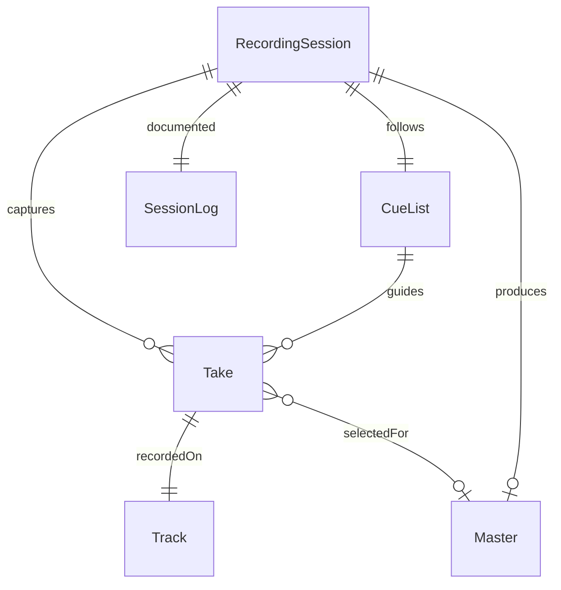
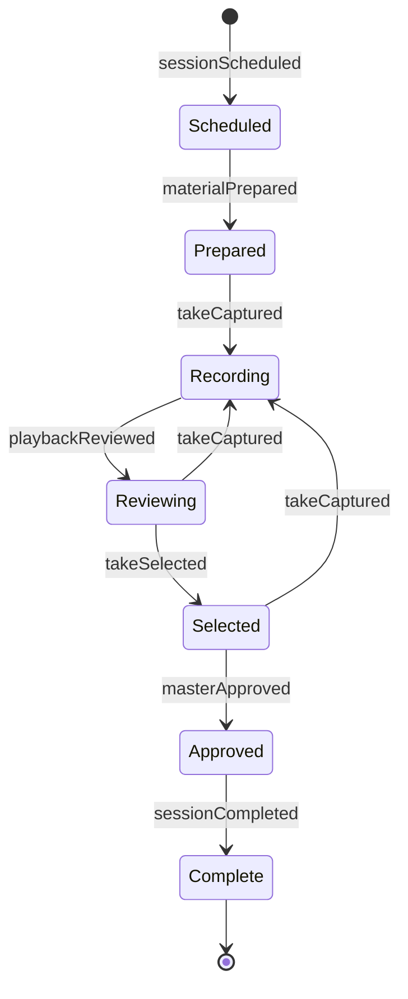
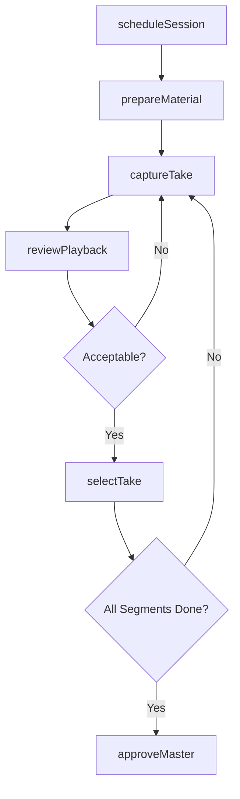
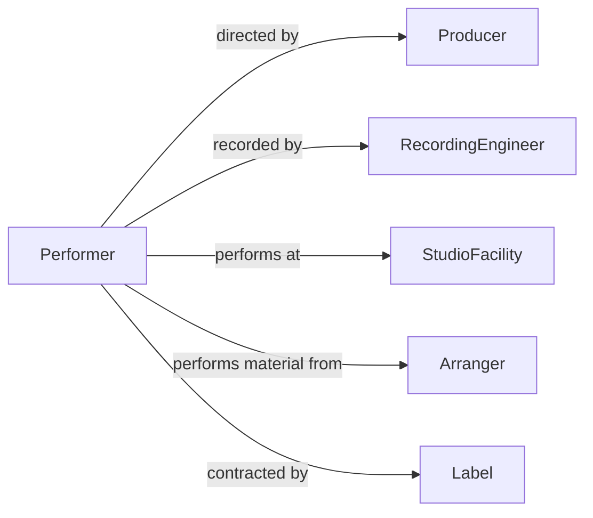

# Perform Recordings

> Business-as-Code definition for performing for recordings. Models the end-to-end recording session lifecycle from scheduling and preparation through capture, review, and final approval.

## Overview

Performing for recordings involves executing artistic material in a controlled environment for audio, video, or multimedia capture. This definition exposes actions for managing recording sessions, capturing takes, reviewing playback, and approving final recordings. It supports workflows across music, voice-over, film, and broadcast production contexts.

## Actors

| Actor | Description |
|-------|-------------|
| RecordingEngineer | Operates recording equipment and manages technical quality |
| Producer | Directs the creative and business aspects of the recording session |
| Director | Provides artistic direction for film or video recordings |
| StudioFacility | Provides the physical recording environment and equipment |
| Label | Commissions recordings and manages distribution rights |
| Arranger | Prepares and adapts musical or script material for the recording |

## Roles

| Role | Description |
|------|-------------|
| Performer | Executes the artistic material during recording sessions |
| SessionCoordinator | Manages scheduling, logistics, and participant coordination |
| MixEngineer | Balances and processes recorded tracks for final output |
| QualityReviewer | Evaluates recorded takes for technical and artistic standards |

## Entities

| Entity | Description |
|--------|-------------|
| RecordingSession | A scheduled block of time for capturing performances |
| Take | A single recorded attempt of a performance segment |
| Track | An individual audio or video channel within a recording |
| SessionLog | A record of takes, notes, and decisions made during a session |
| Master | The approved final version of a recording |
| CueList | The ordered sequence of material to be recorded in a session |

## Actions

| Action | Description |
|--------|-------------|
| scheduleSession | Book a recording session with studio, time, and participants |
| prepareMaterial | Set up scores, scripts, and technical requirements for the session |
| captureTake | Record a single performance attempt of a segment |
| reviewPlayback | Play back and evaluate a recorded take |
| selectTake | Mark a take as the preferred version for a segment |
| approveMaster | Finalize and approve the master recording |
| logSessionNotes | Record observations, decisions, and technical notes during the session |

## Events

| Event | Description |
|-------|-------------|
| sessionScheduled | A recording session has been booked and participants notified |
| materialPrepared | All scores, scripts, and equipment are ready for the session |
| takeCaptured | A performance take has been recorded |
| playbackReviewed | A recorded take has been evaluated |
| takeSelected | A preferred take has been chosen for a segment |
| masterApproved | The final recording has been approved for release |
| sessionCompleted | All planned material has been recorded and the session is closed |

## Searches

| Search | Description |
|--------|-------------|
| findSessions | List recording sessions by date, studio, or performer |
| getTakes | Retrieve all takes for a specific segment or session |
| getSessionLog | Look up notes and decisions from a recording session |
| findApprovedMasters | Query finalized recordings by project or date range |

## Entity Relationships



## State Diagram



## Workflow



## Actor Relationships



## Usage

### Calling Actions

```typescript
import { performRecordings } from '@headlessly/perform-recordings'

const recordings = performRecordings()

// Schedule a recording session
const session = await recordings.scheduleSession({
  studio: 'Studio A',
  date: '2026-04-10',
  startTime: '09:00',
  endTime: '17:00',
  performers: ['perf-001', 'perf-002'],
  project: 'Album - Resonance'
})

// Capture a take
const take = await recordings.captureTake({
  sessionId: session.id,
  segment: 'Track 3 - Verse 1',
  takeNumber: 2
})

// Review and select the best take
await recordings.reviewPlayback({ takeId: take.id })
await recordings.selectTake({ takeId: take.id, segment: 'Track 3 - Verse 1' })
```

### Event-Driven Automation

```typescript
// Notify engineer when material is ready
recordings.materialPrepared(async ({ sessionId }) => {
  await notify({
    to: 'recording-engineer',
    message: `Material prepared for session ${sessionId}. Equipment check recommended.`
  })
})

// Archive and distribute approved master
recordings.masterApproved(async ({ masterId, project }) => {
  await archiveRecording({ masterId })
  await notify({
    to: 'label-distribution',
    message: `Master approved for ${project}. Ready for distribution.`
  })
})
```
