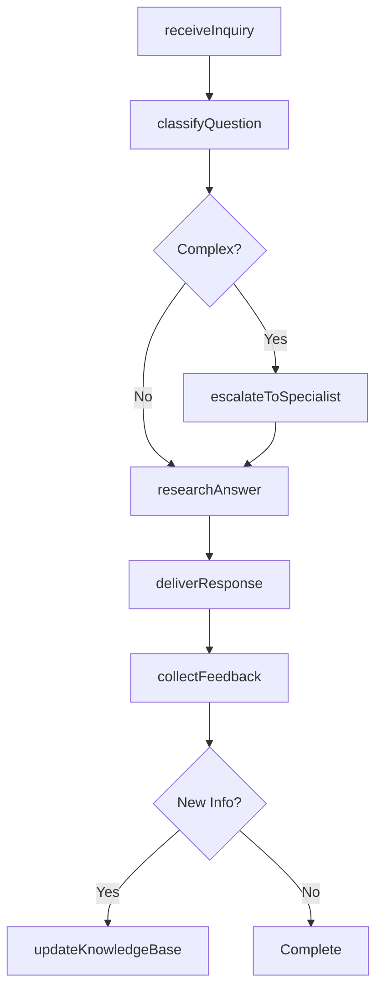
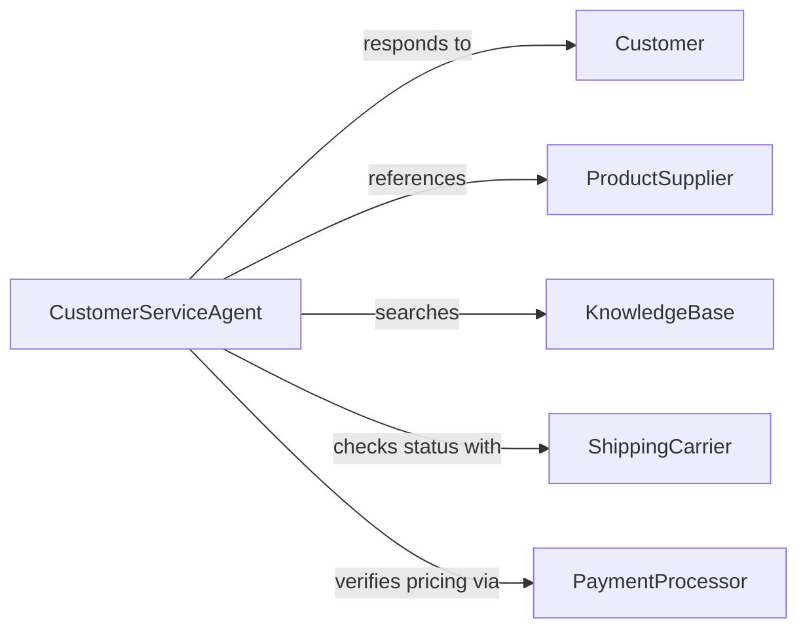

# Answer Customer Questions About Goods or Services

> Business-as-Code definition for answering customer questions about goods or services. Models the process of receiving product or service inquiries, researching accurate information, providing clear responses across channels, and escalating complex questions to subject matter experts.

## Overview

Answering customer questions about goods or services involves receiving inquiries through phone, email, chat, or in-person channels, researching product specifications, pricing, availability, and policies, delivering accurate and helpful responses, and escalating complex or technical questions to appropriate specialists. This definition exposes actions for customer inquiry management, event triggers for response milestones, and searches for product information and inquiry history.

## Actors

| Actor | Description |
|-------|-------------|
| Customer | Individual seeking information about products or services |
| ProductSupplier | Manufacturer or distributor providing detailed product specifications |
| KnowledgeBase | Repository of product information, FAQs, and policy documentation |
| ShippingCarrier | Logistics provider with delivery status and timeline information |
| PaymentProcessor | System handling pricing, promotions, and payment-related inquiries |

## Roles

| Role | Description |
|------|-------------|
| CustomerServiceAgent | Receives and responds to product and service questions |
| ProductSpecialist | Provides detailed technical or feature information on complex items |
| TeamLead | Handles escalated inquiries and coaches agents on responses |
| KnowledgeManager | Maintains and updates the product information repository |

## Entities

| Entity | Description |
|--------|-------------|
| CustomerInquiry | Documented question with channel, topic, and customer details |
| ProductCatalog | Comprehensive listing of goods with specifications and pricing |
| ServiceDescription | Documentation of available services, features, and terms |
| ResponseTemplate | Pre-approved answer for common product or service questions |
| EscalationTicket | Inquiry forwarded to a specialist for detailed resolution |
| SatisfactionRating | Customer feedback on the quality of the response received |
| InquiryTranscript | Complete record of the customer interaction and response |

## Actions

| Action | Description |
|--------|-------------|
| receiveInquiry | Accept a customer question through any supported channel |
| classifyQuestion | Categorize the inquiry by product, topic, and complexity |
| researchAnswer | Look up accurate product or service information from available sources |
| deliverResponse | Provide the customer with a clear, accurate answer |
| escalateToSpecialist | Forward complex or technical questions to a subject matter expert |
| collectFeedback | Request and record customer satisfaction with the response |
| updateKnowledgeBase | Add new information or improve existing entries based on inquiries |

## Events

| Event | Description |
|-------|-------------|
| inquiryReceived | A customer question has been accepted |
| questionClassified | The inquiry has been categorized by topic and complexity |
| answerResearched | Product or service information has been looked up |
| responseDelivered | The customer has received an answer |
| inquiryEscalated | A complex question has been forwarded to a specialist |
| feedbackCollected | Customer satisfaction data has been recorded |
| knowledgeBaseUpdated | Product information entries have been improved |

## Searches

| Search | Description |
|--------|-------------|
| findInquiries | List customer questions by product, topic, channel, or date |
| getProducts | Retrieve product specifications, pricing, or availability data |
| getTemplates | Search response templates by topic, product, or keyword |
| getSatisfaction | Query customer feedback ratings by agent, period, or topic |

## Workflow



## Actor Relationships



## Usage

### Calling Actions

```typescript
import { answerCustomerQuestionsAboutGoods } from '@headlessly/answer-customer-questions-about-goods'

const questions = answerCustomerQuestionsAboutGoods()

// Receive and classify a product inquiry
const inquiry = await questions.receiveInquiry({
  channel: 'live-chat',
  customer: 'cust-78432',
  question: 'What is the battery life of the ProTech X500 laptop and does it support USB-C charging?',
  product: 'protech-x500'
})

const classified = await questions.classifyQuestion({
  inquiryId: inquiry.id,
  category: 'product-specifications',
  complexity: 'standard',
  topics: ['battery-life', 'charging-compatibility']
})

// Research and deliver answer
const answer = await questions.researchAnswer({
  inquiryId: inquiry.id,
  sources: ['product-catalog', 'manufacturer-specs', 'knowledge-base'],
  productId: 'protech-x500'
})

await questions.deliverResponse({
  inquiryId: inquiry.id,
  response: answer.formattedResponse,
  channel: 'live-chat',
  attachments: ['protech-x500-spec-sheet']
})
```

### Event-Driven Automation

```typescript
// Auto-escalate unanswered questions after timeout
questions.inquiryReceived(async ({ inquiryId, complexity, timestamp }) => {
  await scheduleReminder({
    triggerDate: addMinutes(timestamp, complexity === 'standard' ? 15 : 5),
    action: 'escalateToSpecialist',
    inquiryId,
    reason: 'response-time-exceeded'
  })
})

// Update knowledge base when new questions surface frequently
questions.feedbackCollected(async ({ inquiryId, topic, satisfactionScore }) => {
  if (satisfactionScore < 3) {
    await notify({
      to: 'knowledge-manager',
      message: `Low satisfaction on ${topic} inquiry ${inquiryId}. Knowledge base entry may need improvement.`
    })
  }
})
```
