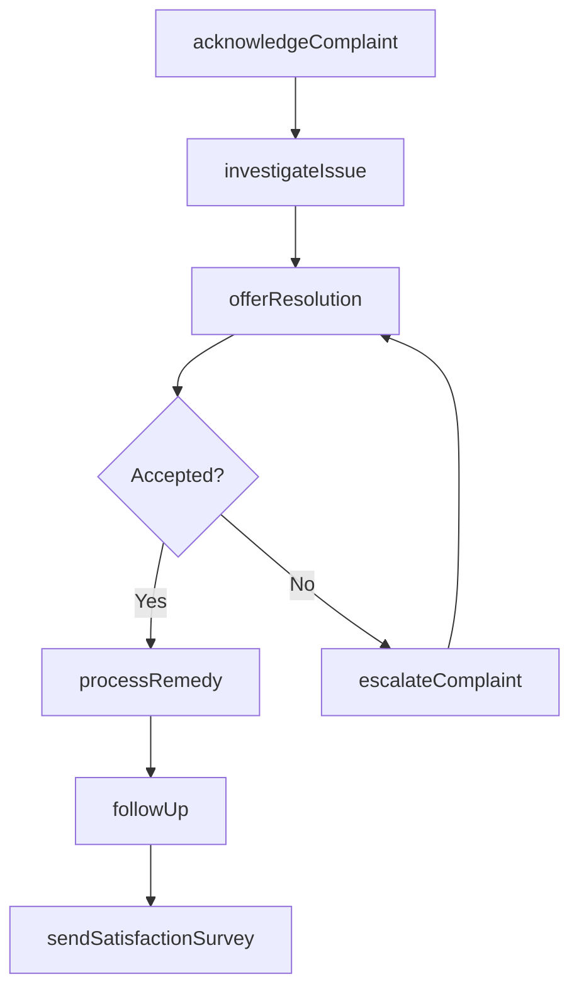
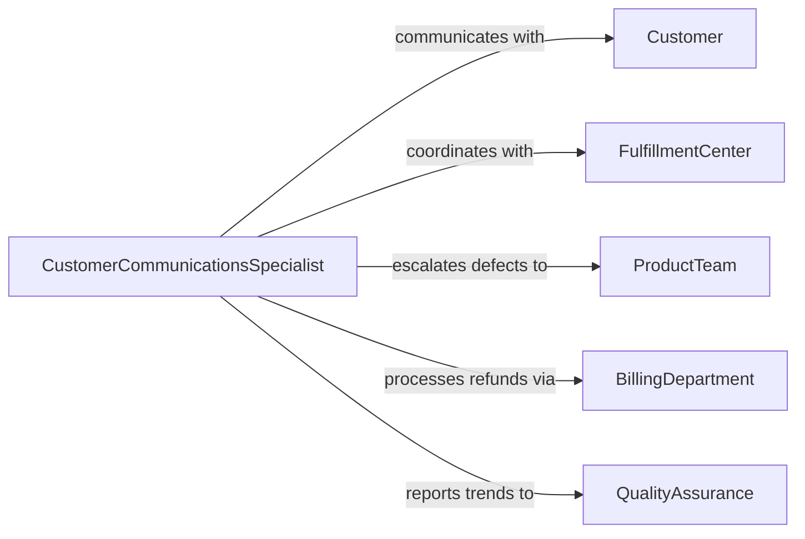

# Communicate with Customers to Resolve Complaints or Ensure Satisfaction

> Business-as-Code definition for customer communication to resolve complaints and ensure satisfaction. Models the process of initiating proactive and reactive customer outreach, acknowledging concerns, investigating issues, providing resolutions, and following up to confirm satisfaction.

## Overview

Communicating with customers to resolve complaints or ensure satisfaction involves reaching out proactively after service interactions, receiving and acknowledging customer concerns, investigating the root cause of dissatisfaction, offering appropriate remedies such as refunds, replacements, or service credits, and following up to confirm the customer is satisfied with the outcome. This definition exposes actions for customer satisfaction communication management, event triggers for resolution milestones, and searches for complaint history and satisfaction records.

## Actors

| Actor | Description |
|-------|-------------|
| Customer | Individual or organization expressing a complaint or providing feedback |
| FulfillmentCenter | Warehouse or distribution facility involved in order-related complaints |
| ProductTeam | Engineering or manufacturing group addressing product defect reports |
| BillingDepartment | Finance unit handling pricing disputes and refund processing |
| QualityAssurance | Team investigating systemic issues behind customer complaints |

## Roles

| Role | Description |
|------|-------------|
| CustomerCommunicationsSpecialist | Manages outreach and dialogue with customers on complaints and satisfaction |
| ResolutionCoordinator | Investigates issues and coordinates remediation across departments |
| SatisfactionAnalyst | Tracks satisfaction trends and identifies improvement opportunities |
| EscalationManager | Handles high-priority or recurring complaints requiring senior attention |

## Entities

| Entity | Description |
|--------|-------------|
| ComplaintCase | Documented customer concern with channel, category, and status |
| SatisfactionSurvey | Structured feedback collection sent after service interactions |
| ResolutionOffer | Proposed remedy such as refund, replacement, or credit |
| FollowUpRecord | Documentation of post-resolution outreach and customer response |
| CommunicationLog | Complete transcript of customer interactions across all channels |
| SatisfactionScore | Quantitative rating of customer experience with the resolution |
| EscalationRecord | Documentation of complaints requiring senior or executive attention |

## Actions

| Action | Description |
|--------|-------------|
| acknowledgeComplaint | Confirm receipt of the customer concern and set response expectations |
| investigateIssue | Research the root cause of the complaint across relevant departments |
| offerResolution | Present the customer with a remedy for their complaint |
| processRemedy | Execute the approved resolution such as refund, replacement, or credit |
| followUp | Contact the customer after resolution to confirm satisfaction |
| sendSatisfactionSurvey | Distribute feedback collection after service interactions |
| escalateComplaint | Forward high-priority or unresolved complaints to senior management |

## Events

| Event | Description |
|-------|-------------|
| complaintAcknowledged | The customer concern has been confirmed and response timeline set |
| issueInvestigated | The root cause of the complaint has been researched |
| resolutionOffered | A remedy has been presented to the customer |
| remedyProcessed | The approved resolution has been executed |
| followUpCompleted | Post-resolution outreach has been conducted |
| surveyReceived | Customer satisfaction feedback has been collected |
| complaintEscalated | A high-priority complaint has been forwarded to senior management |

## Searches

| Search | Description |
|--------|-------------|
| findComplaints | List complaint cases by customer, category, status, or date |
| getSatisfaction | Retrieve satisfaction scores by customer, period, or channel |
| getResolutions | Search resolution offers by type, amount, or outcome |
| getCommunications | Query interaction logs by customer, channel, or date |

## Workflow



## Actor Relationships



## Usage

### Calling Actions

```typescript
import { communicateCustomersResolveComplaintsEnsure } from '@headlessly/communicate-customers-resolve-complaints-ensure'

const comms = communicateCustomersResolveComplaintsEnsure()

// Acknowledge an incoming complaint
const complaint = await comms.acknowledgeComplaint({
  customer: 'cust-34210',
  channel: 'email',
  category: 'product-defect',
  description: 'Received damaged packaging and product with cosmetic scratches',
  orderId: 'ord-98712',
  responseTimePromise: '24-hours'
})

// Investigate and offer resolution
await comms.investigateIssue({
  caseId: complaint.id,
  departments: ['fulfillment-center', 'quality-assurance'],
  evidenceRequested: ['shipping-photos', 'packaging-inspection-log']
})

await comms.offerResolution({
  caseId: complaint.id,
  options: [
    { type: 'replacement', description: 'Ship new unit within 2 business days', cost: 0 },
    { type: 'refund', description: 'Full refund to original payment method', amount: 149.99 },
    { type: 'discount', description: '30% discount on next purchase', code: 'SORRY30' }
  ],
  customerPreference: 'replacement'
})

// Follow up after resolution
await comms.followUp({
  caseId: complaint.id,
  method: 'email',
  daysSinceResolution: 5,
  message: 'We wanted to check that your replacement arrived in perfect condition.'
})
```

### Event-Driven Automation

```typescript
// Auto-escalate complaints from high-value customers
comms.complaintAcknowledged(async ({ caseId, customerId }) => {
  const customerValue = await getCustomerLifetimeValue(customerId)
  if (customerValue > 10000) {
    await comms.escalateComplaint({
      caseId,
      reason: 'high-value-customer',
      assignTo: 'escalation-manager'
    })
  }
})

// Track satisfaction trends and alert on declining scores
comms.surveyReceived(async ({ customerId, score, category }) => {
  if (score <= 2) {
    await notify({
      to: 'satisfaction-analyst',
      message: `Low satisfaction score (${score}/5) from ${customerId} in category ${category}`
    })
  }
})
```
