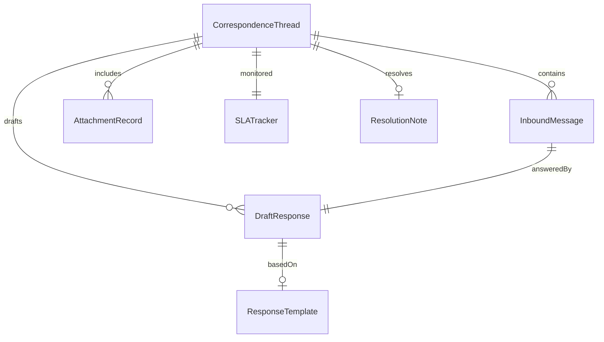
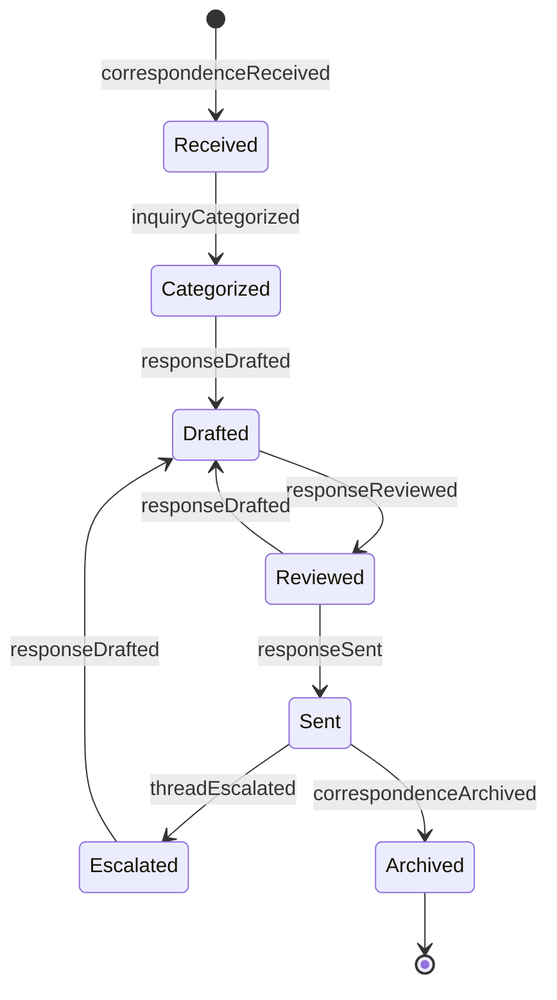
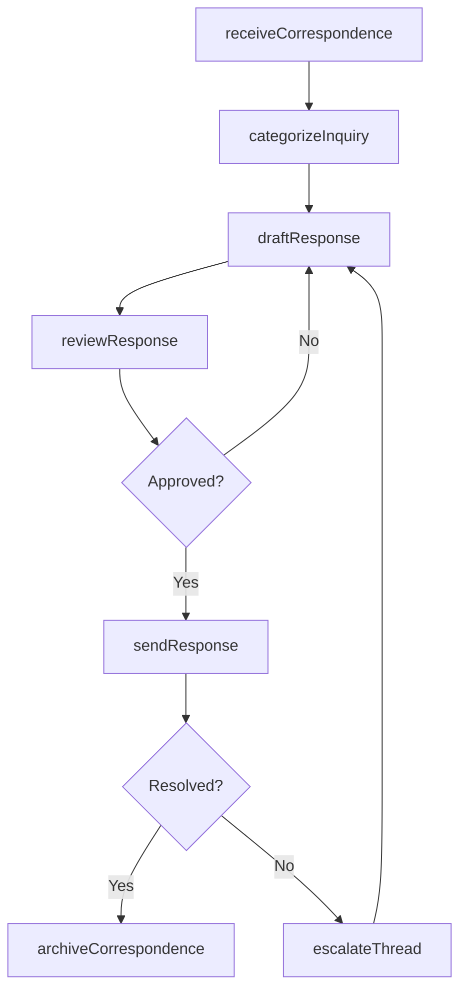
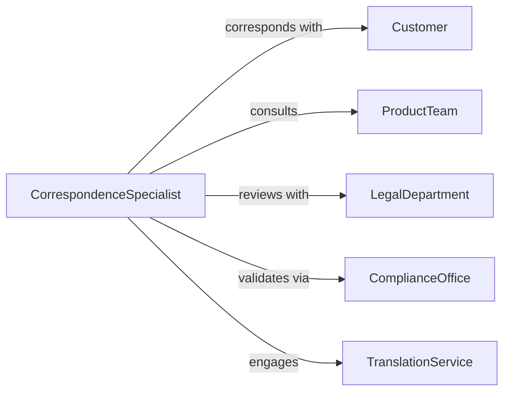

# Correspond with Customers to Answer Questions or Resolve Complaints

> Business-as-Code definition for written customer correspondence to answer questions and resolve complaints. Models the process of receiving written inquiries, drafting professional responses, managing email and letter workflows, tracking correspondence threads, and ensuring timely resolution through written communication channels.

## Overview

Corresponding with customers to answer questions or resolve complaints involves managing inbound written communications through email, mail, and messaging platforms, researching accurate information, composing professional responses that address the customer's concern, and maintaining correspondence records for quality assurance and compliance. This definition exposes actions for written correspondence management, event triggers for response milestones, and searches for correspondence history and resolution records.

## Actors

| Actor | Description |
|-------|-------------|
| Customer | Individual or organization submitting written questions or complaints |
| ProductTeam | Department providing technical product information for responses |
| LegalDepartment | Counsel reviewing correspondence on sensitive or regulatory matters |
| ComplianceOffice | Unit ensuring written communications meet regulatory disclosure requirements |
| TranslationService | Provider handling multilingual correspondence when needed |

## Roles

| Role | Description |
|------|-------------|
| CorrespondenceSpecialist | Drafts and manages written responses to customer inquiries |
| QualityReviewer | Reviews outbound correspondence for accuracy and tone |
| TicketManager | Assigns, prioritizes, and tracks correspondence through resolution |
| TemplateAuthor | Creates and maintains standard response templates for common topics |

## Entities

| Entity | Description |
|--------|-------------|
| CorrespondenceThread | Complete chain of written exchanges between the company and a customer |
| InboundMessage | Customer-initiated written question or complaint |
| DraftResponse | Prepared reply pending review and approval before sending |
| ResponseTemplate | Pre-approved written answer for frequently asked questions |
| AttachmentRecord | Documents, images, or files exchanged during correspondence |
| ResolutionNote | Internal documentation of how the customer issue was addressed |
| SLATracker | Monitoring record for response time compliance against targets |

## Actions

| Action | Description |
|--------|-------------|
| receiveCorrespondence | Accept and log inbound written customer messages |
| categorizeInquiry | Classify the message by topic, urgency, and required expertise |
| draftResponse | Compose a written reply addressing the customer's question or complaint |
| reviewResponse | Verify accuracy, tone, and compliance of the draft before sending |
| sendResponse | Deliver the approved written reply to the customer |
| escalateThread | Forward complex or unresolved correspondence to a specialist or manager |
| archiveCorrespondence | Store completed correspondence threads for record-keeping |

## Events

| Event | Description |
|-------|-------------|
| correspondenceReceived | An inbound customer message has been logged |
| inquiryCategorized | The message has been classified by topic and urgency |
| responseDrafted | A written reply has been composed |
| responseReviewed | The draft has been verified for accuracy and compliance |
| responseSent | The approved reply has been delivered to the customer |
| threadEscalated | Complex correspondence has been forwarded to a specialist |
| correspondenceArchived | The completed thread has been stored |

## Searches

| Search | Description |
|--------|-------------|
| findThreads | List correspondence threads by customer, topic, status, or date |
| getTemplates | Retrieve response templates by topic, product, or keyword |
| getSLACompliance | Search response time metrics by agent, period, or priority level |
| getResolutions | Query resolution outcomes by correspondence thread or category |

## Entity Relationships



## State Diagram



## Workflow



## Actor Relationships



## Usage

### Calling Actions

```typescript
import { correspondCustomersAnswerQuestionsResolve } from '@headlessly/correspond-customers-answer-questions-resolve'

const correspondence = correspondCustomersAnswerQuestionsResolve()

// Receive and categorize an inbound email
const message = await correspondence.receiveCorrespondence({
  channel: 'email',
  customer: 'cust-56201',
  subject: 'Question about warranty coverage for Model Z100',
  body: 'I purchased a Z100 unit six months ago and the display is flickering. Is this covered under warranty?',
  attachments: ['purchase-receipt.pdf', 'video-of-issue.mp4']
})

await correspondence.categorizeInquiry({
  messageId: message.id,
  topic: 'warranty-inquiry',
  product: 'model-z100',
  urgency: 'standard',
  requiresExpertise: false
})

// Draft and send response
const draft = await correspondence.draftResponse({
  messageId: message.id,
  template: 'warranty-coverage-response',
  customFields: {
    productName: 'Model Z100',
    warrantyPeriod: '12-months',
    nextSteps: 'Submit a warranty claim through our service portal'
  }
})

await correspondence.reviewResponse({ draftId: draft.id, reviewer: 'quality-reviewer' })
await correspondence.sendResponse({ draftId: draft.id })
```

### Event-Driven Automation

```typescript
// Alert on SLA breach risk
correspondence.correspondenceReceived(async ({ messageId, urgency, timestamp }) => {
  const slaHours = urgency === 'high' ? 4 : 24
  await scheduleReminder({
    triggerDate: addHours(timestamp, slaHours - 1),
    to: 'ticket-manager',
    message: `Correspondence ${messageId} approaching ${slaHours}-hour SLA deadline`
  })
})

// Auto-archive resolved threads
correspondence.responseSent(async ({ threadId, responseCount, customerConfirmed }) => {
  if (customerConfirmed === 'satisfied') {
    await correspondence.archiveCorrespondence({
      threadId,
      resolution: 'customer-confirmed-satisfied',
      totalResponses: responseCount
    })
  }
})
```
