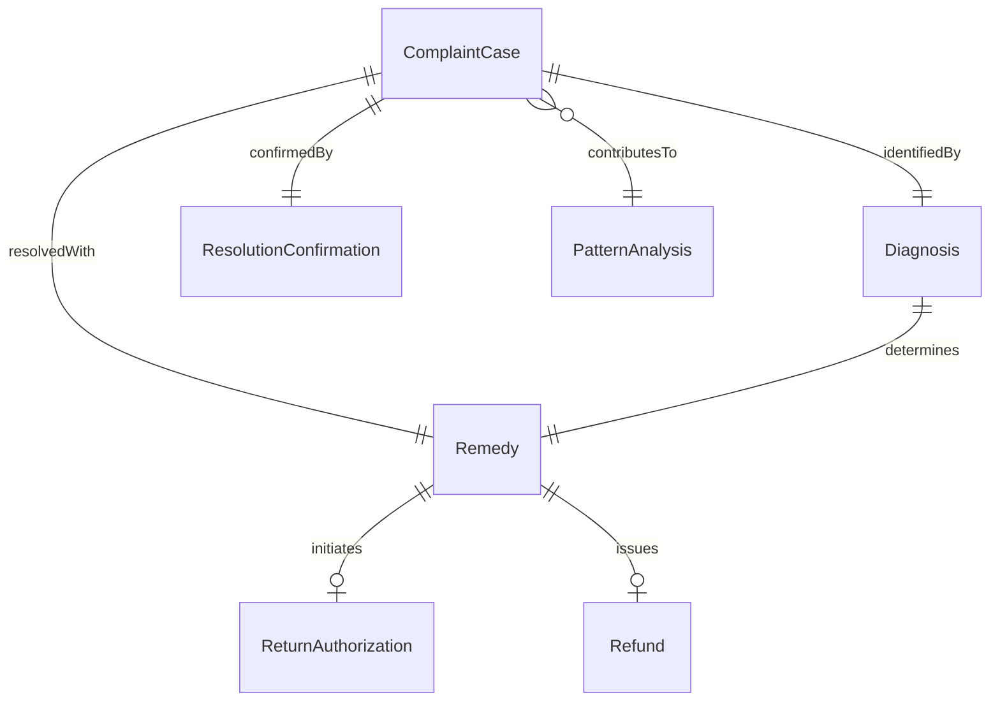
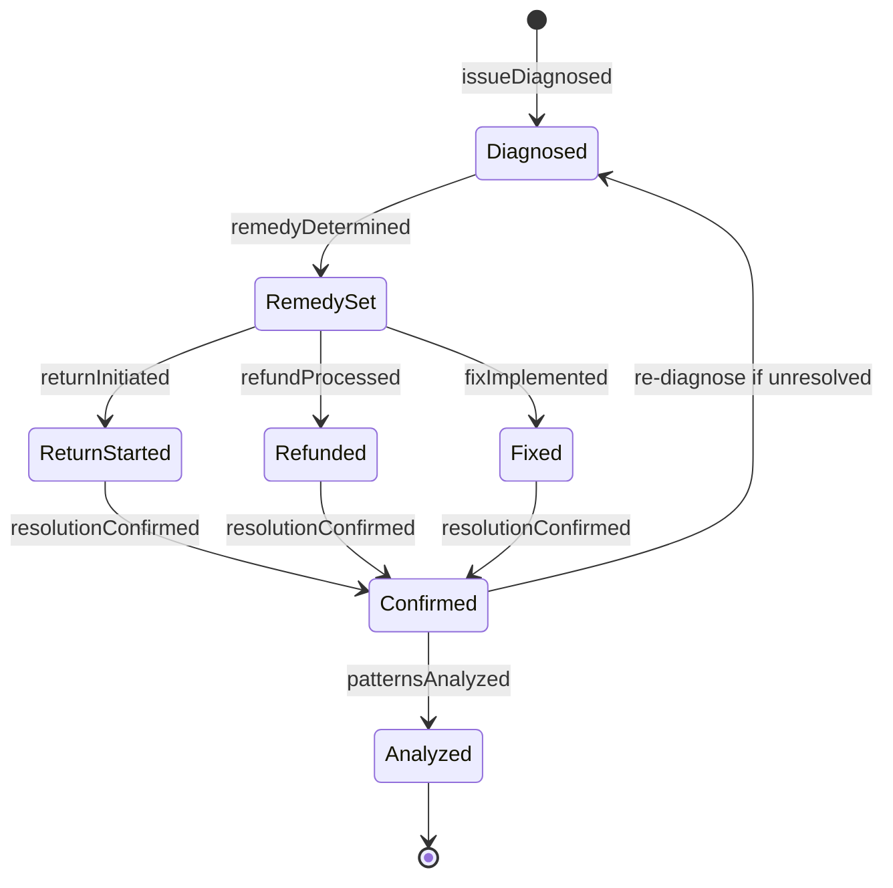
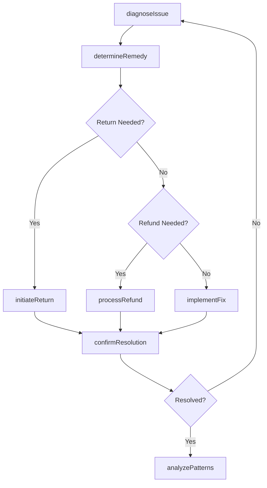
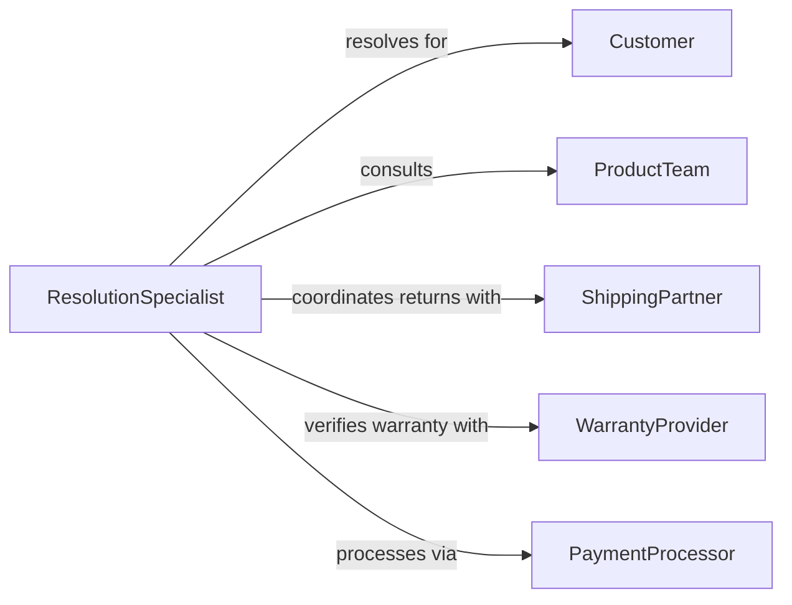

# Resolve Customer Complaints or Problems

> Business-as-Code definition for customer complaint resolution. Models the process of diagnosing issues, implementing fixes, delivering remedies, and confirming customer satisfaction.

## Overview

Customer complaint resolution involves diagnosing the root cause of a problem, identifying the appropriate remedy, implementing the fix, communicating the outcome to the customer, and verifying satisfaction. This definition exposes actions for resolution workflow management, event triggers for case status changes, and searches for complaint patterns and resolution effectiveness data.

## Actors

| Actor | Description |
|-------|-------------|
| Customer | Individual whose complaint requires resolution |
| ProductTeam | Internal group responsible for product quality and fixes |
| ShippingPartner | Logistics provider handling returns or replacements |
| WarrantyProvider | Administers product warranty claims and coverage |
| PaymentProcessor | Handles refund transactions |

## Roles

| Role | Description |
|------|-------------|
| ResolutionSpecialist | Diagnoses problems and implements fixes |
| CustomerAdvocate | Ensures the resolution meets the customer expectation |
| ReturnCoordinator | Manages product returns and exchange logistics |
| EscalationManager | Handles complex or high-value complaint resolutions |

## Entities

| Entity | Description |
|--------|-------------|
| ComplaintCase | Tracked record of a customer problem through resolution |
| Diagnosis | Root cause identification for the reported problem |
| Remedy | Specific action taken to resolve the complaint |
| ReturnAuthorization | Approval for a product return or exchange |
| Refund | Financial credit issued to the customer |
| ResolutionConfirmation | Customer acknowledgment that the issue is resolved |
| PatternAnalysis | Aggregated view of recurring complaint types |

## Actions

| Action | Description |
|--------|-------------|
| diagnoseIssue | Identify the root cause of the customer problem |
| determineRemedy | Select the appropriate resolution action |
| initiateReturn | Create a return authorization for product exchange |
| processRefund | Issue a financial credit to the customer account |
| implementFix | Apply a technical or operational correction |
| confirmResolution | Verify with the customer that the problem is resolved |
| analyzePatterns | Review complaint data for recurring issues |

## Events

| Event | Description |
|-------|-------------|
| issueDiagnosed | The root cause has been identified |
| remedyDetermined | The resolution action has been selected |
| returnInitiated | A return authorization has been created |
| refundProcessed | A financial credit has been issued |
| fixImplemented | A technical or operational correction has been applied |
| resolutionConfirmed | The customer has acknowledged the issue is resolved |
| patternsAnalyzed | Recurring complaint data has been reviewed |

## Searches

| Search | Description |
|--------|-------------|
| findCases | List complaint cases by status, product, or date |
| getDiagnoses | Retrieve root cause records by issue type |
| getRefunds | List refund transactions by customer, amount, or period |
| getPatterns | View recurring complaint types and frequency |
| getConfirmations | Find resolution confirmations by satisfaction status |

## Entity Relationships



## State Diagram



## Workflow



## Actor Relationships



## Usage

### Calling Actions

```typescript
import { resolveCustomerComplaintsProblems } from '@headlessly/resolve-customer-complaints-problems'

const resolve = resolveCustomerComplaintsProblems()

// Diagnose a reported issue
const diagnosis = await resolve.diagnoseIssue({
  caseId: 'case-9021',
  symptoms: ['screen-flickering', 'random-shutdowns'],
  product: 'laptop-model-x15'
})

// Determine and apply the remedy
const remedy = await resolve.determineRemedy({
  diagnosisId: diagnosis.id,
  options: ['replacement', 'repair', 'refund']
})

await resolve.initiateReturn({
  caseId: 'case-9021',
  remedyType: 'replacement',
  shippingLabel: true
})

// Confirm the resolution with the customer
await resolve.confirmResolution({
  caseId: 'case-9021',
  method: 'phone-callback'
})
```

### Event-Driven Automation

```typescript
// Auto-initiate return for defective product diagnoses
resolve.issueDiagnosed(async ({ caseId, rootCause }) => {
  if (rootCause === 'manufacturing-defect') {
    await resolve.initiateReturn({ caseId, remedyType: 'replacement' })
  }
})

// Alert product team on pattern detection
resolve.patternsAnalyzed(async ({ product, issueType, frequency }) => {
  if (frequency > 50) {
    await notify({
      to: 'product-quality-team',
      message: `Recurring ${issueType} issue on ${product}: ${frequency} cases this month`
    })
  }
})
```
