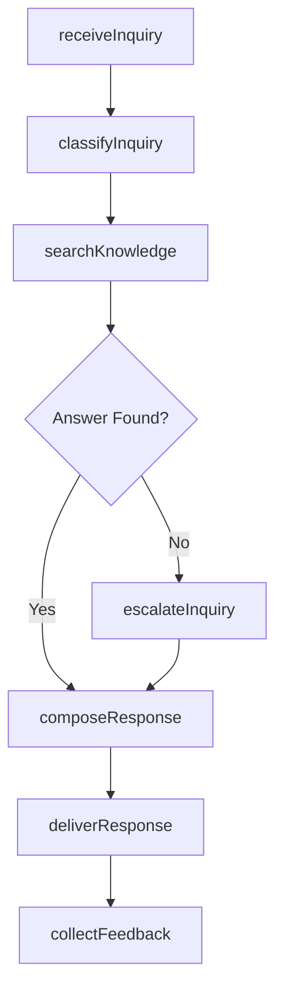
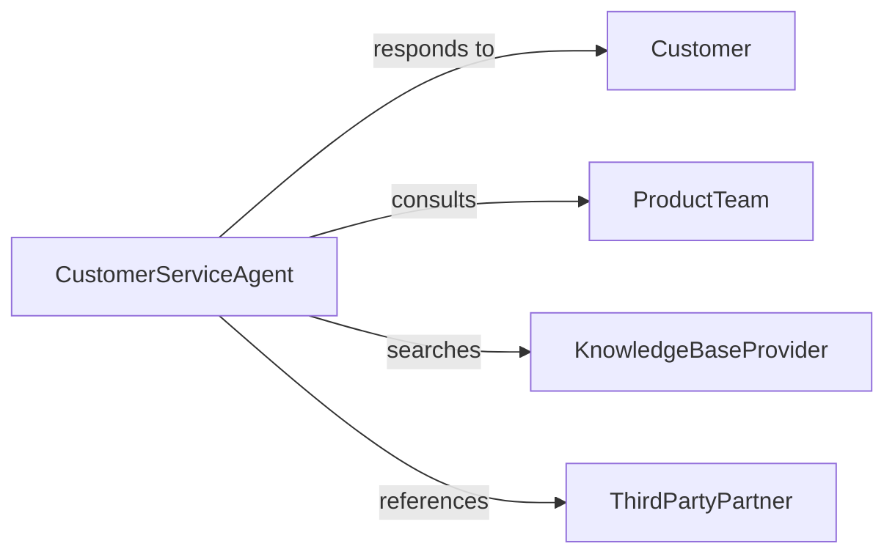

# Respond to Customer Inquiries

> Business-as-Code definition for customer inquiry response operations. Models the intake, classification, response, and tracking of customer questions across service channels.

## Overview

Customer inquiry response involves receiving questions through phone, email, chat, and in-person channels, classifying them by topic and urgency, providing accurate answers, and tracking response quality. This definition exposes actions for inquiry handling, event triggers for response milestones, and searches for knowledge base and inquiry history records.

## Actors

| Actor | Description |
|-------|-------------|
| Customer | Individual submitting a question or information request |
| ProductTeam | Internal group providing technical product information |
| KnowledgeBaseProvider | System or team maintaining self-service content |
| ThirdPartyPartner | External organization referenced in customer inquiries |

## Roles

| Role | Description |
|------|-------------|
| CustomerServiceAgent | Receives and responds to customer questions |
| SubjectMatterExpert | Provides specialized answers for complex inquiries |
| KnowledgeManager | Maintains and updates the customer-facing knowledge base |
| QualityReviewer | Audits response accuracy and adherence to standards |

## Entities

| Entity | Description |
|--------|-------------|
| Inquiry | Customer question or information request |
| Response | Answer delivered to the customer |
| KnowledgeArticle | Self-service content addressing common questions |
| InteractionRecord | Complete log of a customer service exchange |
| ResponseTemplate | Pre-approved answer for frequently asked questions |
| SatisfactionRating | Customer feedback on the quality of the response |

## Actions

| Action | Description |
|--------|-------------|
| receiveInquiry | Log an incoming customer question from any channel |
| classifyInquiry | Categorize the question by topic, product, and urgency |
| searchKnowledge | Query the knowledge base for relevant articles |
| composeResponse | Draft an answer to the customer question |
| deliverResponse | Send the answer through the appropriate channel |
| escalateInquiry | Route a complex question to a subject matter expert |
| collectFeedback | Request a satisfaction rating from the customer |

## Events

| Event | Description |
|-------|-------------|
| inquiryReceived | A customer question has been logged |
| inquiryClassified | The question has been categorized |
| knowledgeSearched | The knowledge base has been queried |
| responseComposed | An answer has been drafted |
| responseDelivered | The answer has been sent to the customer |
| inquiryEscalated | The question has been routed to a specialist |
| feedbackCollected | A satisfaction rating has been received |

## Searches

| Search | Description |
|--------|-------------|
| findInquiries | List inquiries by topic, channel, status, or date |
| getKnowledgeArticles | Search self-service content by keyword or category |
| getInteractions | Retrieve complete service exchange logs for a customer |
| getSatisfactionMetrics | Query response quality ratings by agent or period |

## Workflow



## Actor Relationships



## Usage

### Calling Actions

```typescript
import { respondCustomerInquiries } from '@headlessly/respond-customer-inquiries'

const inquiries = respondCustomerInquiries()

// Receive and classify an inquiry
const inquiry = await inquiries.receiveInquiry({
  customerId: 'cust-4412',
  channel: 'live-chat',
  question: 'What are the return policy terms for electronics?'
})

await inquiries.classifyInquiry({
  inquiryId: inquiry.id,
  topic: 'return-policy',
  product: 'electronics',
  urgency: 'normal'
})

// Search knowledge base and deliver response
const articles = await inquiries.searchKnowledge({
  topic: 'return-policy',
  category: 'electronics'
})

await inquiries.deliverResponse({
  inquiryId: inquiry.id,
  content: articles[0].summary,
  channel: 'live-chat'
})
```

### Event-Driven Automation

```typescript
// Auto-suggest knowledge articles on inquiry receipt
inquiries.inquiryClassified(async ({ inquiryId, topic }) => {
  const suggestions = await inquiries.searchKnowledge({ topic })
  await attachSuggestions({ inquiryId, articles: suggestions })
})

// Flag low satisfaction responses for review
inquiries.feedbackCollected(async ({ inquiryId, rating, agentId }) => {
  if (rating <= 2) {
    await notify({
      to: 'quality-reviewer',
      message: `Low satisfaction rating on inquiry ${inquiryId} by agent ${agentId}`
    })
  }
})
```
