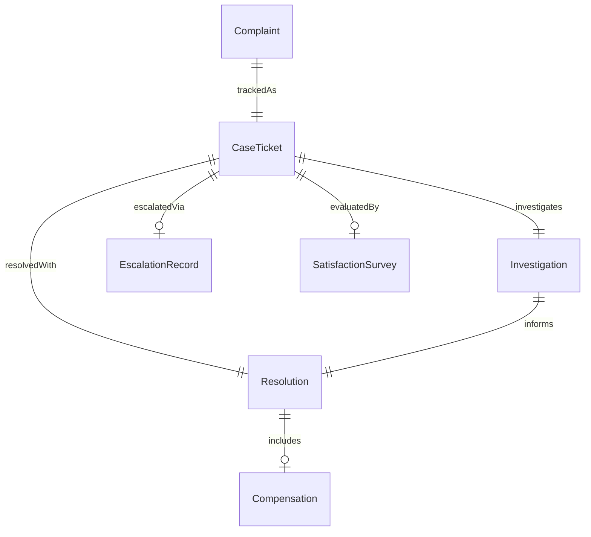
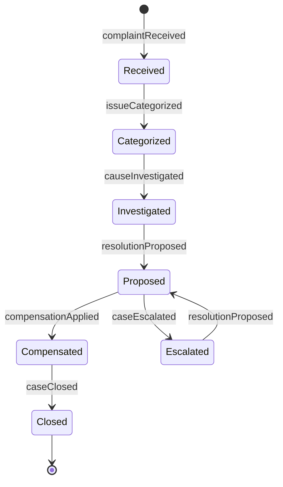
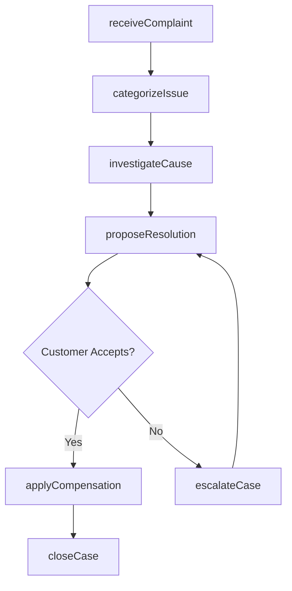
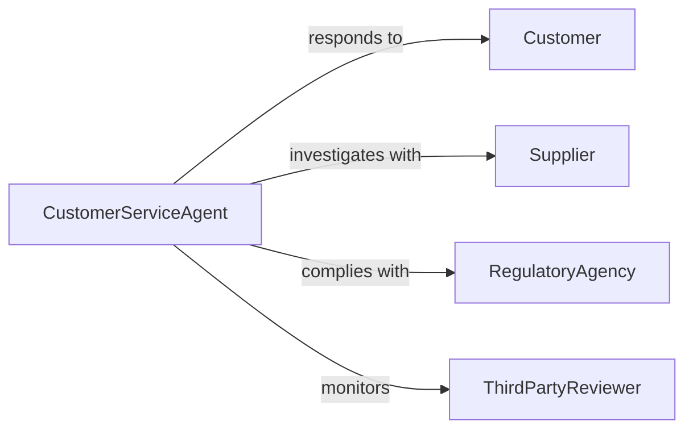

# Respond to Customer Problems or Complaints

> Business-as-Code definition for customer complaint response operations. Models the intake, investigation, resolution, and follow-up workflow for customer-reported problems across service channels.

## Overview

Customer complaint response involves receiving problem reports through multiple channels, categorizing and prioritizing issues, investigating root causes, delivering resolutions, and tracking satisfaction outcomes. This definition exposes actions for case lifecycle management, event triggers for escalation and closure, and searches for complaint records and resolution metrics.

## Actors

| Actor | Description |
|-------|-------------|
| Customer | Individual reporting a problem or complaint |
| Supplier | Vendor whose product or service is the subject of complaint |
| RegulatoryAgency | Government body overseeing consumer protection standards |
| ThirdPartyReviewer | Platform where public complaints or reviews are posted |

## Roles

| Role | Description |
|------|-------------|
| CustomerServiceAgent | Receives and handles customer complaints |
| CaseManager | Tracks complex complaints through investigation and resolution |
| QualityAssuranceAnalyst | Reviews complaint patterns and identifies systemic issues |
| CustomerServiceManager | Oversees escalated cases and approves compensations |
| TechnicalSupport | Investigates product or system defects reported in complaints |

## Entities

| Entity | Description |
|--------|-------------|
| Complaint | Formal customer-reported problem or dissatisfaction record |
| CaseTicket | Tracked workflow item for a specific complaint |
| Investigation | Root cause analysis of a reported problem |
| Resolution | Action taken to address the customer complaint |
| Compensation | Refund, credit, replacement, or other remedy offered |
| SatisfactionSurvey | Post-resolution feedback from the customer |
| EscalationRecord | Documentation of a case moved to a higher tier |

## Actions

| Action | Description |
|--------|-------------|
| receiveComplaint | Log a customer problem through any service channel |
| categorizeIssue | Classify the complaint by type, product, and severity |
| investigateCause | Research the root cause of the reported problem |
| proposeResolution | Present a solution or remedy to the customer |
| applyCompensation | Issue a refund, replacement, or service credit |
| escalateCase | Route the complaint to a senior agent or manager |
| closeCase | Finalize the complaint and trigger satisfaction survey |

## Events

| Event | Description |
|-------|-------------|
| complaintReceived | A customer problem has been logged |
| issueCategorized | The complaint has been classified by type and severity |
| causeInvestigated | Root cause analysis has been completed |
| resolutionProposed | A remedy has been presented to the customer |
| compensationApplied | A refund, credit, or replacement has been issued |
| caseEscalated | The complaint has been routed to a higher tier |
| caseClosed | The complaint has been finalized |

## Searches

| Search | Description |
|--------|-------------|
| findComplaints | List complaints by status, category, product, or date |
| getResolutions | Retrieve resolution records by type or satisfaction score |
| getEscalations | Find cases escalated beyond first-tier support |
| getCompensations | List remedies issued by type, amount, or period |
| getSatisfactionScores | Query post-resolution survey results |

## Entity Relationships



## State Diagram



## Workflow



## Actor Relationships



## Usage

### Calling Actions

```typescript
import { respondCustomerProblemsComplaints } from '@headlessly/respond-customer-problems-complaints'

const support = respondCustomerProblemsComplaints()

// Receive a complaint
const complaint = await support.receiveComplaint({
  customerId: 'cust-7734',
  channel: 'phone',
  product: 'wireless-router-x200',
  description: 'Device overheating and intermittent connectivity loss',
  severity: 'high'
})

// Investigate and propose resolution
await support.investigateCause({
  complaintId: complaint.id,
  findings: 'firmware-bug causing thermal management failure'
})

await support.proposeResolution({
  complaintId: complaint.id,
  resolution: 'firmware-update-and-replacement',
  compensation: { type: 'replacement', value: 89.99 }
})
```

### Event-Driven Automation

```typescript
// Auto-escalate high-severity complaints
support.complaintReceived(async ({ complaintId, severity }) => {
  if (severity === 'critical') {
    await support.escalateCase({
      complaintId,
      reason: 'critical-severity-auto-escalation'
    })
  }
})

// Send satisfaction survey after case closure
support.caseClosed(async ({ complaintId, customerId }) => {
  await sendSurvey({
    customerId,
    subject: 'How did we handle your recent issue?',
    caseRef: complaintId
  })
})
```
