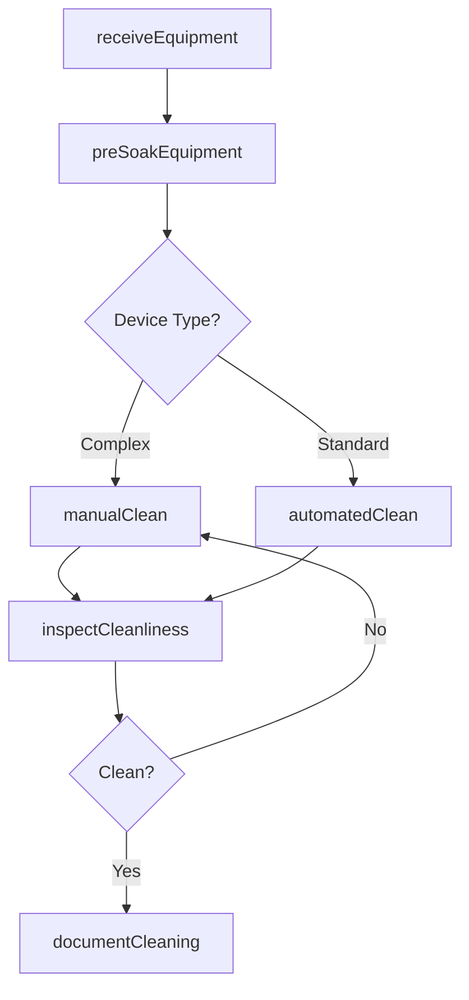
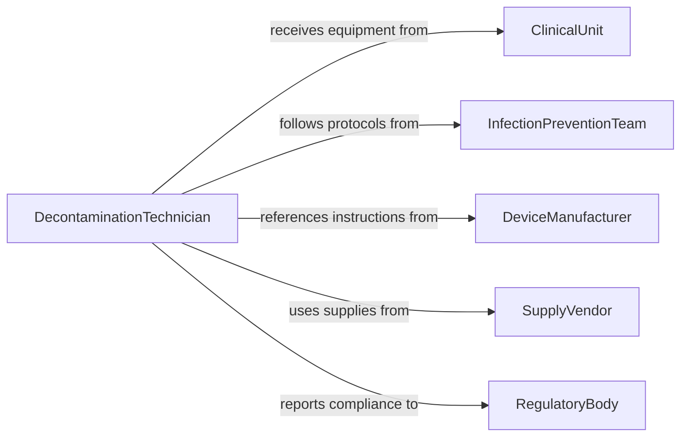

# Clean Medical Equipment

> Business-as-Code definition for medical equipment cleaning. Models the systematic cleaning, decontamination, and preparation of medical devices and instruments for safe reuse or further processing.

## Overview

Cleaning medical equipment involves the removal of visible soil, blood, protein, and other contaminants from reusable medical devices following clinical use. This definition exposes actions for intake, manual and automated cleaning processes, and quality verification, along with events for tracking compliance and searches for equipment status.

## Actors

| Actor | Description |
|-------|-------------|
| ClinicalUnit | Submits used equipment for cleaning after patient care procedures |
| InfectionPreventionTeam | Establishes cleaning protocols and monitors adherence to standards |
| DeviceManufacturer | Provides cleaning instructions specific to each device type |
| SupplyVendor | Supplies enzymatic detergents, brushes, and cleaning consumables |
| RegulatoryBody | Sets requirements for medical device reprocessing and cleanliness |

## Roles

| Role | Description |
|------|-------------|
| DecontaminationTechnician | Performs manual and automated cleaning of medical equipment |
| SterileProcessingSupervisor | Oversees cleaning operations and ensures protocol compliance |
| QualityInspector | Verifies equipment cleanliness before release or sterilization |

## Entities

| Entity | Description |
|--------|-------------|
| MedicalDevice | A reusable instrument or device requiring cleaning after use |
| CleaningProtocol | Documented procedure specifying cleaning steps for a device type |
| WasherDisinfector | Automated machine for cleaning and thermal disinfection |
| DetergentSolution | Enzymatic or alkaline cleaning agent used during decontamination |
| CleaningRecord | Documentation of cleaning actions performed on a device |
| InspectionResult | Outcome of visual or magnified cleanliness verification |

## Actions

| Action | Description |
|--------|-------------|
| receiveEquipment | Log contaminated equipment into the decontamination area |
| preSoakEquipment | Immerse equipment in enzymatic solution to loosen debris |
| manualClean | Scrub equipment by hand using brushes and detergent |
| automatedClean | Process equipment through a washer-disinfector cycle |
| inspectCleanliness | Visually or instrumentally verify equipment is free of contaminants |
| documentCleaning | Record cleaning actions, solutions used, and inspection outcomes |

## Events

| Event | Description |
|-------|-------------|
| equipmentReceived | Contaminated equipment has been logged into decontamination |
| equipmentPreSoaked | Equipment has completed enzymatic pre-soak treatment |
| manualCleanCompleted | Hand cleaning of equipment has been finished |
| automatedCleanCompleted | Washer-disinfector cycle has finished processing |
| cleanlinessVerified | Equipment has passed cleanliness inspection |
| cleaningDocumented | Cleaning record has been finalized and stored |

## Searches

| Search | Description |
|--------|-------------|
| findEquipmentByStatus | Locate medical devices by cleaning status or stage |
| getCleaningRecords | Retrieve cleaning history for a specific device or batch |
| getProtocolByDevice | Look up the cleaning protocol for a given device type |
| findPendingInspections | List cleaned equipment awaiting cleanliness verification |

## Workflow



## Actor Relationships



## Usage

### Calling Actions

```typescript
import { cleanMedicalEquipment } from '@headlessly/clean-medical-equipment'

const cleaning = cleanMedicalEquipment()

// Receive contaminated equipment from a clinical unit
const intake = await cleaning.receiveEquipment({
  deviceId: 'ENDO-SCOPE-112',
  sourceUnit: 'GI-Lab',
  procedureId: 'PROC-2026-0455',
  contaminationLevel: 'high'
})

// Run automated cleaning cycle
await cleaning.automatedClean({
  deviceId: intake.deviceId,
  washerDisinfectorId: 'WD-03',
  cycleType: 'thermal-disinfection',
  detergent: 'enzymatic-neutral'
})

// Verify cleanliness
const inspection = await cleaning.inspectCleanliness({
  deviceId: intake.deviceId,
  method: 'visual-magnified'
})
```

### Event-Driven Automation

```typescript
// Route failed inspections back through manual cleaning
cleaning.cleanlinessVerified(async ({ deviceId, passed }) => {
  if (!passed) {
    await cleaning.manualClean({
      deviceId,
      reason: 're-clean after failed inspection'
    })
  }
})

// Notify supervisor when high-risk devices are received
cleaning.equipmentReceived(async ({ deviceId, contaminationLevel }) => {
  if (contaminationLevel === 'high') {
    await notify({
      to: 'sterile-processing-supervisor',
      message: `High-contamination device ${deviceId} received. Manual clean required.`
    })
  }
})
```
