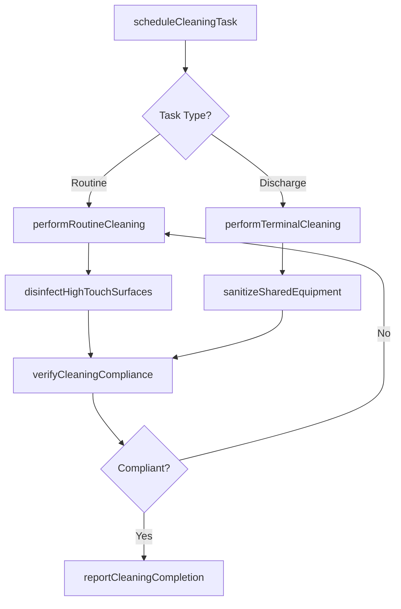
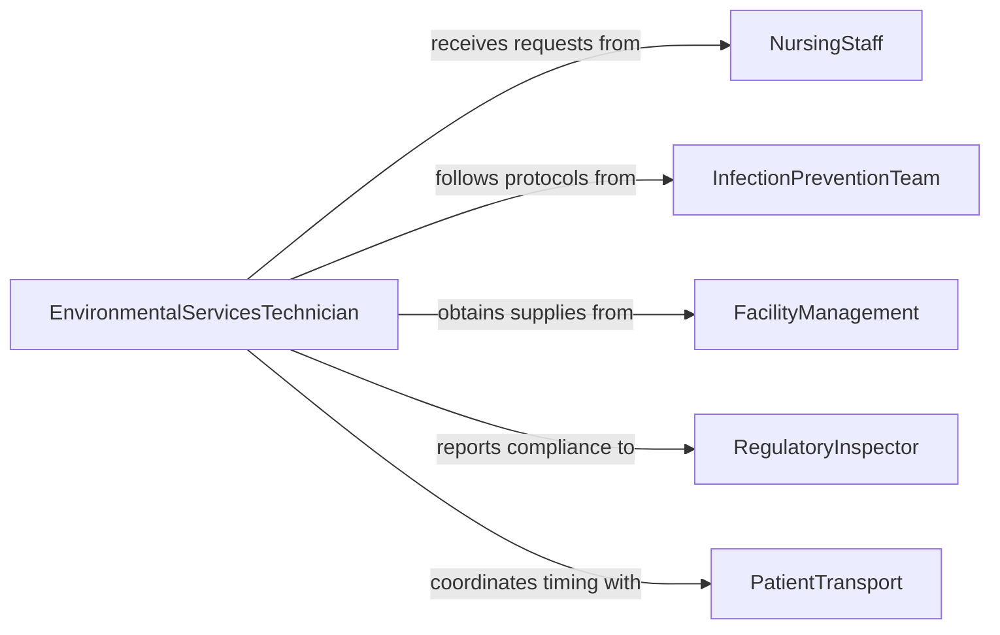

# Clean Medical Equipment Facilities

> Business-as-Code definition for cleaning medical equipment and healthcare facilities. Models environmental hygiene operations including terminal cleaning, daily disinfection, and equipment sanitation across clinical spaces.

## Overview

Cleaning medical equipment and facilities encompasses the environmental hygiene activities required to maintain safe, sanitary healthcare environments. This includes routine surface disinfection, terminal cleaning of patient rooms, operating room turnover cleaning, and sanitation of shared medical equipment. This definition exposes actions for scheduling and executing cleaning tasks, events for compliance tracking, and searches for facility hygiene status.

## Actors

| Actor | Description |
|-------|-------------|
| NursingStaff | Requests room turnover cleaning and reports contamination concerns |
| InfectionPreventionTeam | Defines cleaning protocols and monitors healthcare-associated infection rates |
| FacilityManagement | Manages cleaning supply inventory and equipment maintenance |
| RegulatoryInspector | Audits facility cleanliness and compliance with healthcare sanitation standards |
| CleaningSupplyVendor | Provides hospital-grade disinfectants, wipes, and sanitation consumables |
| PatientTransport | Coordinates patient movement to enable room cleaning schedules |

## Roles

| Role | Description |
|------|-------------|
| EnvironmentalServicesTechnician | Performs hands-on cleaning and disinfection of rooms and equipment |
| EVSSupervisor | Assigns cleaning tasks, monitors completion, and ensures quality |
| InfectionControlNurse | Validates that cleaning protocols meet infection prevention standards |
| FacilityHygieneManager | Oversees environmental services operations across the facility |

## Entities

| Entity | Description |
|--------|-------------|
| CleaningTask | A scheduled or on-demand cleaning assignment for a room or area |
| FacilityZone | A designated area of the healthcare facility with specific cleaning requirements |
| DisinfectionProtocol | Documented procedure specifying agents, contact times, and methods |
| CleaningSchedule | A recurring timetable of routine cleaning activities |
| ComplianceRecord | Documentation confirming a cleaning task was completed to standard |
| HighTouchSurface | Frequently contacted surfaces requiring enhanced disinfection frequency |

## Actions

| Action | Description |
|--------|-------------|
| scheduleCleaningTask | Create a cleaning assignment for a room, zone, or piece of equipment |
| performRoutineCleaning | Execute daily or shift-based cleaning of assigned areas |
| performTerminalCleaning | Deep clean and disinfect a room following patient discharge or transfer |
| disinfectHighTouchSurfaces | Apply hospital-grade disinfectant to high-contact surfaces |
| sanitizeSharedEquipment | Clean shared medical devices between patient uses |
| verifyCleaningCompliance | Inspect and confirm that cleaning tasks meet established protocols |
| reportCleaningCompletion | Document task completion with time, agent used, and inspector sign-off |

## Events

| Event | Description |
|-------|-------------|
| cleaningTaskScheduled | A new cleaning task has been created and assigned |
| routineCleaningCompleted | Daily or shift-based cleaning has been finished for an area |
| terminalCleaningCompleted | A room has been deep cleaned following patient discharge |
| highTouchSurfacesDisinfected | High-contact surfaces have been sanitized in a zone |
| sharedEquipmentSanitized | Shared medical equipment has been cleaned between patients |
| cleaningComplianceVerified | Cleaning has been inspected and confirmed to meet standards |
| cleaningNoncomplianceDetected | A cleaning task has failed quality inspection |

## Searches

| Search | Description |
|--------|-------------|
| findCleaningTasks | List cleaning tasks by zone, status, priority, or assigned technician |
| getComplianceRecords | Retrieve cleaning compliance history for a room or zone |
| findPendingTurnovers | Locate rooms awaiting terminal cleaning for patient admission |
| getDisinfectionProtocol | Look up the required cleaning protocol for a specific area type |

## Workflow



## Actor Relationships



## Usage

### Calling Actions

```typescript
import { cleanMedicalEquipmentFacilities } from '@headlessly/clean-medical-equipment-facilities'

const facilities = cleanMedicalEquipmentFacilities()

// Schedule a terminal cleaning after patient discharge
const task = await facilities.scheduleCleaningTask({
  zone: 'Room-412',
  taskType: 'terminal',
  priority: 'high',
  reason: 'patient-discharge',
  isolationPrecautions: 'contact'
})

// Perform the terminal cleaning
await facilities.performTerminalCleaning({
  taskId: task.id,
  disinfectant: 'quaternary-ammonium',
  contactTimeMinutes: 10,
  uvDisinfection: true
})

// Verify compliance before releasing the room
const verification = await facilities.verifyCleaningCompliance({
  taskId: task.id,
  method: 'atp-bioluminescence',
  threshold: 250
})
```

### Event-Driven Automation

```typescript
// Notify admissions when terminal cleaning is verified
facilities.cleaningComplianceVerified(async ({ taskId, zone }) => {
  await notify({
    to: 'bed-management',
    message: `${zone} cleaned and ready for next admission`
  })
})

// Escalate noncompliance to supervisor
facilities.cleaningNoncomplianceDetected(async ({ taskId, zone, findings }) => {
  await notify({
    to: 'evs-supervisor',
    message: `Cleaning noncompliance in ${zone}: ${findings}. Re-clean required.`
  })
})
```
