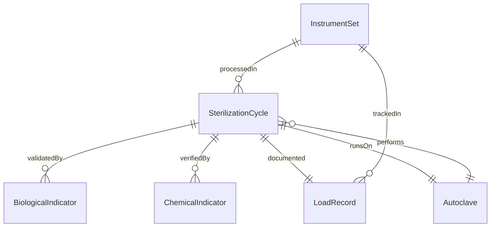
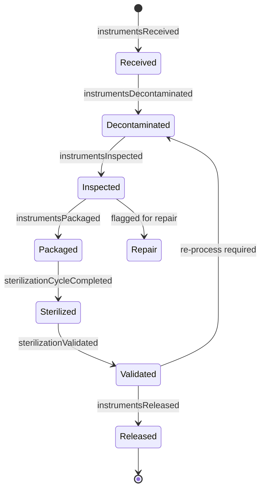
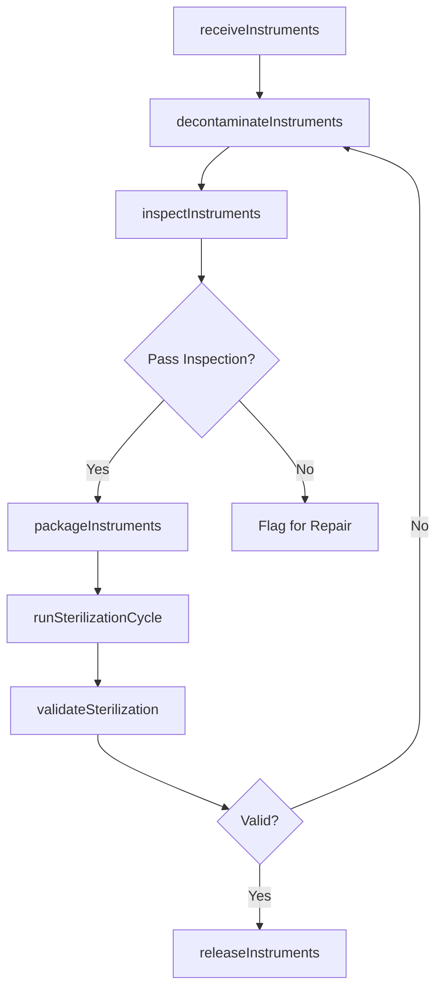
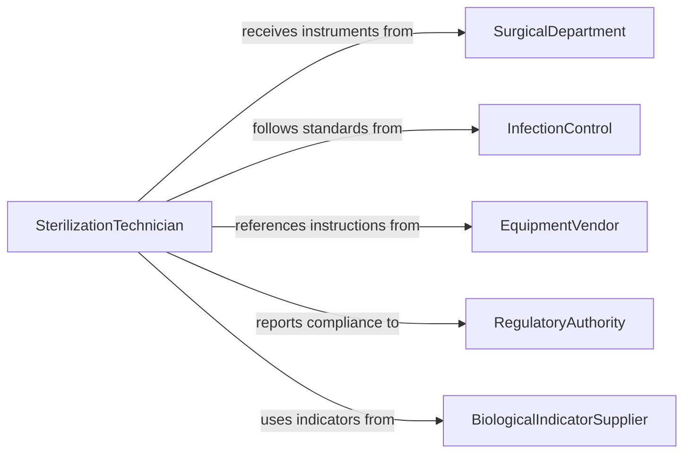

# Sterilize Medical Equipment Instruments

> Business-as-Code definition for medical equipment and instrument sterilization. Models the complete decontamination and sterilization lifecycle from collection through validated sterility assurance.

## Overview

Sterilizing medical equipment and instruments involves systematic decontamination, cleaning, packaging, and processing through validated sterilization methods such as autoclaving, ethylene oxide, or hydrogen peroxide plasma. This definition exposes actions for each phase of the sterilization cycle, events for compliance tracking, and searches for instrument traceability and quality records.

## Actors

| Actor | Description |
|-------|-------------|
| SurgicalDepartment | Submits used instruments for reprocessing after procedures |
| InfectionControl | Sets sterilization standards and monitors compliance |
| EquipmentVendor | Provides instrument-specific reprocessing instructions |
| RegulatoryAuthority | Enforces sterilization standards and conducts facility audits |
| BiologicalIndicatorSupplier | Provides spore tests and chemical indicators for validation |

## Roles

| Role | Description |
|------|-------------|
| SterilizationTechnician | Operates sterilization equipment and processes instruments |
| CentralSterileManager | Oversees sterile processing department operations and compliance |
| QualityAssuranceSpecialist | Validates sterilization cycles and reviews biological indicator results |
| InstrumentCoordinator | Tracks instrument sets and manages inventory through reprocessing |

## Entities

| Entity | Description |
|--------|-------------|
| InstrumentSet | A grouped collection of surgical instruments for a specific procedure |
| SterilizationCycle | A single run of a sterilizer with defined parameters |
| BiologicalIndicator | A spore test used to verify sterilization effectiveness |
| ChemicalIndicator | A strip or tape that changes color to confirm exposure to sterilization conditions |
| LoadRecord | Documentation of items processed in a sterilization cycle |
| Autoclave | A pressure-based steam sterilizer used for heat-tolerant instruments |

## Actions

| Action | Description |
|--------|-------------|
| receiveInstruments | Accept contaminated instruments from clinical departments |
| decontaminateInstruments | Perform initial cleaning and decontamination before sterilization |
| inspectInstruments | Examine instruments for damage, residue, or functionality issues |
| packageInstruments | Wrap or place instruments in sterilization containers or pouches |
| runSterilizationCycle | Execute a sterilization cycle with defined time, temperature, and pressure |
| validateSterilization | Review biological and chemical indicators to confirm cycle efficacy |
| releaseInstruments | Clear sterilized instruments for return to clinical use |

## Events

| Event | Description |
|-------|-------------|
| instrumentsReceived | Contaminated instruments have been logged into reprocessing |
| instrumentsDecontaminated | Initial decontamination has been completed |
| instrumentsInspected | Instruments have been examined and verified for integrity |
| instrumentsPackaged | Instruments have been wrapped and labeled for sterilization |
| sterilizationCycleCompleted | A sterilization cycle has finished processing |
| sterilizationValidated | Biological and chemical indicators confirm successful sterilization |
| instrumentsReleased | Sterilized instruments have been cleared for clinical use |

## Searches

| Search | Description |
|--------|-------------|
| findInstrumentSets | Locate instrument sets by procedure type, status, or department |
| getCycleHistory | Retrieve sterilization cycle records by date, sterilizer, or load |
| getIndicatorResults | Query biological and chemical indicator outcomes for a cycle |
| findExpiringStock | Identify sterilized items approaching their sterility expiration date |

## Entity Relationships



## State Diagram



## Workflow



## Actor Relationships



## Usage

### Calling Actions

```typescript
import { sterilizeMedicalEquipmentInstruments } from '@headlessly/sterilize-medical-equipment-instruments'

const sterile = sterilizeMedicalEquipmentInstruments()

// Receive instruments from the operating room
const load = await sterile.receiveInstruments({
  instrumentSetId: 'SET-ORTHO-045',
  sourceUnit: 'OR-3',
  procedureId: 'PROC-2026-1122',
  itemCount: 24
})

// Run a sterilization cycle
const cycle = await sterile.runSterilizationCycle({
  sterilizerId: 'AUTOCLAVE-02',
  loadId: load.id,
  method: 'steam',
  temperature: 134,
  durationMinutes: 18
})

// Validate the completed cycle
const validation = await sterile.validateSterilization({
  cycleId: cycle.id,
  biologicalIndicatorResult: 'negative',
  chemicalIndicatorResult: 'pass'
})
```

### Event-Driven Automation

```typescript
// Alert infection control on validation failure
sterile.sterilizationCycleCompleted(async ({ cycleId, sterilizerId }) => {
  const results = await sterile.validateSterilization({ cycleId })
  if (results.biologicalIndicatorResult === 'positive') {
    await notify({
      to: 'infection-control',
      message: `Sterilization failure on ${sterilizerId}, cycle ${cycleId}. Quarantine load.`
    })
  }
})

// Auto-flag expiring sterile stock
sterile.instrumentsReleased(async ({ instrumentSetId, expirationDate }) => {
  await scheduleExpirationAlert({
    instrumentSetId,
    alertDate: subtractDays(expirationDate, 7),
    message: 'Sterile pack approaching expiration'
  })
})
```
