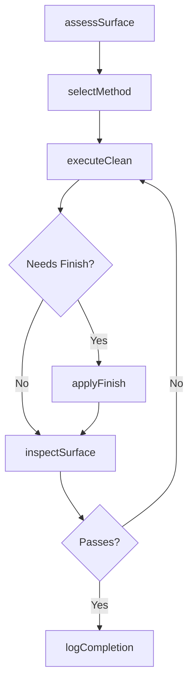
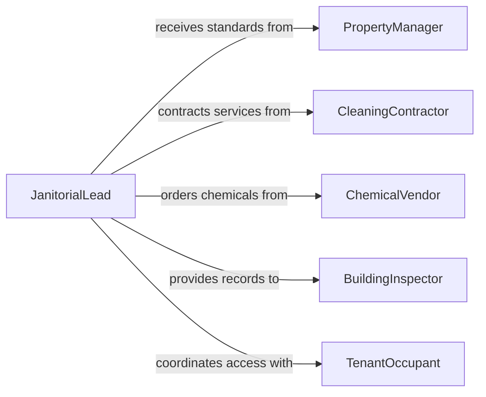

# Clean Building Walls and Flooring

> Business-as-Code definition for cleaning, washing, and restoring building walls and flooring surfaces across commercial, industrial, and institutional facilities.

## Overview

Building wall and floor cleaning covers the maintenance of interior and exterior surfaces including tile, concrete, carpet, hardwood, painted walls, and glass partitions. This definition models surface assessment, cleaning method selection, execution of cleaning procedures, and post-cleaning verification to preserve building appearance, hygiene, and longevity.

## Actors

| Actor | Description |
|-------|-------------|
| PropertyManager | Defines cleaning standards and approves service contracts |
| CleaningContractor | Provides specialized wall and floor cleaning services |
| ChemicalVendor | Supplies surface-specific cleaning agents and sealants |
| BuildingInspector | Evaluates facility conditions during regulatory reviews |
| TenantOccupant | Reports surface cleaning needs and provides access |

## Roles

| Role | Description |
|------|-------------|
| FloorCareTechnician | Operates floor cleaning and restoration equipment |
| JanitorialLead | Assigns and supervises wall and floor cleaning tasks |
| FacilitiesCoordinator | Schedules cleaning around building occupancy |
| QualityReviewer | Inspects cleaned surfaces for compliance with standards |

## Entities

| Entity | Description |
|--------|-------------|
| SurfaceProfile | A record of surface type, finish, and cleaning requirements |
| CleaningTask | A scheduled or ad-hoc wall or floor cleaning assignment |
| CleaningMethod | A procedure specifying chemicals, equipment, and technique |
| FloorEquipment | Machines such as scrubbers, buffers, and extractors |
| InspectionResult | Documentation of post-cleaning surface condition |
| ChemicalApplication | A record of cleaning agents applied with dilution ratios |

## Actions

| Action | Description |
|--------|-------------|
| assessSurface | Evaluate surface type and condition before cleaning |
| selectMethod | Choose the appropriate cleaning method for the surface |
| executeClean | Perform the wall or floor cleaning procedure |
| applyFinish | Apply sealant, wax, or protective coating after cleaning |
| inspectSurface | Verify cleaned surface meets quality standards |
| logCompletion | Record the completed cleaning task with details |

## Events

| Event | Description |
|-------|-------------|
| surfaceAssessed | Surface condition has been evaluated |
| methodSelected | Cleaning method has been chosen for the surface |
| cleaningExecuted | Wall or floor cleaning procedure has been completed |
| finishApplied | Protective finish or sealant has been applied |
| surfaceInspected | Post-cleaning quality check has been performed |
| completionLogged | Cleaning task has been documented as complete |

## Searches

| Search | Description |
|--------|-------------|
| findTasksByZone | List cleaning tasks by building zone or floor |
| getSurfaceProfiles | Retrieve surface specifications for a facility |
| getCleaningHistory | Pull past cleaning records for a surface or area |
| findOverdueTasks | Locate wall or floor cleaning tasks past their schedule |

## Workflow



## Actor Relationships



## Usage

### Calling Actions

```typescript
import { cleanBuildingWallsFlooring } from '@headlessly/clean-building-walls-flooring'

const surfaces = cleanBuildingWallsFlooring()

// Assess and clean a lobby floor
const assessment = await surfaces.assessSurface({
  location: 'main-lobby',
  surfaceType: 'polished-marble',
  condition: 'light-soiling'
})

const method = await surfaces.selectMethod({
  surfaceProfileId: assessment.profileId,
  soilLevel: 'light'
})

await surfaces.executeClean({
  taskId: 'TASK-4021',
  methodId: method.id,
  technicianId: 'FCT-008'
})

// Apply protective finish
await surfaces.applyFinish({
  taskId: 'TASK-4021',
  finishType: 'marble-sealant',
  coats: 2
})
```

### Event-Driven Automation

```typescript
// Schedule follow-up inspection after finish cures
surfaces.finishApplied(async ({ taskId, cureTimeHours }) => {
  await scheduleTask({
    action: 'inspectSurface',
    taskId,
    delay: `${cureTimeHours}h`
  })
})

// Alert facilities when overdue tasks accumulate
surfaces.cleaningExecuted(async ({ zone }) => {
  const overdue = await surfaces.findOverdueTasks({ zone })
  if (overdue.length > 5) {
    await notify({
      to: 'facilities-coordinator',
      message: `${overdue.length} overdue surface cleaning tasks in ${zone}`
    })
  }
})
```
