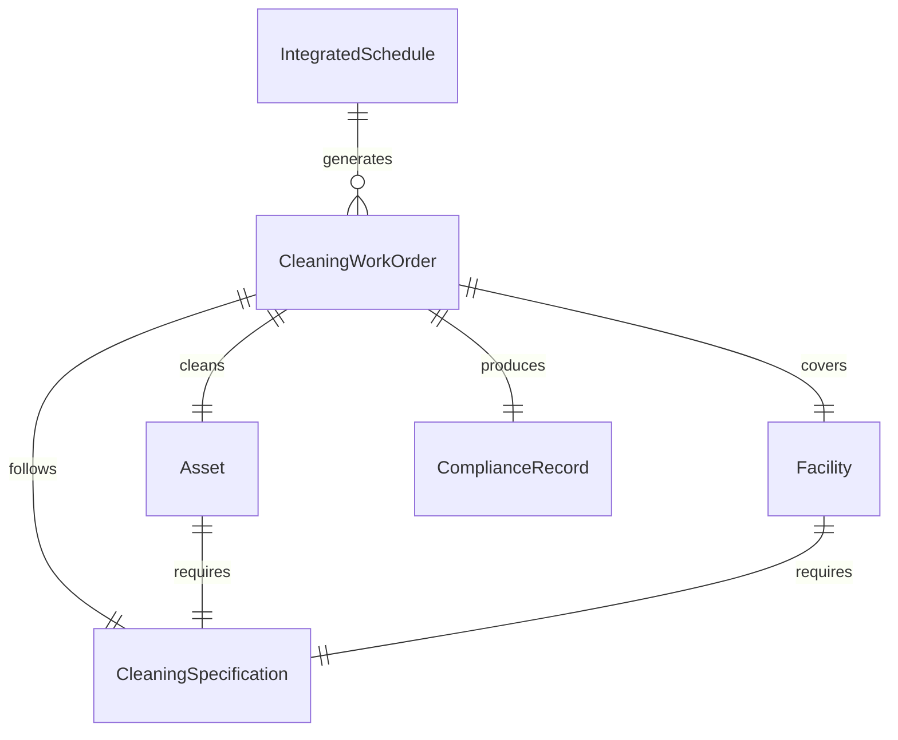
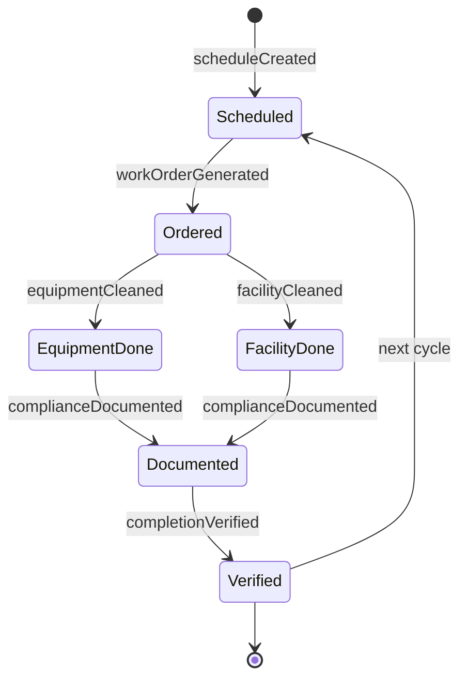
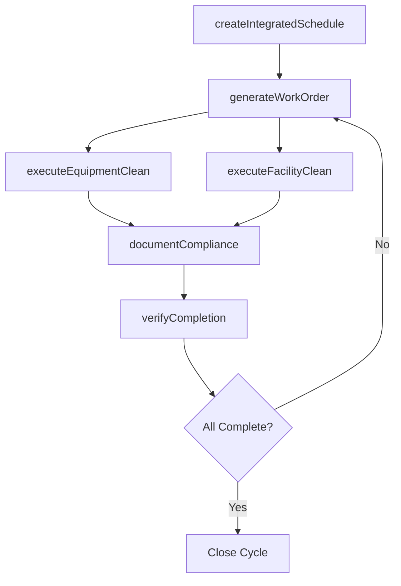
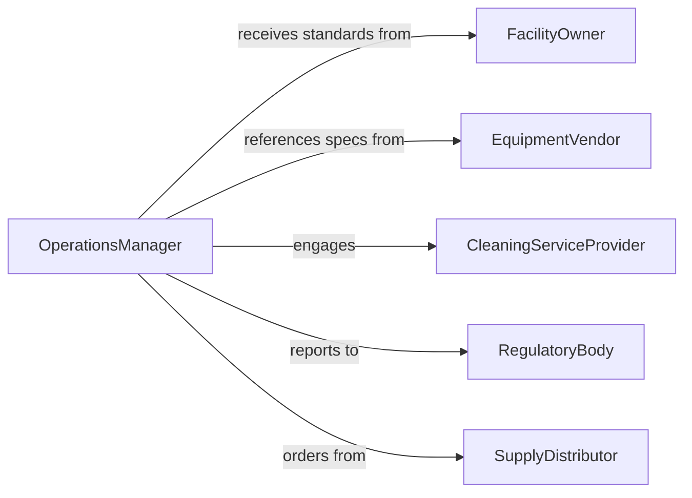

# Clean Equipment or Facilities

> Business-as-Code definition for the combined cleaning of equipment and facility spaces to maintain operational readiness, hygiene, and asset preservation.

## Overview

Equipment and facility cleaning addresses the integrated maintenance of both physical plant spaces and the machinery within them. This definition models the coordinated scheduling of equipment shutdowns with facility cleaning windows, execution of dual-scope cleaning procedures, and unified compliance documentation across both asset and space domains.

## Actors

| Actor | Description |
|-------|-------------|
| FacilityOwner | Establishes cleaning standards for both equipment and spaces |
| EquipmentVendor | Provides cleaning specifications for installed equipment |
| CleaningServiceProvider | Delivers both facility and equipment cleaning services |
| RegulatoryBody | Enforces hygiene and safety standards for the operation |
| SupplyDistributor | Provides cleaning chemicals and consumables |

## Roles

| Role | Description |
|------|-------------|
| OperationsManager | Coordinates equipment downtime with facility cleaning |
| CleaningTechnician | Performs both equipment and facility cleaning tasks |
| MaintenancePlanner | Schedules integrated cleaning activities |
| ComplianceAuditor | Verifies cleaning meets regulatory and internal standards |

## Entities

| Entity | Description |
|--------|-------------|
| CleaningWorkOrder | An integrated order covering equipment and facility scope |
| Asset | A piece of equipment with cleaning requirements |
| Facility | A physical space with cleaning requirements |
| IntegratedSchedule | A timeline aligning equipment and facility cleaning windows |
| ComplianceRecord | Documentation of cleaning activities for audit purposes |
| CleaningSpecification | Approved methods for a specific asset or space type |

## Actions

| Action | Description |
|--------|-------------|
| createIntegratedSchedule | Plan aligned cleaning windows for equipment and facilities |
| generateWorkOrder | Create a combined cleaning task for assets and spaces |
| executeEquipmentClean | Perform cleaning on machinery and equipment |
| executeFacilityClean | Perform cleaning on the surrounding facility space |
| documentCompliance | Record cleaning activities for regulatory reporting |
| verifyCompletion | Confirm both equipment and facility cleaning are done |

## Events

| Event | Description |
|-------|-------------|
| scheduleCreated | An integrated cleaning schedule has been established |
| workOrderGenerated | A combined cleaning task has been created |
| equipmentCleaned | Equipment cleaning has been completed |
| facilityCleaned | Facility space cleaning has been completed |
| complianceDocumented | Cleaning records have been filed for audit |
| completionVerified | Both equipment and facility cleaning confirmed done |

## Searches

| Search | Description |
|--------|-------------|
| findUpcomingCleanings | List scheduled cleaning activities by date range |
| getWorkOrders | Retrieve work orders by status, asset, or facility |
| getComplianceRecords | Pull cleaning documentation for audit review |
| findOverdueCleanings | Locate equipment or facilities past their cleaning schedule |

## Entity Relationships



## State Diagram



## Workflow



## Actor Relationships



## Usage

### Calling Actions

```typescript
import { cleanEquipmentFacilities } from '@headlessly/clean-equipment-facilities'

const cleaning = cleanEquipmentFacilities()

// Create an integrated cleaning schedule
const schedule = await cleaning.createIntegratedSchedule({
  facilityId: 'PLANT-B',
  assets: ['CONV-01', 'CONV-02', 'PACK-LINE-A'],
  frequency: 'weekly',
  preferredWindow: 'sunday-overnight'
})

// Generate and execute work orders
const order = await cleaning.generateWorkOrder({
  scheduleId: schedule.id,
  date: '2026-02-08'
})

await cleaning.executeEquipmentClean({ workOrderId: order.id })
await cleaning.executeFacilityClean({ workOrderId: order.id })
await cleaning.verifyCompletion({ workOrderId: order.id })
```

### Event-Driven Automation

```typescript
// Alert when cleaning is overdue
cleaning.completionVerified(async ({ workOrderId, facilityId }) => {
  const overdue = await cleaning.findOverdueCleanings({ facilityId })
  if (overdue.length > 0) {
    await notify({
      to: 'maintenance-planner',
      message: `${overdue.length} overdue cleanings at ${facilityId}`
    })
  }
})

// Auto-file compliance documentation
cleaning.completionVerified(async ({ workOrderId }) => {
  await cleaning.documentCompliance({ workOrderId, autoFile: true })
})
```
