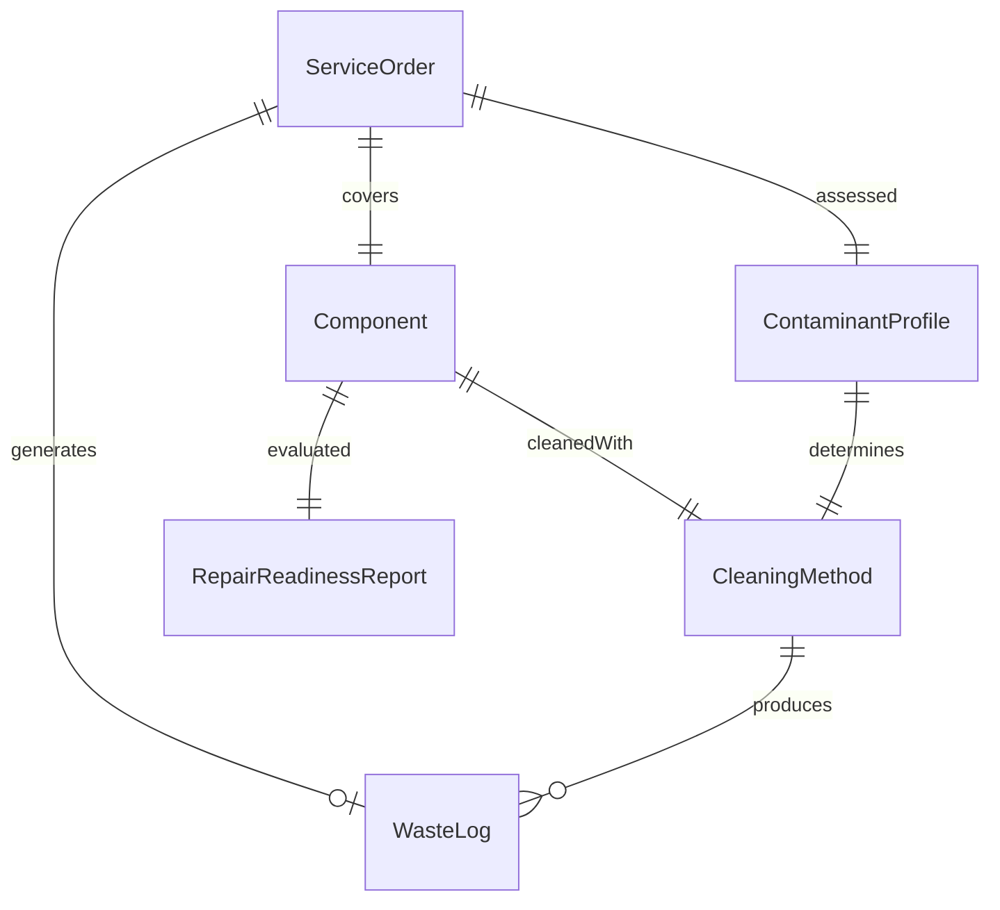
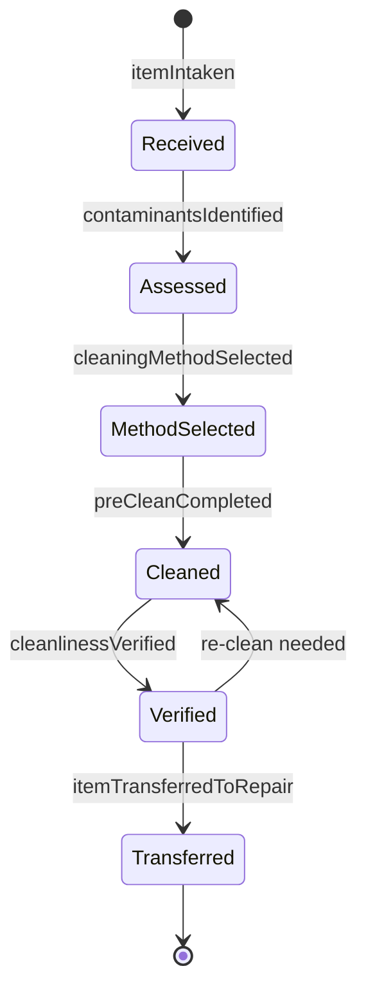
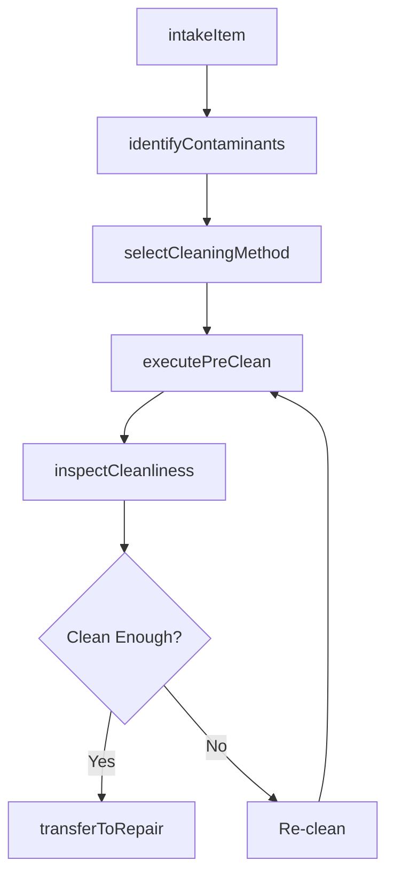
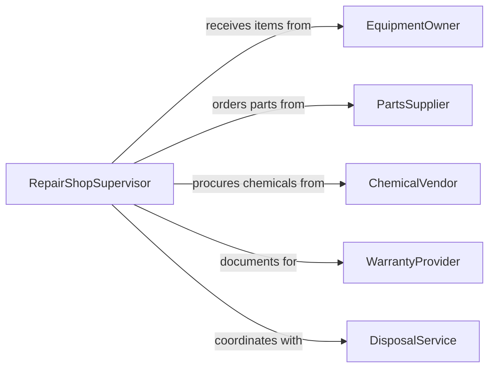

# Clean Equipment, Parts, and Tools for Repair

> Business-as-Code definition for cleaning equipment, parts, and tools as a prerequisite to repair and maintenance activities that keep assets in good working order.

## Overview

Cleaning equipment, parts, and tools for repair involves the preparatory removal of contaminants, corrosion, and residue from components before maintenance work can begin. This definition models the intake of items for service, the selection and execution of appropriate cleaning methods, post-cleaning inspection to assess repairability, and handoff to maintenance technicians for further work.

## Actors

| Actor | Description |
|-------|-------------|
| EquipmentOwner | Submits equipment for cleaning and repair service |
| PartsSupplier | Provides replacement components when cleaning reveals wear |
| ChemicalVendor | Supplies specialized cleaning solvents and degreasers |
| WarrantyProvider | Requires documented cleaning procedures for coverage |
| DisposalService | Handles spent cleaning solvents and contaminated waste |

## Roles

| Role | Description |
|------|-------------|
| RepairShopSupervisor | Manages the intake and prioritization of cleaning orders |
| CleaningTechnician | Performs pre-repair cleaning of equipment and parts |
| MaintenanceMechanic | Receives cleaned items and performs repair work |
| QualityInspector | Verifies cleaning adequacy before repair proceeds |

## Entities

| Entity | Description |
|--------|-------------|
| ServiceOrder | A request to clean and prepare equipment for repair |
| Component | A part, tool, or equipment item requiring cleaning |
| CleaningMethod | A procedure matched to the type of contamination |
| ContaminantProfile | A record of substances to be removed during cleaning |
| RepairReadinessReport | An assessment confirming the item is clean enough for repair |
| WasteLog | Documentation of spent cleaning materials and disposal |

## Actions

| Action | Description |
|--------|-------------|
| intakeItem | Receive equipment, part, or tool for pre-repair cleaning |
| identifyContaminants | Assess the type and severity of contamination |
| selectCleaningMethod | Choose the appropriate cleaning approach for the item |
| executePreClean | Perform the cleaning procedure to prepare for repair |
| inspectCleanliness | Verify the item meets cleanliness standards for repair |
| transferToRepair | Hand off the cleaned item to the maintenance team |

## Events

| Event | Description |
|-------|-------------|
| itemIntaken | Equipment or part has been received for cleaning |
| contaminantsIdentified | Type and severity of contamination has been assessed |
| cleaningMethodSelected | Appropriate cleaning approach has been chosen |
| preCleanCompleted | Cleaning procedure has been finished |
| cleanlinessVerified | Item confirmed clean enough for repair work |
| itemTransferredToRepair | Cleaned item has been handed off to maintenance |

## Searches

| Search | Description |
|--------|-------------|
| findPendingIntakes | List items awaiting pre-repair cleaning |
| getServiceOrders | Retrieve cleaning and repair orders by status |
| getCleaningMethods | Look up approved methods by contamination type |
| findItemsReadyForRepair | Locate items that have passed cleanliness inspection |

## Entity Relationships



## State Diagram



## Workflow



## Actor Relationships



## Usage

### Calling Actions

```typescript
import { cleanEquipmentPartsToolsRepair } from '@headlessly/clean-equipment-parts-tools-repair'

const shop = cleanEquipmentPartsToolsRepair()

// Intake a hydraulic pump for pre-repair cleaning
const order = await shop.intakeItem({
  itemId: 'HYD-PUMP-114',
  type: 'hydraulic-pump',
  condition: 'heavy-grease-buildup',
  repairType: 'seal-replacement'
})

// Identify and clean
await shop.identifyContaminants({
  orderId: order.id,
  contaminants: ['hydraulic-fluid', 'metal-shavings', 'corrosion']
})

await shop.executePreClean({
  orderId: order.id,
  method: 'ultrasonic-degreasing',
  duration: 45
})

// Transfer to repair after inspection
await shop.transferToRepair({
  orderId: order.id,
  mechanicId: 'MECH-007'
})
```

### Event-Driven Automation

```typescript
// Auto-order replacement parts when corrosion is found
shop.contaminantsIdentified(async ({ orderId, contaminants }) => {
  if (contaminants.includes('corrosion')) {
    await notify({
      to: 'parts-procurement',
      message: `Order ${orderId} has corrosion - check if replacement parts are needed`
    })
  }
})

// Notify mechanic when item is ready
shop.cleanlinessVerified(async ({ orderId, itemId }) => {
  await notify({
    to: 'maintenance-mechanic',
    message: `Item ${itemId} is cleaned and ready for repair`
  })
})
```
