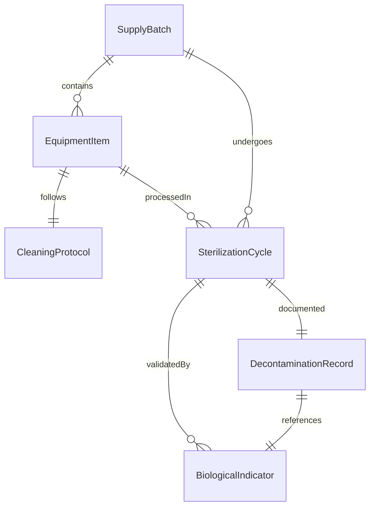
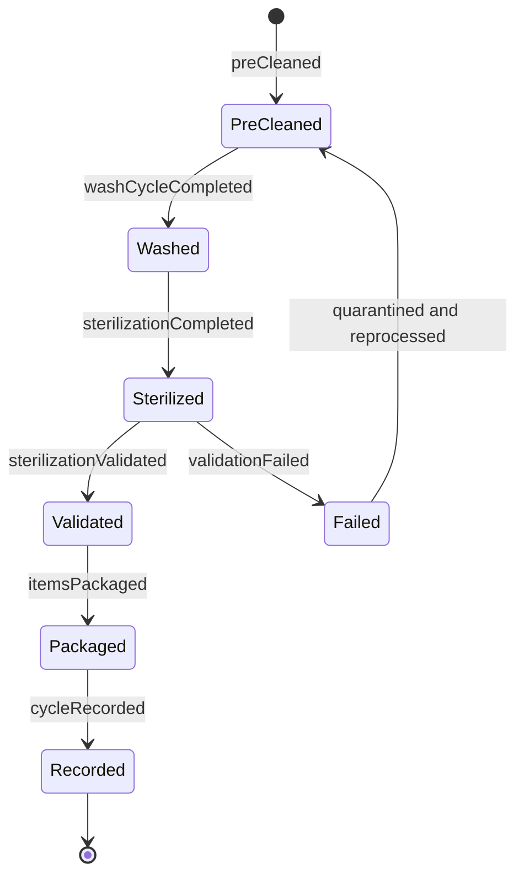
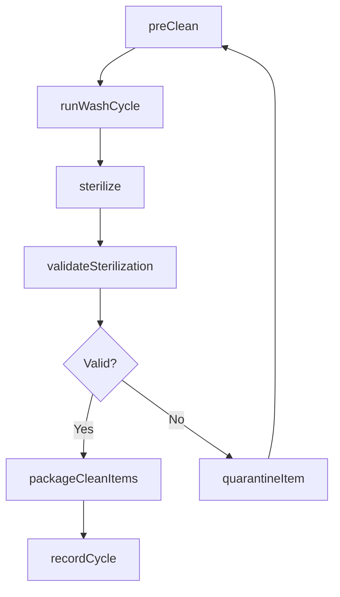
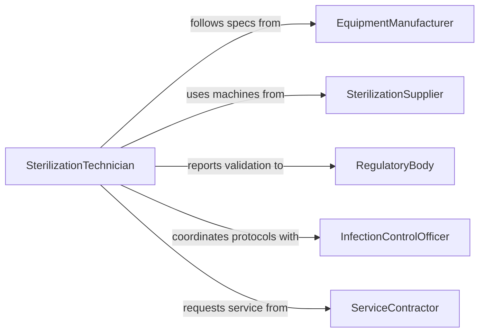

# Clean Equipment Supplies

> Business-as-Code definition for cleaning equipment and supplies. Models the processes for decontaminating, sanitizing, and maintaining operational equipment and reusable supplies across healthcare, laboratory, manufacturing, and service environments.

## Overview

Cleaning equipment and supplies involves removing contaminants, residues, and biological material from tools, instruments, machinery, and reusable materials to restore them to a safe and functional state. This activity is critical in healthcare for sterilizing surgical instruments, in laboratories for preventing cross-contamination, and in manufacturing for maintaining production quality. The definition covers manual and automated cleaning methods, sterilization protocols, and tracking of cleaning cycles for regulatory compliance.

## Actors

| Actor | Description |
|-------|-------------|
| EquipmentManufacturer | Provides cleaning specifications and compatible cleaning agents |
| SterilizationSupplier | Supplies autoclaves, washer-disinfectors, and sterilization consumables |
| RegulatoryBody | Sets cleaning and sterilization standards for equipment reuse |
| InfectionControlOfficer | Monitors decontamination practices in healthcare settings |
| ServiceContractor | Performs specialized cleaning on complex or large-scale equipment |

## Roles

| Role | Description |
|------|-------------|
| SterilizationTechnician | Operates cleaning and sterilization equipment following protocols |
| EquipmentOperator | Performs routine cleaning of tools and supplies after each use |
| QualityAssuranceSpecialist | Validates that cleaning processes meet required standards |
| SupplyChainCoordinator | Tracks cleaned equipment inventory and rotation schedules |

## Entities

| Entity | Description |
|--------|-------------|
| EquipmentItem | A specific tool, instrument, or machine requiring cleaning |
| CleaningProtocol | Step-by-step instructions for cleaning a category of equipment |
| SterilizationCycle | A timed process using heat, chemicals, or radiation to sterilize items |
| DecontaminationRecord | Documentation of cleaning steps, parameters, and outcomes |
| SupplyBatch | A group of reusable supplies processed through a cleaning cycle |
| BiologicalIndicator | A test strip used to verify sterilization effectiveness |

## Actions

| Action | Description |
|--------|-------------|
| preClean | Remove gross contamination from equipment before main cleaning |
| runWashCycle | Execute automated or manual washing of equipment and supplies |
| sterilize | Process equipment through a sterilization cycle |
| validateSterilization | Test biological indicators to confirm sterilization success |
| packageCleanItems | Wrap or package sterilized equipment for storage or use |
| recordCycle | Document cleaning parameters and outcomes for traceability |
| quarantineItem | Isolate equipment that fails cleaning validation for reprocessing |

## Events

| Event | Description |
|-------|-------------|
| preCleaned | Gross contamination has been removed from equipment |
| washCycleCompleted | Equipment has completed the washing process |
| sterilizationCompleted | A sterilization cycle has finished processing |
| sterilizationValidated | Biological indicators confirm successful sterilization |
| itemsPackaged | Cleaned equipment has been packaged for storage or distribution |
| cycleRecorded | Cleaning and sterilization data has been documented |
| validationFailed | A sterilization cycle did not meet required parameters |

## Searches

| Search | Description |
|--------|-------------|
| findEquipmentByStatus | List equipment items by cleaning status such as dirty, in-process, or sterile |
| getCycleHistory | Retrieve sterilization and cleaning records for a specific item or batch |
| getValidationResults | Access biological indicator test results for compliance review |

## Entity Relationships



## State Diagram



## Workflow



## Actor Relationships



## Usage

### Calling Actions

```typescript
import { cleanEquipmentSupplies } from '@headlessly/clean-equipment-supplies'

const cleaning = cleanEquipmentSupplies()

// Pre-clean surgical instruments after a procedure
await cleaning.preClean({
  items: ['forceps-22', 'scalpel-handle-4', 'retractor-15'],
  method: 'enzymatic-soak',
  duration: 300
})

// Run through the washer-disinfector
await cleaning.runWashCycle({
  batchId: 'batch-2026-0205-am',
  machine: 'washer-disinfector-03',
  program: 'surgical-instruments',
  temperature: 93
})

// Sterilize and validate
await cleaning.sterilize({
  batchId: 'batch-2026-0205-am',
  method: 'steam-autoclave',
  temperature: 134,
  duration: 180
})

const validation = await cleaning.validateSterilization({
  batchId: 'batch-2026-0205-am',
  indicator: 'geobacillus-stearothermophilus'
})
```

### Event-Driven Automation

```typescript
// Alert on failed sterilization validation
cleaning.validationFailed(async ({ batchId, reason, cycleParams }) => {
  await notify({
    to: 'quality-assurance',
    message: `Sterilization failed for ${batchId}: ${reason}. Batch quarantined for reprocessing.`
  })
})

// Auto-package items after successful validation
cleaning.sterilizationValidated(async ({ batchId, items }) => {
  await cleaning.packageCleanItems({
    batchId,
    packaging: 'peel-pouch',
    expirationDays: 30
  })
})
```
