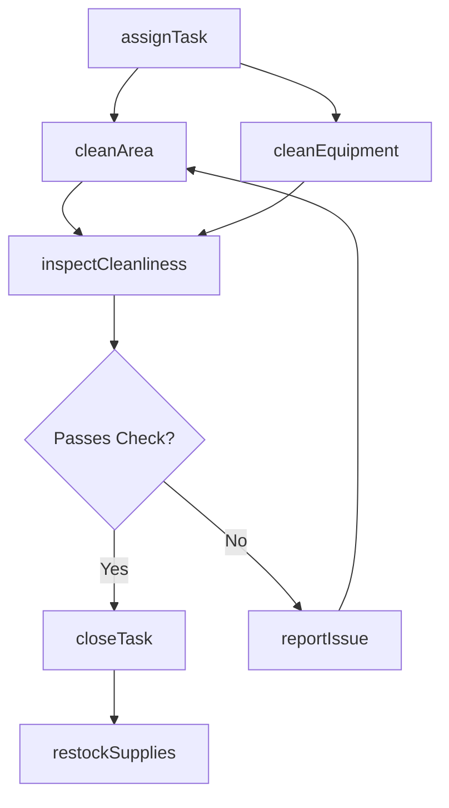
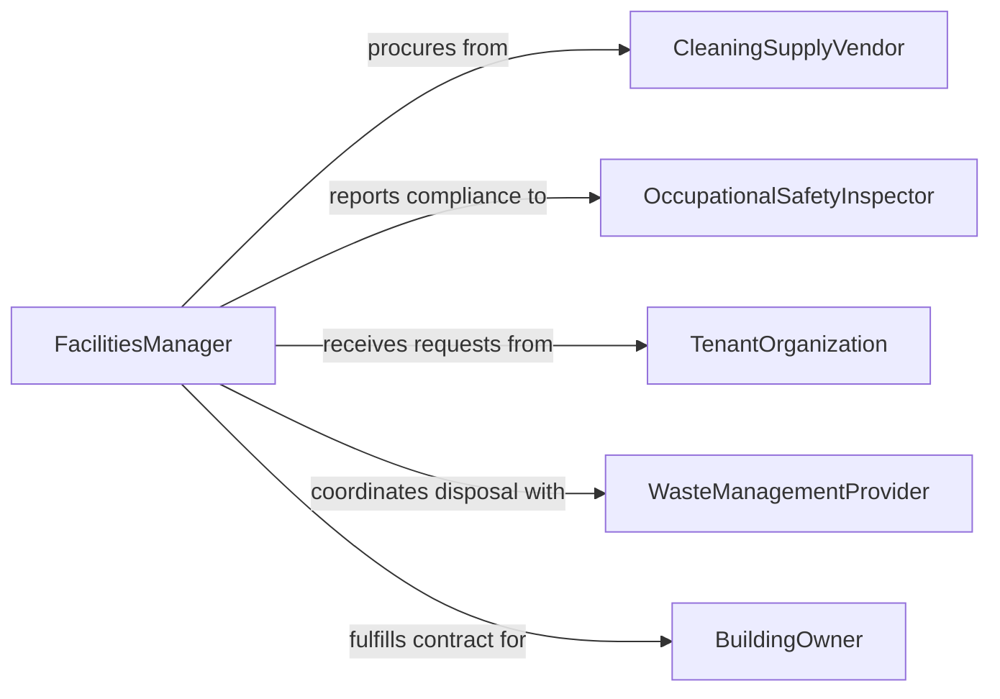

# Clean Facilities Equipment

> Business-as-Code definition for cleaning facilities and equipment. Models the general-purpose cleaning and maintenance processes for buildings, rooms, and operational equipment across commercial, industrial, and institutional settings.

## Overview

Cleaning facilities and equipment encompasses routine and scheduled maintenance of building interiors, exterior areas, and operational machinery to maintain hygiene, safety, and operational readiness. This includes sweeping, mopping, disinfecting, and decontaminating surfaces as well as cleaning production equipment, HVAC systems, and shared spaces. The definition covers task assignment, cleaning execution, quality verification, and compliance documentation across diverse facility types.

## Actors

| Actor | Description |
|-------|-------------|
| BuildingOwner | Contracts cleaning services and sets facility standards |
| CleaningSupplyVendor | Provides detergents, disinfectants, and cleaning tools |
| OccupationalSafetyInspector | Audits facility cleanliness for workplace safety compliance |
| TenantOrganization | Occupies the facility and reports cleaning needs |
| WasteManagementProvider | Handles disposal of cleaning waste and hazardous materials |

## Roles

| Role | Description |
|------|-------------|
| FacilityCustodian | Performs daily cleaning of floors, restrooms, and common areas |
| MaintenanceTechnician | Cleans and maintains operational equipment and mechanical systems |
| FacilitiesManager | Schedules cleaning activities and allocates custodial resources |
| QualityAuditor | Inspects cleaned areas and equipment against cleanliness standards |

## Entities

| Entity | Description |
|--------|-------------|
| Facility | A building or site requiring regular cleaning and upkeep |
| CleaningTask | A specific cleaning job assigned to a custodian or technician |
| EquipmentAsset | A piece of machinery or system requiring periodic cleaning |
| CleaningSchedule | A recurring plan defining cleaning frequency and scope per area |
| InspectionReport | Documentation of post-cleaning quality checks |
| SupplyInventory | Stock levels of cleaning agents, tools, and consumables |

## Actions

| Action | Description |
|--------|-------------|
| assignTask | Create and assign a cleaning task to a custodian or technician |
| cleanArea | Execute cleaning procedures for a designated facility zone |
| cleanEquipment | Perform cleaning on a specific piece of operational equipment |
| inspectCleanliness | Verify that cleaned areas or equipment meet required standards |
| restockSupplies | Replenish cleaning agents and consumable materials |
| reportIssue | Flag maintenance issues discovered during cleaning |
| closeTask | Mark a cleaning task as completed with documentation |

## Events

| Event | Description |
|-------|-------------|
| taskAssigned | A cleaning task has been created and assigned to personnel |
| areaCleaned | A facility zone has been cleaned according to schedule |
| equipmentCleaned | An equipment asset has been cleaned and returned to service |
| cleanlinessApproved | Post-cleaning inspection has confirmed acceptable standards |
| issueReported | A maintenance or safety concern has been flagged during cleaning |
| suppliesRestocked | Cleaning materials have been replenished to required levels |
| taskClosed | A cleaning task has been completed and documented |

## Searches

| Search | Description |
|--------|-------------|
| findTasks | List cleaning tasks by facility, status, assignee, or date |
| getInspectionHistory | Retrieve cleanliness inspection reports for a facility or asset |
| getSupplyLevels | Check current inventory of cleaning supplies and consumables |

## Workflow



## Actor Relationships



## Usage

### Calling Actions

```typescript
import { cleanFacilitiesEquipment } from '@headlessly/clean-facilities-equipment'

const facilities = cleanFacilitiesEquipment()

// Assign a nightly cleaning task for the office building lobby
const task = await facilities.assignTask({
  facility: 'building-a',
  area: 'main-lobby',
  assignee: 'custodian-12',
  type: 'routine-nightly',
  checklist: ['vacuum-carpets', 'mop-tile', 'disinfect-surfaces', 'empty-trash']
})

// Clean a production line conveyor system
await facilities.cleanEquipment({
  assetId: 'conveyor-belt-07',
  method: 'pressure-wash',
  detergent: 'industrial-degreaser',
  downtime: 45
})

// Inspect and close out the task
const inspection = await facilities.inspectCleanliness({
  taskId: task.id,
  standard: 'ISSA-clean-standard'
})
```

### Event-Driven Automation

```typescript
// Notify maintenance when issues are found during cleaning
facilities.issueReported(async ({ facilityId, area, description }) => {
  await notify({
    to: 'maintenance-team',
    message: `Issue in ${facilityId} / ${area}: ${description}`
  })
})

// Auto-reorder supplies when stock drops below threshold
facilities.suppliesRestocked(async ({ item, currentLevel, reorderPoint }) => {
  if (currentLevel <= reorderPoint) {
    await facilities.restockSupplies({
      item,
      quantity: reorderPoint * 2,
      vendor: 'preferred-supplier'
    })
  }
})
```
