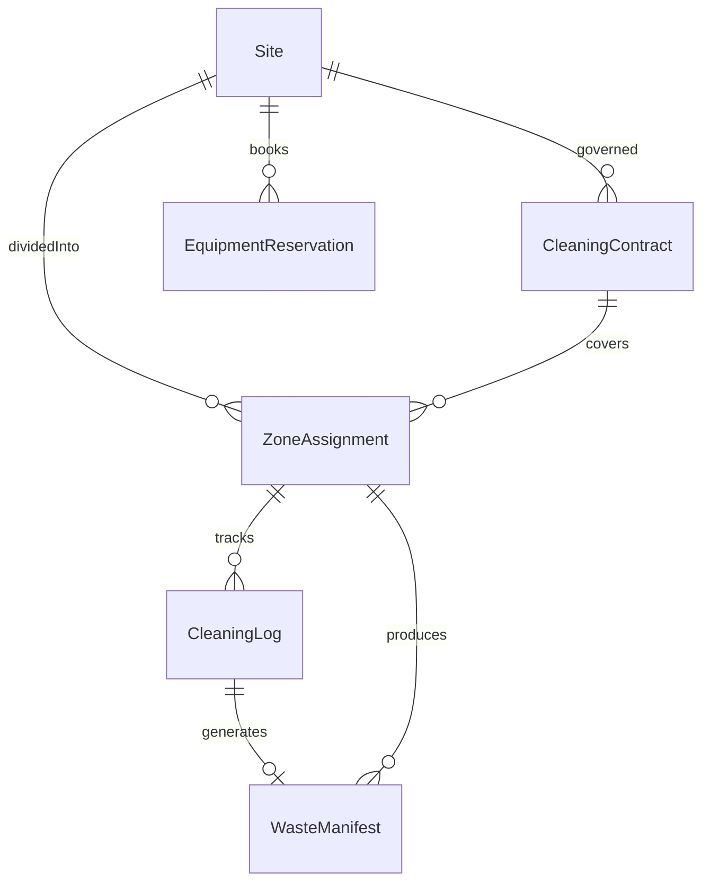
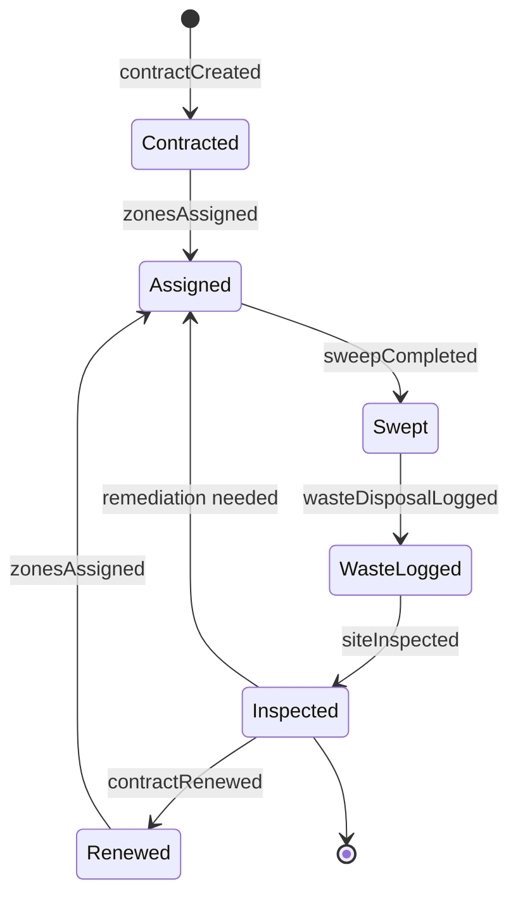
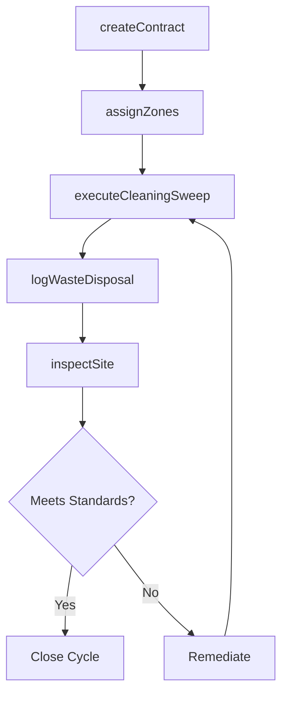
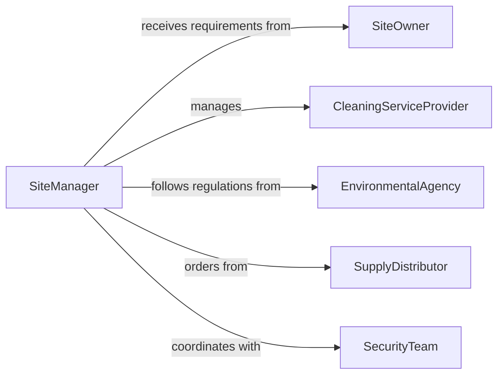

# Clean Facilities or Sites

> Business-as-Code definition for the comprehensive cleaning of entire facilities and sites including grounds, exteriors, and interior common areas.

## Overview

Facility and site cleaning involves full-scope cleaning operations for buildings, campuses, and grounds including pressure washing, window cleaning, parking area maintenance, and interior deep cleaning. This definition covers the coordination of multi-zone cleaning efforts, vendor management, and documentation needed to maintain site-wide cleanliness standards.

## Actors

| Actor | Description |
|-------|-------------|
| SiteOwner | Establishes cleaning requirements and budget allocations |
| CleaningServiceProvider | Delivers contracted cleaning services for the site |
| EnvironmentalAgency | Regulates runoff, waste disposal, and cleaning chemicals |
| SupplyDistributor | Provides bulk cleaning materials and equipment |
| SecurityTeam | Provides access and coordinates cleaning around security protocols |

## Roles

| Role | Description |
|------|-------------|
| SiteManager | Oversees all cleaning operations across the facility |
| CleaningCrewLead | Directs on-site cleaning teams and manages task flow |
| GroundsMaintenanceWorker | Handles exterior and grounds cleaning tasks |
| ComplianceOfficer | Ensures cleaning practices meet environmental regulations |

## Entities

| Entity | Description |
|--------|-------------|
| Site | A physical property with defined boundaries and zones |
| CleaningContract | A service agreement specifying scope, frequency, and standards |
| ZoneAssignment | A mapping of cleaning crews to facility zones |
| CleaningLog | A timestamped record of completed cleaning activities |
| EquipmentReservation | A booking for specialized cleaning machinery |
| WasteManifest | Documentation of waste generated and disposal methods |

## Actions

| Action | Description |
|--------|-------------|
| createContract | Establish a cleaning service agreement for the site |
| assignZones | Map cleaning crews to specific facility zones |
| executeCleaningSweep | Perform a full cleaning pass across assigned zones |
| logWasteDisposal | Record waste volumes and disposal methods used |
| inspectSite | Conduct a comprehensive site cleanliness audit |
| renewContract | Extend or modify an existing cleaning service agreement |

## Events

| Event | Description |
|-------|-------------|
| contractCreated | A cleaning service agreement has been established |
| zonesAssigned | Cleaning crews have been mapped to facility zones |
| sweepCompleted | A full cleaning pass has been finished |
| wasteDisposalLogged | Waste disposal records have been documented |
| siteInspected | A comprehensive cleanliness audit has been completed |
| contractRenewed | A cleaning service agreement has been extended |

## Searches

| Search | Description |
|--------|-------------|
| findActiveContracts | List current cleaning service agreements |
| getZoneAssignments | Retrieve crew-to-zone mappings for a site |
| getCleaningLogs | Pull cleaning activity records by date or zone |
| findInspectionResults | Locate audit results for a site or zone |

## Entity Relationships



## State Diagram



## Workflow



## Actor Relationships



## Usage

### Calling Actions

```typescript
import { cleanFacilitiesSites } from '@headlessly/clean-facilities-sites'

const site = cleanFacilitiesSites()

// Set up a cleaning contract
const contract = await site.createContract({
  siteId: 'CAMPUS-NORTH',
  provider: 'ProClean Services',
  zones: ['building-a', 'building-b', 'parking', 'grounds'],
  frequency: 'weekly',
  startDate: '2026-01-01'
})

// Execute a full cleaning sweep
await site.executeCleaningSweep({
  contractId: contract.id,
  zones: ['building-a', 'parking'],
  crewId: 'CREW-12'
})

// Inspect the site
await site.inspectSite({
  siteId: 'CAMPUS-NORTH',
  inspectorId: 'CO-005'
})
```

### Event-Driven Automation

```typescript
// Notify site owner of completed inspections
site.siteInspected(async ({ siteId, score, deficiencies }) => {
  await notify({
    to: 'site-owner',
    message: `Site ${siteId} inspection score: ${score}. Issues: ${deficiencies.length}`
  })
})

// Auto-schedule remediation for failed inspections
site.siteInspected(async ({ siteId, score }) => {
  if (score < 80) {
    await site.executeCleaningSweep({
      siteId,
      priority: 'urgent',
      scope: 'remediation'
    })
  }
})
```
