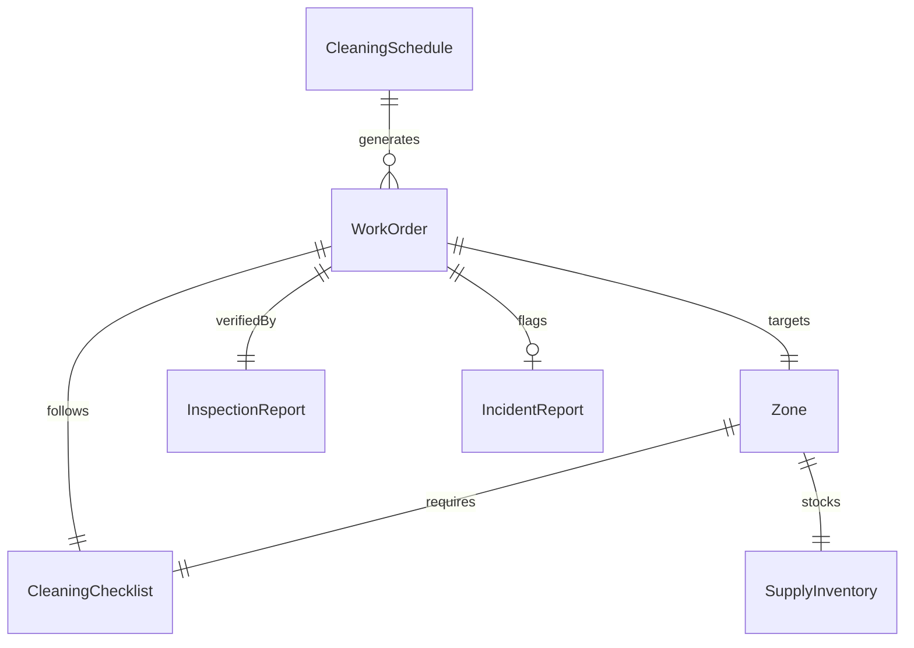
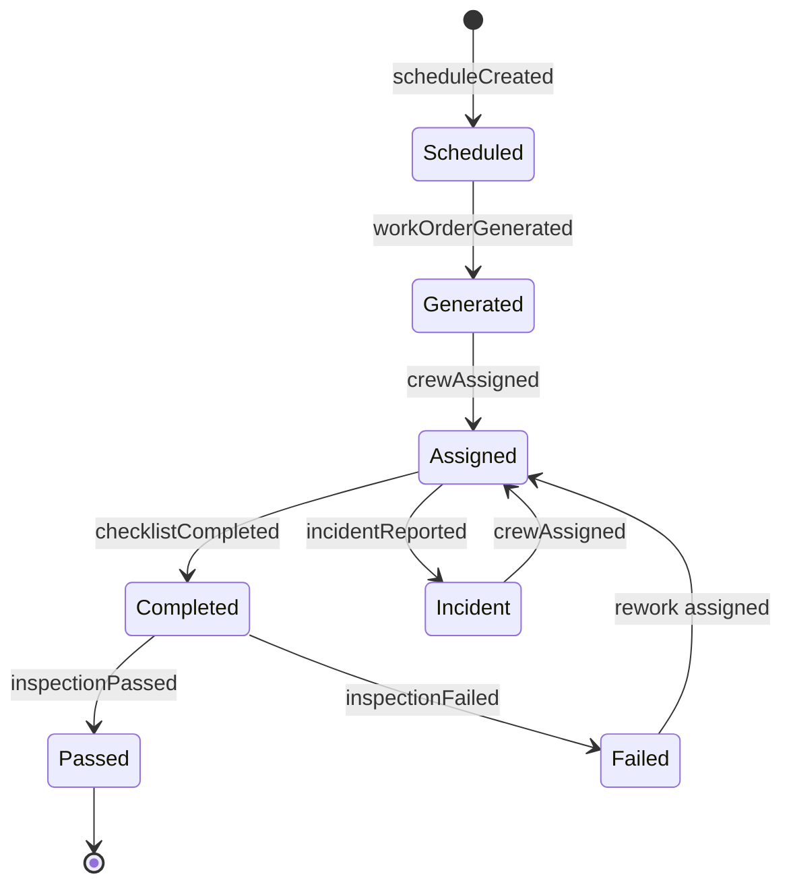
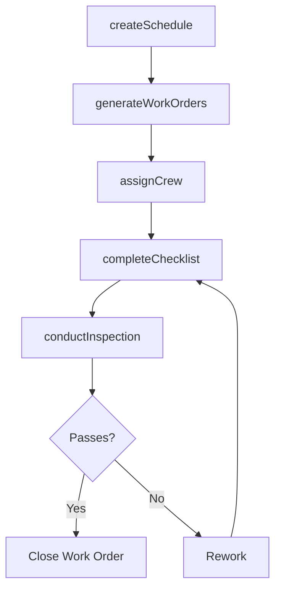
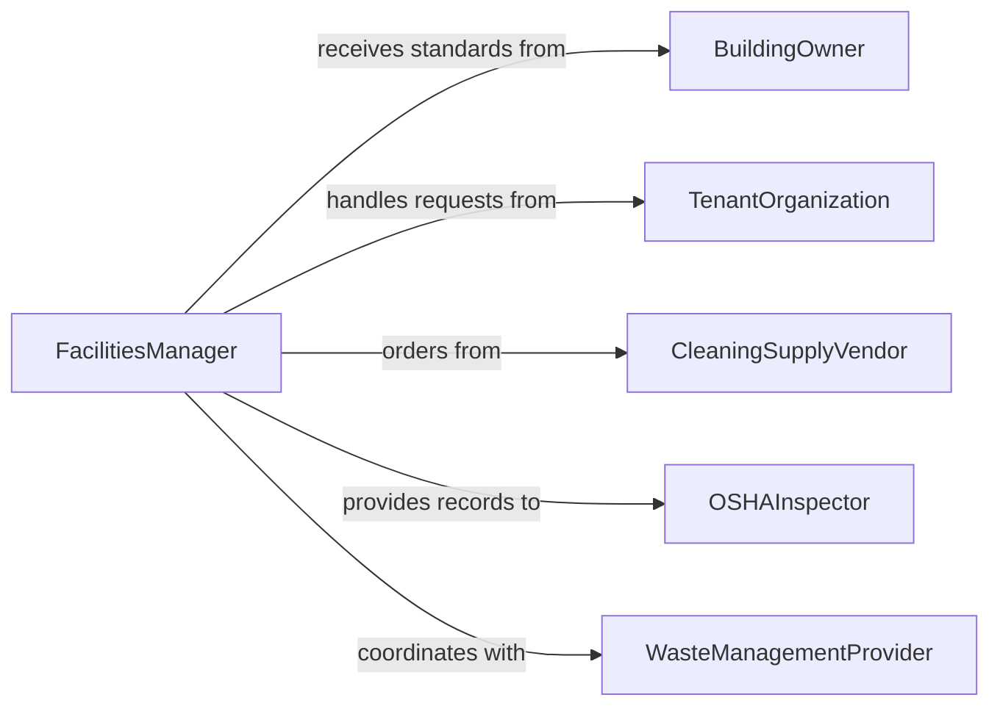

# Clean Facilities and Work Areas

> Business-as-Code definition for cleaning and maintaining commercial, industrial, and institutional facilities and their associated work areas.

## Overview

Facility and work area cleaning encompasses routine and deep-cleaning operations across commercial buildings, offices, warehouses, and institutional spaces. This definition models the scheduling, execution, and verification of cleaning activities including surface sanitization, floor care, restroom servicing, and common area maintenance to meet occupational health and building standards.

## Actors

| Actor | Description |
|-------|-------------|
| BuildingOwner | Sets facility cleanliness standards and approves budgets |
| TenantOrganization | Requests cleaning services and reports facility issues |
| CleaningSupplyVendor | Provides cleaning products, chemicals, and equipment |
| OSHAInspector | Enforces workplace cleanliness and safety standards |
| WasteManagementProvider | Handles trash collection and recycling services |

## Roles

| Role | Description |
|------|-------------|
| FacilitiesManager | Oversees cleaning operations and vendor relationships |
| JanitorialSupervisor | Manages cleaning crews and daily task assignments |
| Custodian | Performs day-to-day cleaning and maintenance tasks |
| QualityInspector | Conducts walk-throughs to verify cleaning standards |

## Entities

| Entity | Description |
|--------|-------------|
| CleaningSchedule | A recurring plan for cleaning tasks by zone and frequency |
| WorkOrder | A specific cleaning task assignment for a location |
| Zone | A defined area within a facility with cleaning requirements |
| CleaningChecklist | A list of tasks to complete for a given zone |
| SupplyInventory | Stock levels of cleaning products and equipment |
| InspectionReport | Documentation of cleaning quality verification |
| IncidentReport | Record of spills, biohazards, or urgent cleaning needs |

## Actions

| Action | Description |
|--------|-------------|
| createSchedule | Define a recurring cleaning plan for facility zones |
| generateWorkOrders | Create daily task assignments from the master schedule |
| assignCrew | Assign custodial staff to specific work orders |
| completeChecklist | Mark cleaning tasks as finished for a zone |
| conductInspection | Perform a quality walk-through of cleaned areas |
| reportIncident | Log an urgent or unscheduled cleaning need |
| reorderSupplies | Place orders for depleted cleaning materials |

## Events

| Event | Description |
|-------|-------------|
| scheduleCreated | A new cleaning schedule has been established |
| workOrderGenerated | Daily cleaning tasks have been created |
| crewAssigned | Custodial staff have been assigned to work orders |
| checklistCompleted | All cleaning tasks for a zone have been finished |
| inspectionPassed | Quality walk-through confirmed acceptable standards |
| inspectionFailed | Quality walk-through identified deficiencies |
| incidentReported | An urgent cleaning need has been logged |

## Searches

| Search | Description |
|--------|-------------|
| findOpenWorkOrders | List uncompleted cleaning tasks by zone or priority |
| getInspectionHistory | Retrieve quality check results over a date range |
| getSupplyLevels | Check current inventory of cleaning materials |
| findZonesByStatus | Locate zones by their current cleanliness status |

## Entity Relationships



## State Diagram



## Workflow



## Actor Relationships



## Usage

### Calling Actions

```typescript
import { cleanFacilitiesWorkAreas } from '@headlessly/clean-facilities-work-areas'

const facilities = cleanFacilitiesWorkAreas()

// Create a weekly cleaning schedule
const schedule = await facilities.createSchedule({
  facilityId: 'BLDG-100',
  zones: ['lobby', 'restrooms', 'breakroom', 'offices'],
  frequency: 'daily',
  deepCleanFrequency: 'weekly'
})

// Generate today's work orders
const orders = await facilities.generateWorkOrders({
  scheduleId: schedule.id,
  date: '2026-02-05'
})

// Complete and inspect
await facilities.completeChecklist({ workOrderId: orders[0].id })
await facilities.conductInspection({ workOrderId: orders[0].id, inspectorId: 'QI-003' })
```

### Event-Driven Automation

```typescript
// Auto-reorder when supplies run low
facilities.checklistCompleted(async ({ zoneId, suppliesUsed }) => {
  const levels = await facilities.getSupplyLevels({ zoneId })
  for (const item of levels.filter(s => s.quantity < s.reorderPoint)) {
    await facilities.reorderSupplies({ itemId: item.id, quantity: item.reorderQuantity })
  }
})

// Escalate failed inspections
facilities.inspectionFailed(async ({ workOrderId, deficiencies }) => {
  await notify({
    to: 'janitorial-supervisor',
    message: `Rework needed on ${workOrderId}: ${deficiencies.join(', ')}`
  })
})
```
