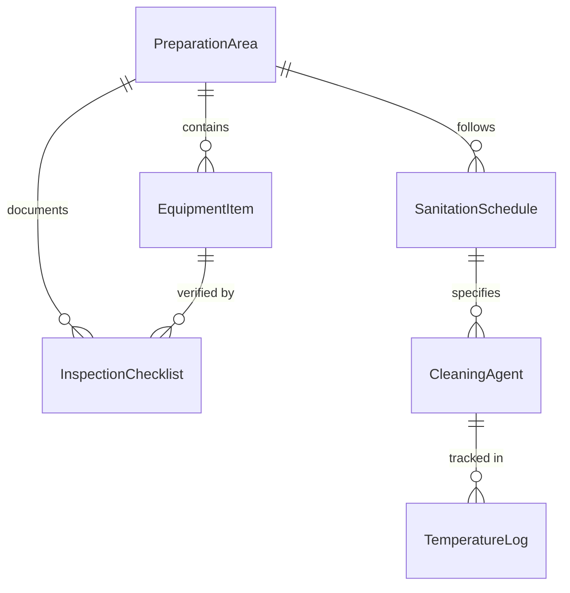
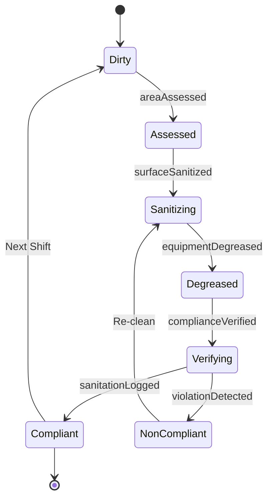
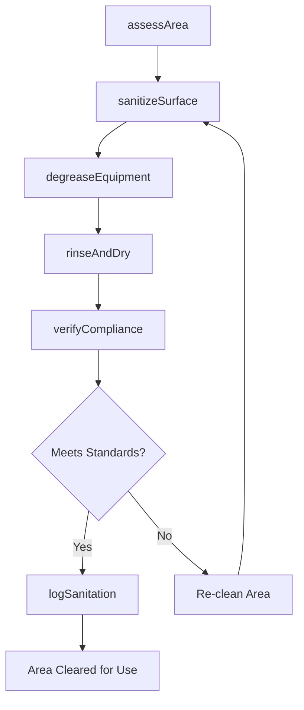
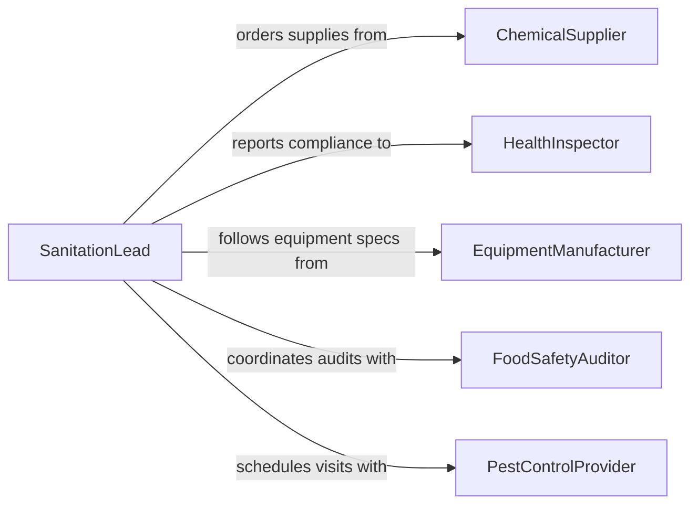

# Clean Food Preparation Areas Facilities

> Business-as-Code definition for cleaning food preparation areas, facilities, and equipment. Models sanitation workflows required to maintain food safety compliance in commercial kitchens, processing plants, and food service operations.

## Overview

Cleaning food preparation areas involves sanitizing countertops, cooking equipment, storage areas, and utensils to prevent contamination and foodborne illness. This activity follows strict health department and HACCP protocols, including scheduled deep cleans, between-task surface sanitization, and end-of-shift breakdown procedures. The definition covers the full sanitation lifecycle from pre-cleaning assessment through verification and documentation.

## Actors

| Actor | Description |
|-------|-------------|
| HealthInspector | Conducts facility audits and enforces food safety regulations |
| ChemicalSupplier | Provides food-safe sanitizers, degreasers, and cleaning agents |
| EquipmentManufacturer | Specifies cleaning procedures for commercial kitchen equipment |
| FoodSafetyAuditor | Performs third-party sanitation compliance assessments |
| PestControlProvider | Manages integrated pest management related to sanitation |

## Roles

| Role | Description |
|------|-------------|
| KitchenSteward | Performs routine cleaning and sanitation of preparation areas |
| SanitationLead | Coordinates cleaning schedules and verifies sanitation standards |
| FoodSafetyManager | Oversees HACCP compliance and sanitation documentation |
| ShiftChef | Ensures workstations are cleaned between food preparation tasks |

## Entities

| Entity | Description |
|--------|-------------|
| PreparationArea | A designated zone where food is handled, cut, or assembled |
| SanitationSchedule | A timetable defining cleaning frequency for each area and equipment |
| CleaningAgent | A food-safe chemical used for sanitizing surfaces and equipment |
| InspectionChecklist | A form documenting completed sanitation tasks and verification |
| EquipmentItem | A specific piece of kitchen equipment requiring cleaning |
| TemperatureLog | Record of sanitizer solution temperatures during cleaning cycles |

## Actions

| Action | Description |
|--------|-------------|
| assessArea | Evaluate the current condition of a preparation area before cleaning |
| sanitizeSurface | Apply food-safe sanitizer to countertops and cutting boards |
| degreaseEquipment | Remove grease buildup from cooking equipment and exhaust hoods |
| rinseAndDry | Remove chemical residues and dry surfaces to prevent contamination |
| verifyCompliance | Confirm sanitation meets required microbial count thresholds |
| logSanitation | Record completed cleaning tasks on the sanitation checklist |
| scheduleDeepClean | Plan intensive cleaning sessions for hard-to-reach areas |

## Events

| Event | Description |
|-------|-------------|
| areaAssessed | A preparation area has been evaluated for cleaning needs |
| surfaceSanitized | A food contact surface has been cleaned and sanitized |
| equipmentDegreased | Cooking equipment has been thoroughly degreased |
| complianceVerified | Sanitation has been confirmed to meet food safety standards |
| sanitationLogged | Cleaning activities have been documented on the checklist |
| deepCleanScheduled | An intensive cleaning session has been planned |
| violationDetected | A sanitation standard has not been met during verification |

## Searches

| Search | Description |
|--------|-------------|
| findSanitationTasks | List pending or completed sanitation tasks by area, shift, or date |
| getComplianceRecords | Retrieve sanitation inspection and verification history |
| getChemicalInventory | Check current stock levels of cleaning agents and sanitizers |

## Entity Relationships



## State Diagram



## Workflow



## Actor Relationships



## Usage

### Calling Actions

```typescript
import { cleanFoodPreparationAreasFacilities } from '@headlessly/clean-food-preparation-areas-facilities'

const sanitation = cleanFoodPreparationAreasFacilities()

// Assess a prep area before lunch service
const assessment = await sanitation.assessArea({
  areaId: 'prep-station-3',
  shift: 'morning',
  priorActivity: 'raw-poultry-handling'
})

// Sanitize the surface with appropriate agent
await sanitation.sanitizeSurface({
  areaId: 'prep-station-3',
  agent: 'quaternary-ammonium',
  contactTime: 60,
  concentration: 200
})

// Verify microbial compliance
const verification = await sanitation.verifyCompliance({
  areaId: 'prep-station-3',
  method: 'atp-swab',
  threshold: 150
})
```

### Event-Driven Automation

```typescript
// Alert food safety manager on failed verification
sanitation.violationDetected(async ({ areaId, reading, threshold }) => {
  await notify({
    to: 'food-safety-manager',
    message: `Area ${areaId} failed sanitation check: ATP reading ${reading} exceeds threshold ${threshold}`
  })
})

// Auto-schedule deep cleans on a recurring basis
sanitation.sanitationLogged(async ({ areaId, taskType, shift }) => {
  if (shift === 'closing') {
    await sanitation.scheduleDeepClean({
      areaId,
      frequency: 'weekly',
      nextDate: getNextMonday()
    })
  }
})
```
