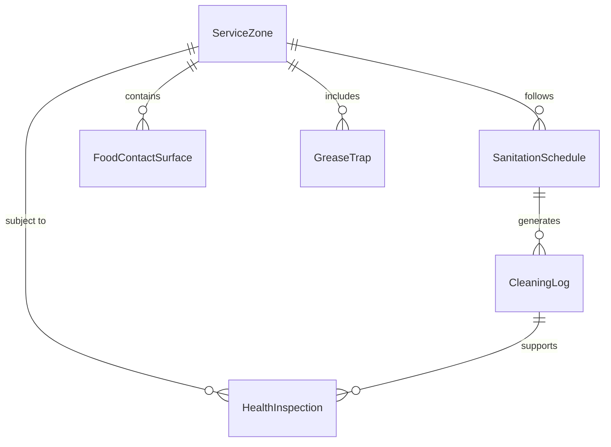
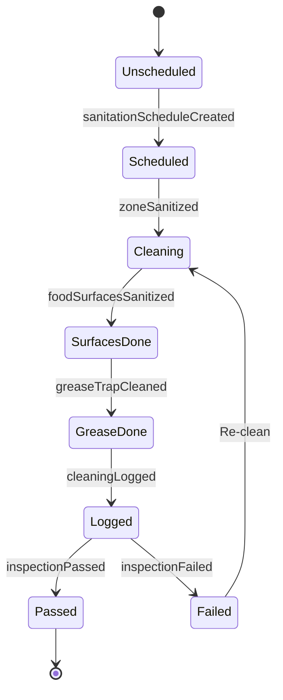
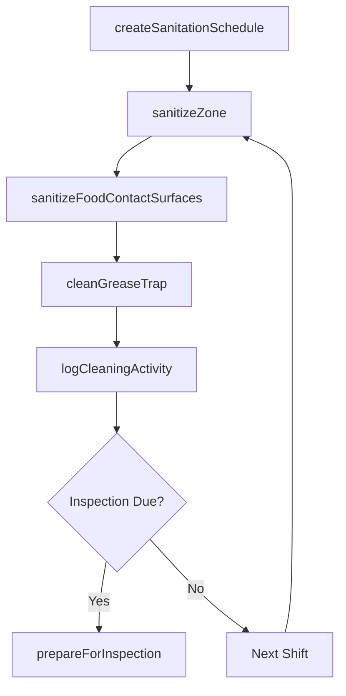
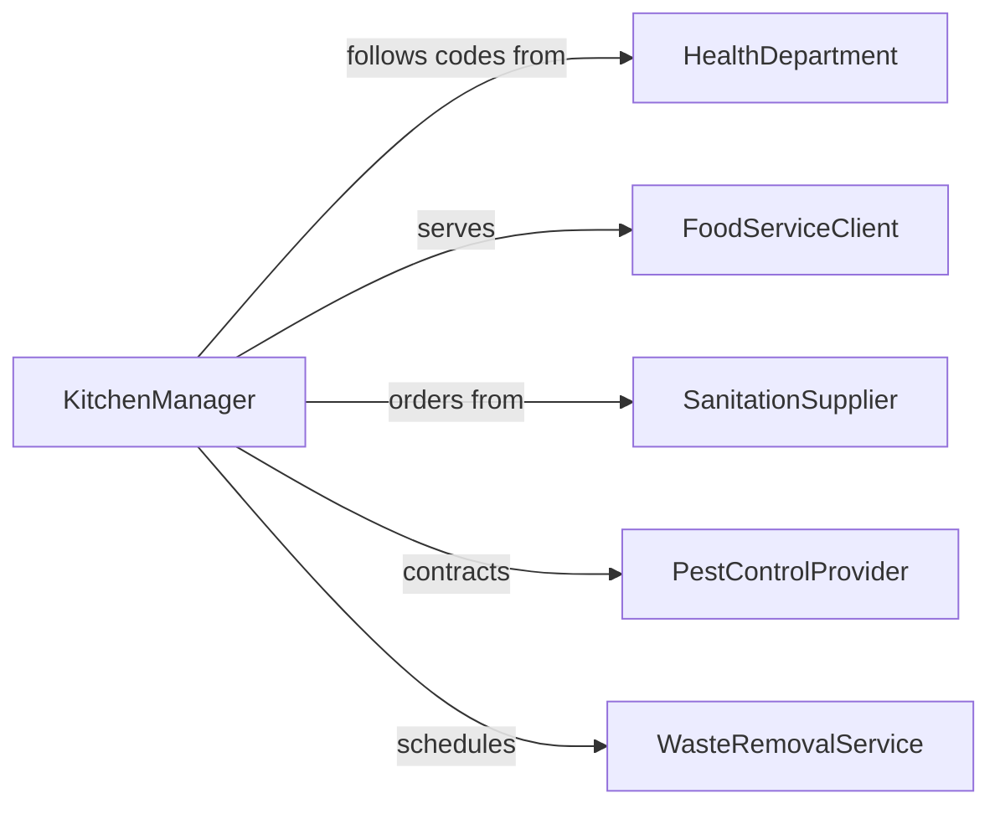

# Clean Food Service Areas

> Business-as-Code definition for cleaning kitchens, dining rooms, serving stations, and food storage areas to maintain food safety and health code compliance.

## Overview

Food service area cleaning covers the sanitation of commercial kitchens, dining rooms, buffet lines, food prep stations, and cold storage facilities. This definition models the scheduling of cleaning shifts around meal service, execution of zone-specific sanitation procedures, health department compliance documentation, and pest prevention measures required in food service operations.

## Actors

| Actor | Description |
|-------|-------------|
| HealthDepartment | Conducts inspections and enforces food safety codes |
| FoodServiceClient | Operates the dining or catering facility |
| SanitationSupplier | Provides food-safe cleaning chemicals and supplies |
| PestControlProvider | Delivers integrated pest management services |
| WasteRemovalService | Collects food waste and grease trap contents |

## Roles

| Role | Description |
|------|-------------|
| KitchenManager | Oversees cleaning schedules and food safety compliance |
| SanitationWorker | Performs hands-on cleaning of food service zones |
| FoodSafetyManager | Maintains HACCP documentation and training programs |
| DishwashingAttendant | Operates dishwashing equipment and sanitizes wares |

## Entities

| Entity | Description |
|--------|-------------|
| ServiceZone | A defined area such as kitchen, prep station, or dining room |
| SanitationSchedule | A recurring cleaning plan tied to meal service periods |
| HealthInspection | A regulatory review of food service cleanliness |
| GreaseTrap | A plumbing fixture requiring periodic cleaning |
| FoodContactSurface | A surface that directly touches food during preparation |
| CleaningLog | A documented record of cleaning activities and times |

## Actions

| Action | Description |
|--------|-------------|
| createSanitationSchedule | Define cleaning tasks tied to meal service periods |
| sanitizeZone | Perform cleaning and disinfection of a service zone |
| cleanGreaseTrap | Service and clean grease trap fixtures |
| sanitizeFoodContactSurfaces | Disinfect surfaces that directly contact food |
| logCleaningActivity | Record completed cleaning with time and method |
| prepareForInspection | Ensure all zones and records are ready for health audit |

## Events

| Event | Description |
|-------|-------------|
| sanitationScheduleCreated | Cleaning plan has been established for meal periods |
| zoneSanitized | A food service zone has been cleaned and disinfected |
| greaseTrapCleaned | Grease trap has been serviced |
| foodSurfacesSanitized | Food contact surfaces have been disinfected |
| cleaningLogged | A cleaning activity has been documented |
| inspectionPassed | Health department inspection has been passed |
| inspectionFailed | Health department inspection identified violations |

## Searches

| Search | Description |
|--------|-------------|
| findZonesByStatus | List food service zones by cleaning status |
| getCleaningLogs | Retrieve cleaning records by zone or date |
| getInspectionHistory | Pull health inspection results over time |
| findOverdueCleanings | Locate zones past their scheduled cleaning time |

## Entity Relationships



## State Diagram



## Workflow



## Actor Relationships



## Usage

### Calling Actions

```typescript
import { cleanFoodServiceAreas } from '@headlessly/clean-food-service-areas'

const foodService = cleanFoodServiceAreas()

// Create sanitation schedule for a restaurant
const schedule = await foodService.createSanitationSchedule({
  facilityId: 'RESTAURANT-12',
  zones: ['kitchen', 'prep-station', 'dining-room', 'dishwash'],
  shifts: ['pre-service', 'mid-service', 'post-close']
})

// Sanitize kitchen after dinner service
await foodService.sanitizeZone({
  zoneId: 'kitchen',
  shift: 'post-close',
  tasks: ['degrease-range', 'sanitize-prep-tables', 'mop-floors']
})

// Log completion
await foodService.logCleaningActivity({
  zoneId: 'kitchen',
  shift: 'post-close',
  completedBy: 'SW-014',
  completedAt: '2026-02-05T23:45:00Z'
})
```

### Event-Driven Automation

```typescript
// Alert kitchen manager on overdue cleanings
foodService.zoneSanitized(async ({ zoneId }) => {
  const overdue = await foodService.findOverdueCleanings({ facilityId: 'RESTAURANT-12' })
  if (overdue.length > 0) {
    await notify({
      to: 'kitchen-manager',
      message: `${overdue.length} zones are overdue for cleaning`
    })
  }
})

// Prepare documentation before scheduled inspections
foodService.inspectionPassed(async ({ facilityId, nextInspection }) => {
  await scheduleTask({
    action: 'prepareForInspection',
    facilityId,
    scheduledDate: nextInspection
  })
})
```
