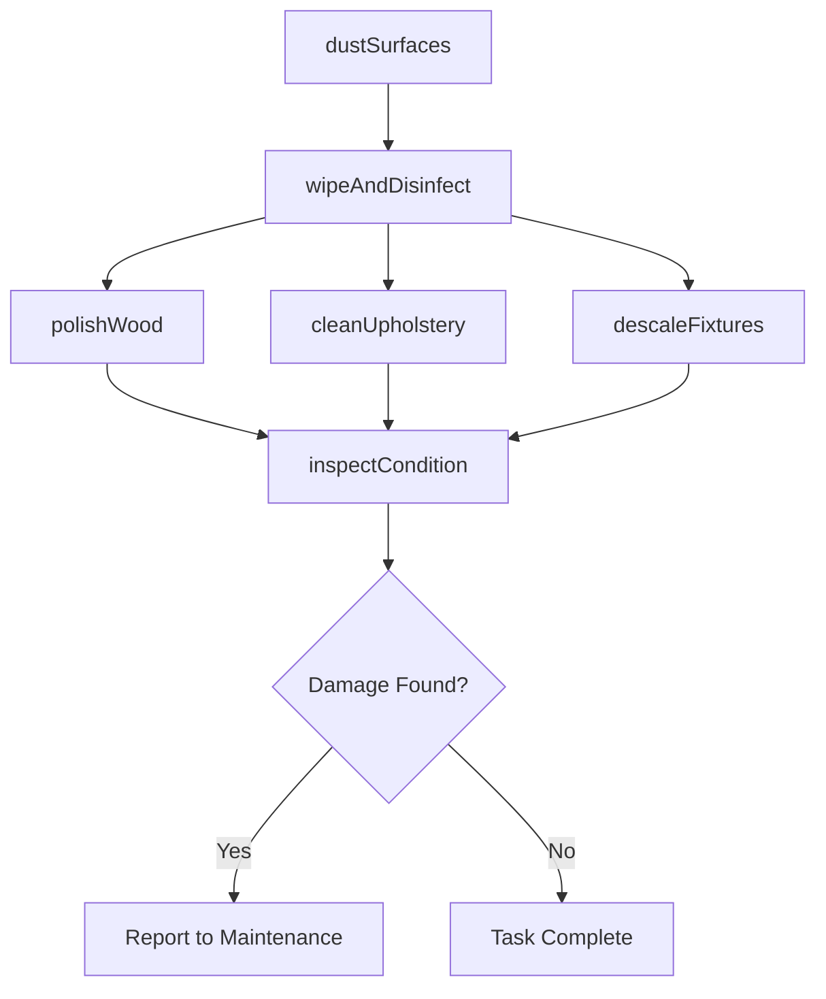
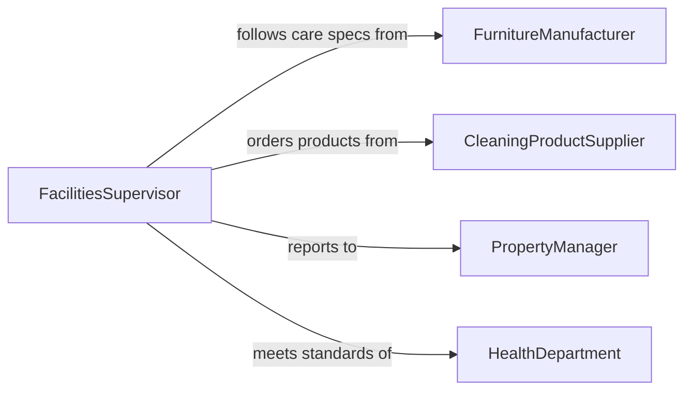

# Clean Furniture Fixtures

> Business-as-Code definition for cleaning furniture and fixtures. Models the processes for maintaining desks, chairs, shelving, lighting fixtures, bathroom fittings, and other installed or movable furnishings in commercial, hospitality, and institutional settings.

## Overview

Cleaning furniture and fixtures involves dusting, wiping, polishing, and disinfecting desks, tables, chairs, cabinets, light fixtures, bathroom hardware, and other permanent or semi-permanent items within a facility. This activity preserves the appearance and hygiene of shared and private spaces, prevents the spread of germs, and extends the useful life of furnishings. The definition covers routine daily maintenance, periodic deep cleaning, and specialty care for materials such as wood, upholstery, and metal.

## Actors

| Actor | Description |
|-------|-------------|
| FurnitureManufacturer | Provides care instructions and compatible cleaning products for furnishings |
| CleaningProductSupplier | Supplies polishes, disinfectants, upholstery cleaners, and tools |
| PropertyManager | Sets cleaning standards and schedules for building furnishings |
| HealthDepartment | Establishes hygiene requirements for public-facing furniture and fixtures |

## Roles

| Role | Description |
|------|-------------|
| Housekeeper | Performs routine cleaning of furniture and fixtures in assigned areas |
| DeepCleaningSpecialist | Handles periodic intensive cleaning of upholstery, carpets, and fixtures |
| FacilitiesSupervisor | Coordinates cleaning assignments and inspects completed work |
| InteriorMaintainer | Repairs and restores damaged finishes on furniture and fixtures |

## Entities

| Entity | Description |
|--------|-------------|
| FurnitureItem | A movable piece such as a desk, chair, table, or cabinet |
| Fixture | A permanently installed item such as a light fitting, sink, or towel bar |
| CleaningSchedule | A recurring plan for routine and deep cleaning of furnishings |
| MaterialType | The surface material of an item that determines appropriate cleaning method |
| CleaningTask | A specific assignment to clean designated furniture or fixtures |

## Actions

| Action | Description |
|--------|-------------|
| dustSurfaces | Remove dust from furniture tops, shelves, and fixture housings |
| wipeAndDisinfect | Clean and sanitize high-touch surfaces such as armrests and handles |
| polishWood | Apply wood polish to desks, tables, and wooden fixtures |
| cleanUpholstery | Vacuum and spot-treat fabric-covered furniture |
| descaleFixtures | Remove mineral buildup from bathroom and kitchen fixtures |
| inspectCondition | Check furniture and fixtures for damage or wear during cleaning |

## Events

| Event | Description |
|-------|-------------|
| surfacesDusted | Dust has been removed from furniture and fixture surfaces |
| surfacesDisinfected | High-touch areas have been wiped and sanitized |
| woodPolished | Wooden furniture has been treated with appropriate polish |
| upholsteryCleaned | Fabric furniture has been vacuumed and spot-treated |
| fixturesDescaled | Mineral deposits have been removed from plumbing fixtures |
| damageDetected | Furniture or fixture damage has been identified during cleaning |

## Searches

| Search | Description |
|--------|-------------|
| findCleaningTasks | List furniture and fixture cleaning tasks by area, assignee, or status |
| getConditionReports | Retrieve damage and wear reports for furniture and fixture assets |
| getSchedule | View upcoming cleaning assignments for a building or floor |

## Workflow



## Actor Relationships



## Usage

### Calling Actions

```typescript
import { cleanFurnitureFixtures } from '@headlessly/clean-furniture-fixtures'

const furnishings = cleanFurnitureFixtures()

// Dust and disinfect conference room furniture
await furnishings.dustSurfaces({
  area: 'conference-room-4b',
  items: ['table-main', 'chairs-1-through-12', 'credenza']
})

await furnishings.wipeAndDisinfect({
  area: 'conference-room-4b',
  surfaces: ['table-top', 'chair-armrests', 'door-handles', 'light-switches'],
  agent: 'quaternary-ammonium'
})

// Deep clean upholstered lobby seating
await furnishings.cleanUpholstery({
  items: ['lobby-sofa-1', 'lobby-sofa-2', 'accent-chairs'],
  method: 'hot-water-extraction',
  spotTreat: true
})

// Descale bathroom fixtures
await furnishings.descaleFixtures({
  area: 'restroom-3rd-floor',
  fixtures: ['faucets', 'shower-heads', 'soap-dispensers'],
  agent: 'citric-acid-solution'
})
```

### Event-Driven Automation

```typescript
// Create maintenance ticket when damage is found
furnishings.damageDetected(async ({ itemId, area, description }) => {
  await createTicket({
    team: 'interior-maintenance',
    priority: 'medium',
    subject: `Damage found on ${itemId} in ${area}: ${description}`
  })
})

// Schedule deep cleaning based on usage patterns
furnishings.surfacesDisinfected(async ({ area, completionCount }) => {
  if (completionCount % 30 === 0) {
    await furnishings.cleanUpholstery({
      area,
      method: 'steam-clean',
      scheduled: getNextWeekend()
    })
  }
})
```
