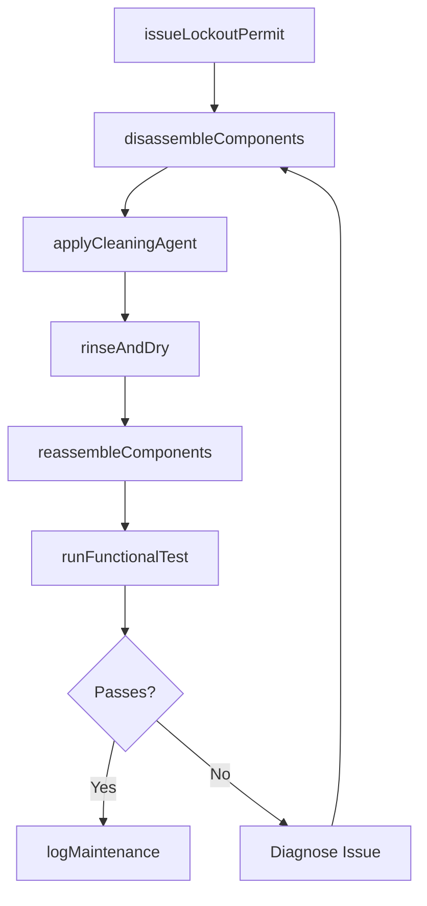
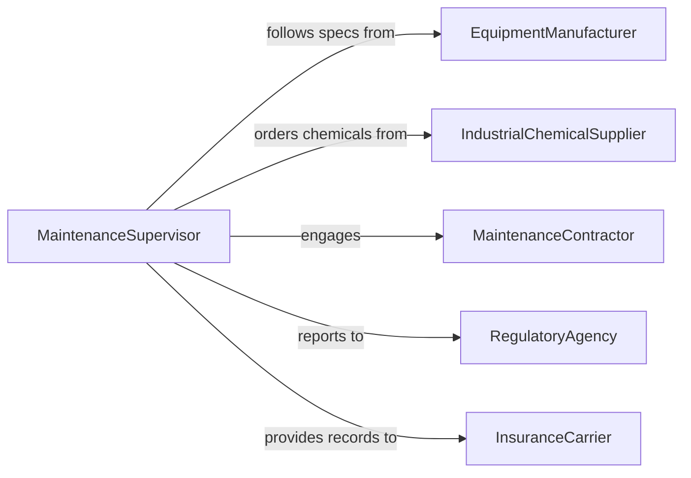

# Clean Machinery and Equipment

> Business-as-Code definition for cleaning industrial machinery and equipment to maintain operational performance, prevent contamination, and extend asset lifespan.

## Overview

Machinery and equipment cleaning involves the removal of grease, residue, particulates, and buildup from production machines, heavy equipment, and mechanical systems. This definition covers pre-cleaning lockout procedures, cleaning method execution based on equipment specifications, post-cleaning functional verification, and maintenance documentation for regulatory and warranty compliance.

## Actors

| Actor | Description |
|-------|-------------|
| EquipmentManufacturer | Provides cleaning specifications and approved methods |
| IndustrialChemicalSupplier | Delivers degreasers, solvents, and cleaning compounds |
| MaintenanceContractor | Performs specialized or outsourced cleaning services |
| RegulatoryAgency | Sets equipment hygiene and environmental standards |
| InsuranceCarrier | Requires documented maintenance for coverage validity |

## Roles

| Role | Description |
|------|-------------|
| MaintenanceSupervisor | Schedules and oversees machinery cleaning operations |
| MachineCleaner | Performs hands-on cleaning of equipment and components |
| SafetyTechnician | Manages lockout-tagout procedures during cleaning |
| MaintenanceEngineer | Verifies equipment function after cleaning |

## Entities

| Entity | Description |
|--------|-------------|
| Machine | An industrial machine or piece of equipment to be cleaned |
| CleaningProcedure | Manufacturer-specified cleaning steps for an equipment type |
| LockoutPermit | Authorization to de-energize equipment for safe cleaning |
| CleaningAgent | A chemical compound used in the cleaning process |
| MaintenanceLog | A record of cleaning activities tied to an asset |
| FunctionalTest | A post-cleaning verification of equipment operation |
| PartsList | Components that must be removed or accessed for cleaning |

## Actions

| Action | Description |
|--------|-------------|
| issueLockoutPermit | Authorize equipment shutdown for safe cleaning access |
| disassembleComponents | Remove covers, guards, or parts for thorough cleaning |
| applyCleaningAgent | Use specified chemicals or methods to clean surfaces |
| rinseAndDry | Remove cleaning residue and dry equipment components |
| reassembleComponents | Reinstall removed parts after cleaning |
| runFunctionalTest | Verify equipment operates correctly after cleaning |
| logMaintenance | Record cleaning details in the asset maintenance log |

## Events

| Event | Description |
|-------|-------------|
| lockoutPermitIssued | Equipment has been de-energized for cleaning |
| componentsDisassembled | Machine parts have been removed for access |
| cleaningAgentApplied | Cleaning chemicals or methods have been applied |
| equipmentRinsed | Cleaning residue has been removed and dried |
| componentsReassembled | Machine parts have been reinstalled |
| functionalTestPassed | Equipment verified operational after cleaning |
| functionalTestFailed | Equipment did not pass post-cleaning verification |
| maintenanceLogged | Cleaning activity has been documented |

## Searches

| Search | Description |
|--------|-------------|
| findMachinesByCleaningDue | List equipment due for scheduled cleaning |
| getMaintenanceLogs | Retrieve cleaning history for an asset |
| findOpenLockouts | List active lockout permits for equipment |
| getTestResults | Pull post-cleaning functional test results |

## Workflow



## Actor Relationships



## Usage

### Calling Actions

```typescript
import { cleanMachineryEquipment } from '@headlessly/clean-machinery-equipment'

const machinery = cleanMachineryEquipment()

// Issue lockout and begin cleaning
const permit = await machinery.issueLockoutPermit({
  machineId: 'CNC-LATHE-007',
  requestedBy: 'MS-004',
  reason: 'scheduled-cleaning'
})

await machinery.applyCleaningAgent({
  machineId: 'CNC-LATHE-007',
  agent: 'industrial-degreaser',
  dilutionRatio: '1:20',
  dwellMinutes: 15
})

// Verify and log
const test = await machinery.runFunctionalTest({
  machineId: 'CNC-LATHE-007',
  checks: ['spindle-rotation', 'coolant-flow', 'axis-movement']
})

await machinery.logMaintenance({
  machineId: 'CNC-LATHE-007',
  permitId: permit.id,
  testResult: test.status
})
```

### Event-Driven Automation

```typescript
// Alert engineering on failed functional tests
machinery.functionalTestFailed(async ({ machineId, failures }) => {
  await notify({
    to: 'maintenance-engineering',
    message: `Machine ${machineId} failed post-cleaning test: ${failures.join(', ')}`
  })
})

// Auto-schedule next cleaning based on completion
machinery.maintenanceLogged(async ({ machineId, procedure }) => {
  await scheduleTask({
    action: 'cleanMachine',
    machineId,
    delay: procedure.intervalDays + 'd'
  })
})
```
