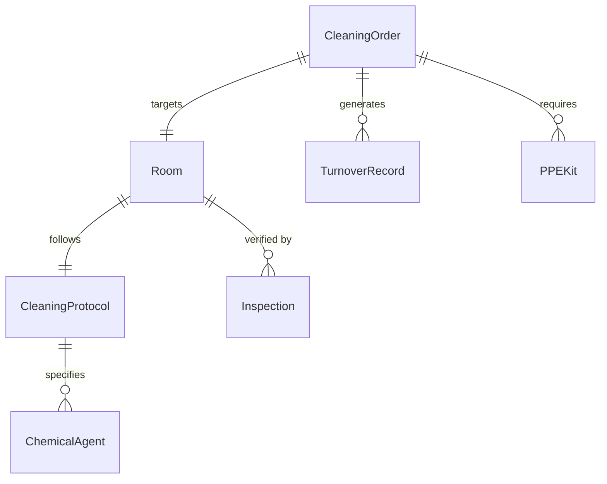
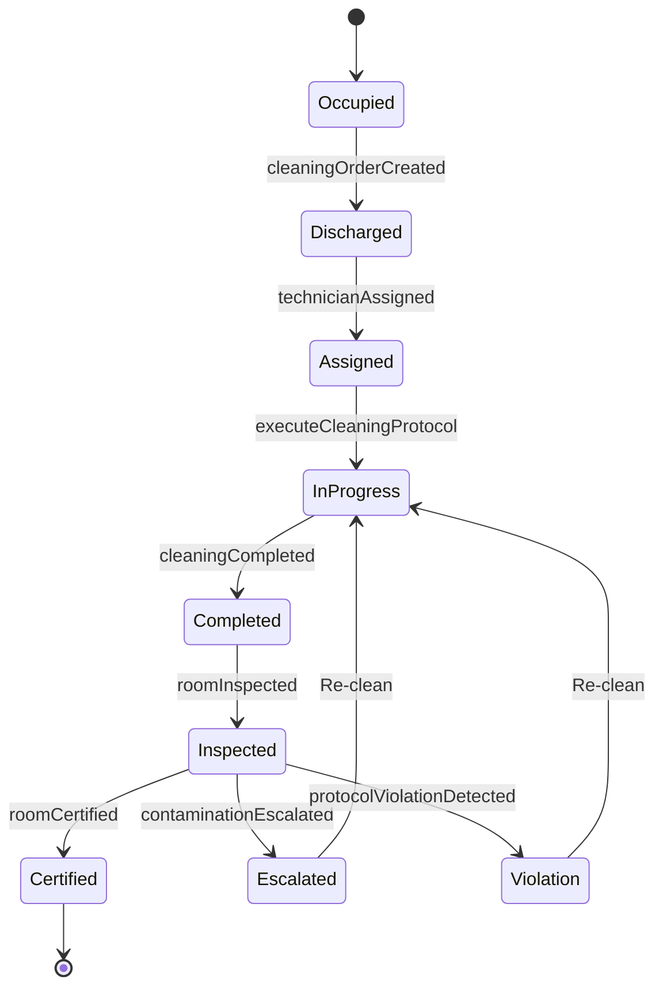
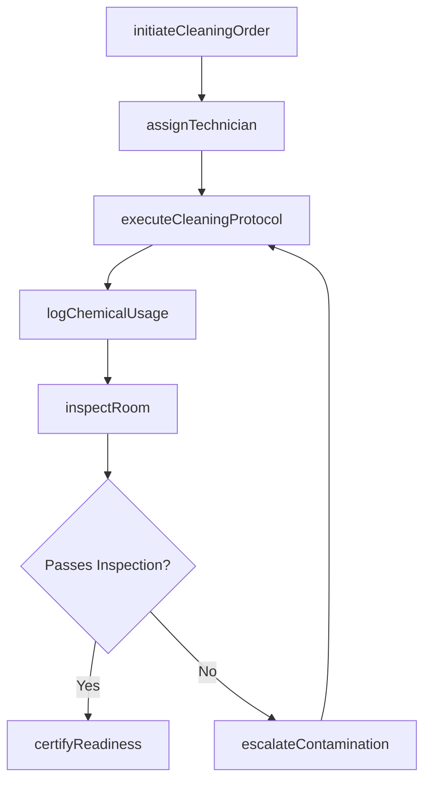
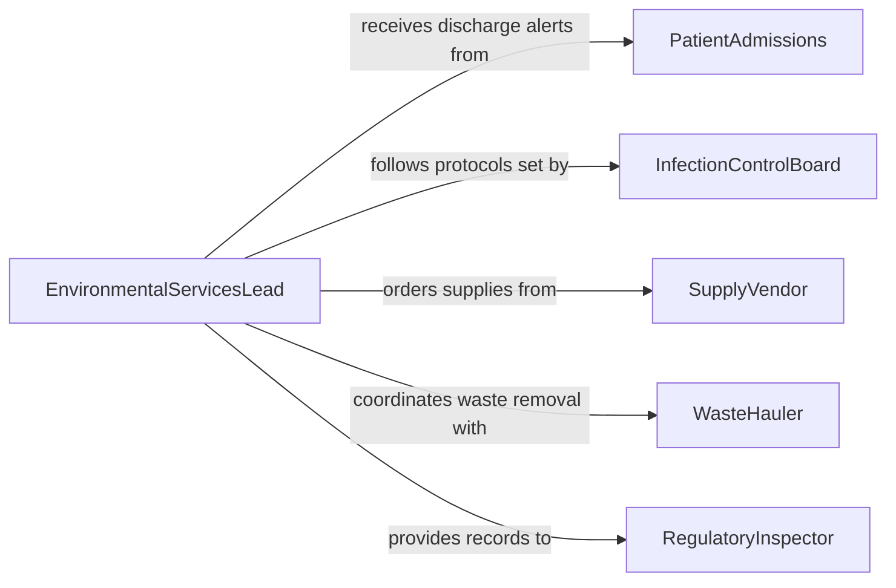

# Clean Patient Rooms and Treatment Areas

> Business-as-Code definition for cleaning and sanitizing patient rooms and treatment areas in healthcare facilities to maintain infection control standards and patient safety.

## Overview

Patient room and treatment area cleaning encompasses the systematic disinfection, sanitization, and preparation of clinical spaces between patient occupancies. This definition models the complete turnover process from discharge notification through terminal cleaning, inspection, and room readiness certification, ensuring compliance with healthcare hygiene protocols.

## Actors

| Actor | Description |
|-------|-------------|
| InfectionControlBoard | Sets cleaning protocols and monitors compliance rates |
| PatientAdmissions | Triggers room turnover requests upon discharge or transfer |
| SupplyVendor | Provides cleaning agents, disinfectants, and PPE supplies |
| RegulatoryInspector | Audits facility cleanliness and infection control practices |
| WasteHauler | Removes biohazard and regulated medical waste |
| LinenService | Supplies fresh linens and collects soiled materials |

## Roles

| Role | Description |
|------|-------------|
| EnvironmentalServicesLead | Coordinates cleaning schedules and staff assignments |
| HousekeepingTechnician | Performs hands-on room cleaning and disinfection |
| InfectionPreventionist | Validates cleaning protocols meet infection control standards |
| FacilitySupervisor | Inspects completed rooms and certifies readiness |

## Entities

| Entity | Description |
|--------|-------------|
| CleaningOrder | A request to clean a specific room after patient discharge |
| Room | A patient room or treatment area with location and status |
| CleaningProtocol | Step-by-step disinfection procedure for a room type |
| Inspection | A quality check confirming cleaning standards are met |
| ChemicalAgent | A registered disinfectant or cleaning solution used |
| TurnoverRecord | Documentation of cleaning completion with timestamps |
| PPEKit | Personal protective equipment required for cleaning tasks |

## Actions

| Action | Description |
|--------|-------------|
| initiateCleaningOrder | Create a room turnover request upon patient discharge |
| assignTechnician | Assign a housekeeping technician to a cleaning order |
| executeCleaningProtocol | Perform the prescribed cleaning and disinfection steps |
| logChemicalUsage | Record disinfectant concentrations and dwell times |
| inspectRoom | Conduct post-cleaning quality inspection |
| certifyReadiness | Mark room as clean and ready for next patient |
| escalateContamination | Flag rooms requiring enhanced terminal cleaning |

## Events

| Event | Description |
|-------|-------------|
| cleaningOrderCreated | A new room turnover request has been submitted |
| technicianAssigned | A housekeeping technician has been assigned to a room |
| cleaningCompleted | All cleaning protocol steps have been finished |
| roomInspected | Post-cleaning quality inspection has been conducted |
| roomCertified | Room has been certified ready for patient admission |
| contaminationEscalated | Room flagged for enhanced cleaning due to infection risk |
| protocolViolationDetected | Cleaning procedure deviation has been identified |

## Searches

| Search | Description |
|--------|-------------|
| findPendingOrders | List cleaning orders awaiting technician assignment |
| getRoomStatus | Retrieve current cleaning status for a room or unit |
| getTurnoverMetrics | Get average turnover times by room type or shift |
| findProtocolViolations | Locate rooms with incomplete or non-compliant cleaning |
| getChemicalInventory | Check disinfectant supply levels and expiration dates |

## Entity Relationships



## State Diagram



## Workflow



## Actor Relationships



## Usage

### Calling Actions

```typescript
import { cleanPatientRoomsPatientTreatment } from '@headlessly/clean-patient-rooms-patient-treatment'

const rooms = cleanPatientRoomsPatientTreatment()

// Initiate a room turnover after patient discharge
const order = await rooms.initiateCleaningOrder({
  roomId: 'ICU-204',
  dischargeTime: '2026-02-05T14:30:00Z',
  precautions: ['contact', 'droplet'],
  priority: 'stat'
})

// Assign a technician and execute protocol
await rooms.assignTechnician({
  orderId: order.id,
  technicianId: 'EVS-047'
})

// Certify room after inspection
await rooms.certifyReadiness({
  orderId: order.id,
  inspectorId: 'SUP-012',
  notes: 'All high-touch surfaces verified with ATP testing'
})
```

### Event-Driven Automation

```typescript
// Alert nursing station when room is ready
rooms.roomCertified(async ({ roomId, certifiedAt }) => {
  await notify({
    to: 'nursing-station',
    message: `Room ${roomId} is clean and ready for admission as of ${certifiedAt}`
  })
})

// Escalate protocol violations to infection prevention
rooms.protocolViolationDetected(async ({ roomId, violation }) => {
  await notify({
    to: 'infection-prevention',
    message: `Protocol violation in ${roomId}: ${violation.description}`
  })
})
```
