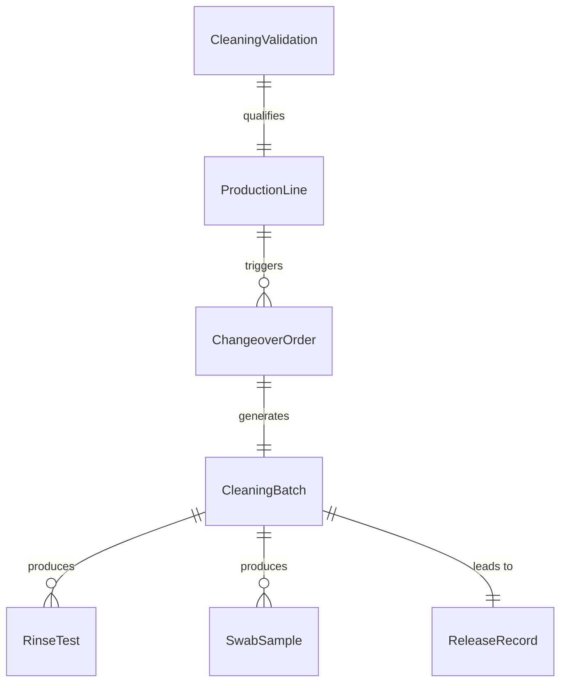
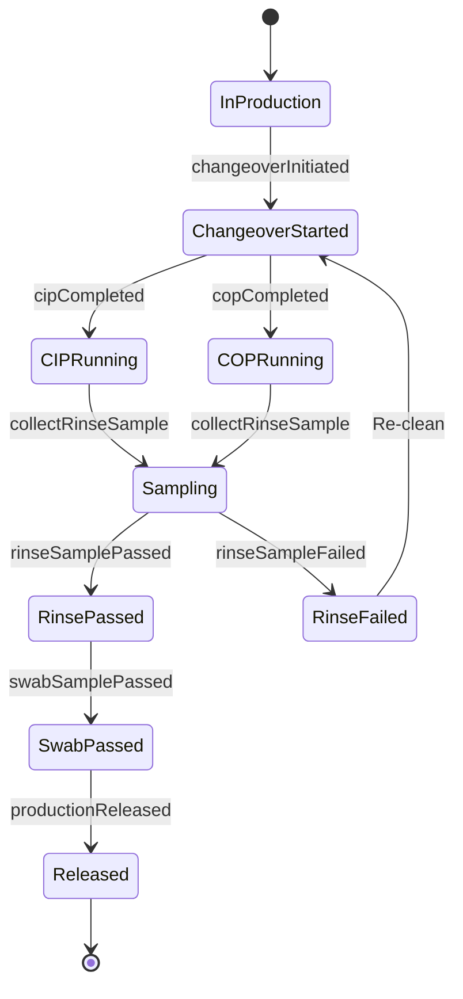
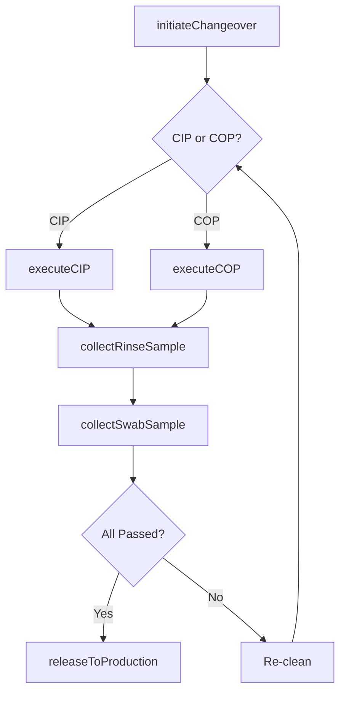
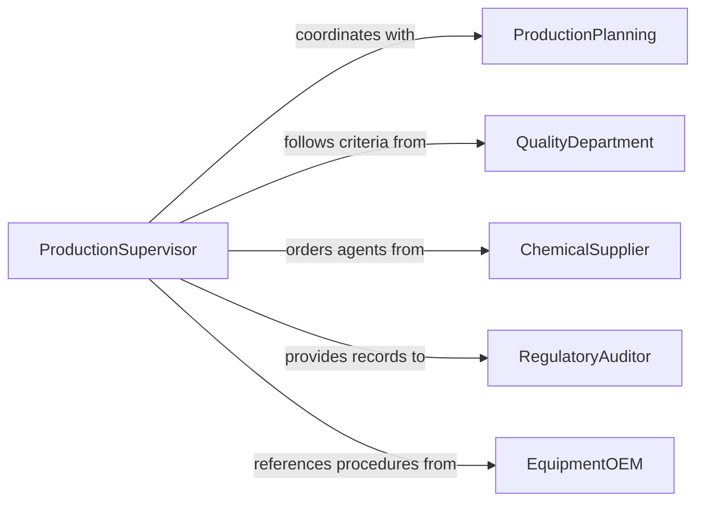

# Clean Production Equipment

> Business-as-Code definition for cleaning manufacturing and production line equipment to prevent cross-contamination, maintain output quality, and ensure regulatory compliance.

## Overview

Production equipment cleaning involves the systematic decontamination of manufacturing machinery between production runs, product changeovers, and scheduled maintenance intervals. This definition models changeover planning, clean-in-place and clean-out-of-place procedures, verification testing, and release-to-production certification critical in pharmaceutical, food, and chemical manufacturing.

## Actors

| Actor | Description |
|-------|-------------|
| ProductionPlanning | Schedules equipment availability windows for cleaning |
| QualityDepartment | Sets cleaning validation requirements and acceptance criteria |
| ChemicalSupplier | Provides production-grade cleaning agents and rinse solutions |
| RegulatoryAuditor | Inspects cleaning records during compliance audits |
| EquipmentOEM | Provides recommended cleaning procedures for machinery |

## Roles

| Role | Description |
|------|-------------|
| ProductionSupervisor | Coordinates cleaning with production schedules |
| CleaningOperator | Executes equipment cleaning procedures |
| QualityAnalyst | Performs rinse testing and swab analysis |
| ValidationEngineer | Qualifies cleaning processes and sets limits |

## Entities

| Entity | Description |
|--------|-------------|
| ProductionLine | A set of equipment configured for a product run |
| CleaningBatch | A documented cleaning event with procedure and results |
| ChangeoverOrder | A request to clean between different product types |
| RinseTest | A sample analysis verifying cleaning agent removal |
| SwabSample | A surface test checking for product residue |
| CleaningValidation | A documented study proving the cleaning process works |
| ReleaseRecord | Authorization to restart production after cleaning |

## Actions

| Action | Description |
|--------|-------------|
| initiateChangeover | Start the cleaning process for a product changeover |
| executeCIP | Run a clean-in-place cycle on closed equipment |
| executeCOP | Perform clean-out-of-place on removed components |
| collectRinseSample | Take rinse water samples for residue analysis |
| collectSwabSample | Take surface swab samples from critical contact points |
| releaseToProduction | Authorize equipment for the next production run |

## Events

| Event | Description |
|-------|-------------|
| changeoverInitiated | Product changeover cleaning has begun |
| cipCompleted | Clean-in-place cycle has finished |
| copCompleted | Clean-out-of-place procedure has finished |
| rinseSamplePassed | Rinse water analysis met acceptance criteria |
| rinseSampleFailed | Rinse water analysis exceeded residue limits |
| swabSamplePassed | Surface swab test met cleanliness criteria |
| productionReleased | Equipment authorized for next production run |

## Searches

| Search | Description |
|--------|-------------|
| findPendingChangeovers | List changeover orders awaiting cleaning |
| getCleaningBatches | Retrieve cleaning event records by line or date |
| getSampleResults | Pull rinse and swab test results by batch |
| findValidationStudies | Locate cleaning validation records by equipment |

## Entity Relationships



## State Diagram



## Workflow



## Actor Relationships



## Usage

### Calling Actions

```typescript
import { cleanProductionEquipment } from '@headlessly/clean-production-equipment'

const production = cleanProductionEquipment()

// Initiate changeover from Product A to Product B
const changeover = await production.initiateChangeover({
  lineId: 'FILL-LINE-3',
  previousProduct: 'PROD-A-500mg',
  nextProduct: 'PROD-B-250mg',
  cleaningProcedure: 'SOP-CL-042'
})

// Run CIP cycle
await production.executeCIP({
  changeoverId: changeover.id,
  cycles: [
    { agent: 'caustic-wash', concentration: '2%', temperature: 80, duration: 20 },
    { agent: 'purified-water-rinse', temperature: 25, duration: 10 }
  ]
})

// Collect and verify samples
const rinse = await production.collectRinseSample({
  changeoverId: changeover.id,
  samplePoint: 'final-rinse-outlet'
})

if (rinse.passed) {
  await production.releaseToProduction({ changeoverId: changeover.id })
}
```

### Event-Driven Automation

```typescript
// Notify quality on failed rinse samples
production.rinseSampleFailed(async ({ changeoverId, residue }) => {
  await notify({
    to: 'quality-analyst',
    message: `Changeover ${changeoverId} failed rinse test: ${residue.substance} at ${residue.level}`
  })
})

// Auto-update production schedule on release
production.productionReleased(async ({ lineId, changeoverId }) => {
  await notify({
    to: 'production-planning',
    message: `Line ${lineId} is released and ready for next batch`
  })
})
```
