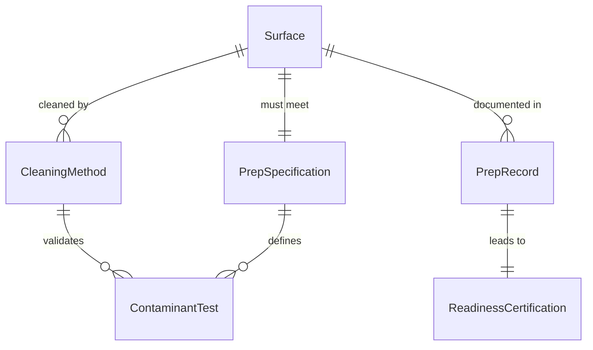
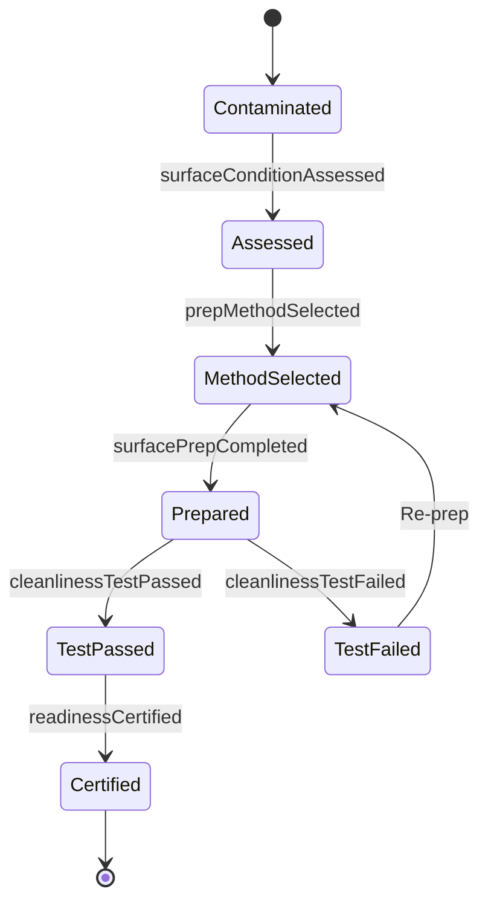
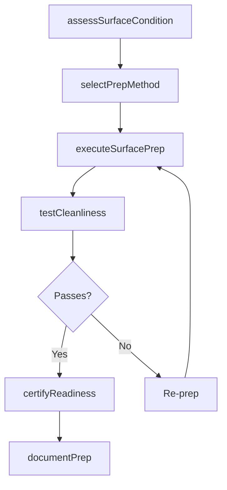
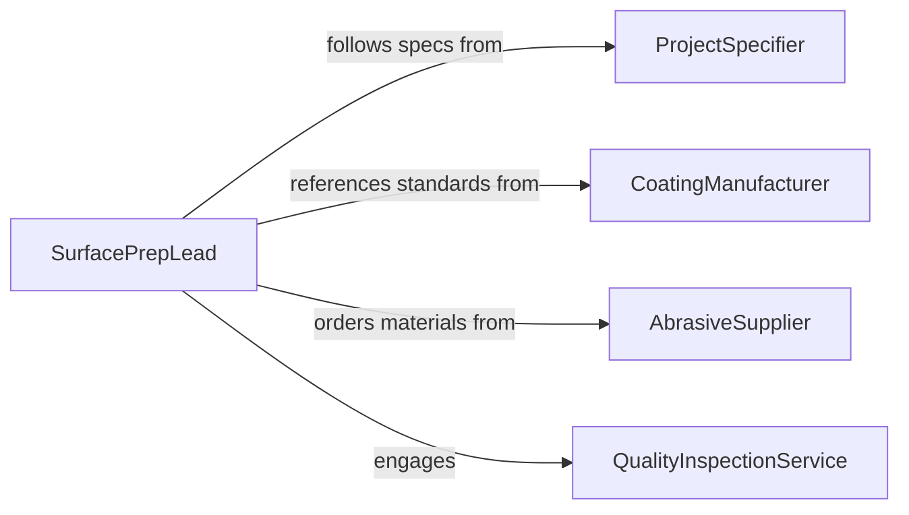

# Clean Surfaces in Preparation for Work Activities

> Business-as-Code definition for cleaning and preparing surfaces before painting, coating, bonding, welding, or other work activities that require a contaminant-free substrate.

## Overview

Surface preparation cleaning ensures substrates are free of dust, grease, oxide layers, and other contaminants that could compromise subsequent work quality. This definition models the assessment of surface conditions, selection of cleaning methods matched to the planned work activity, execution of preparation procedures, and verification that surfaces meet readiness standards.

## Actors

| Actor | Description |
|-------|-------------|
| ProjectSpecifier | Defines surface preparation requirements for the work |
| CoatingManufacturer | Specifies substrate cleanliness standards for adhesion |
| AbrasiveSupplier | Provides blasting media, sanding materials, and solvents |
| QualityInspectionService | Verifies surface preparation meets specifications |

## Roles

| Role | Description |
|------|-------------|
| SurfacePrepLead | Coordinates surface cleaning before work commences |
| PrepTechnician | Performs hands-on surface cleaning and preparation |
| QualityController | Inspects prepared surfaces for contaminant levels |
| ProjectForeman | Schedules surface prep in the overall work sequence |

## Entities

| Entity | Description |
|--------|-------------|
| Surface | A substrate requiring cleaning before work activity |
| PrepSpecification | Standards defining required cleanliness for the work type |
| CleaningMethod | A technique such as solvent wipe, abrasive blast, or acid etch |
| ContaminantTest | A measurement of surface cleanliness level |
| PrepRecord | Documentation of surface preparation activities |
| ReadinessCertification | Confirmation that the surface is ready for work |

## Actions

| Action | Description |
|--------|-------------|
| assessSurfaceCondition | Evaluate current contamination level and surface profile |
| selectPrepMethod | Choose the cleaning method based on work requirements |
| executeSurfacePrep | Perform the surface cleaning and preparation procedure |
| testCleanliness | Measure surface contamination level after cleaning |
| certifyReadiness | Confirm the surface meets preparation specifications |
| documentPrep | Record preparation details for quality traceability |

## Events

| Event | Description |
|-------|-------------|
| surfaceConditionAssessed | Current contamination level has been evaluated |
| prepMethodSelected | Cleaning method has been chosen for the surface |
| surfacePrepCompleted | Surface cleaning procedure has been executed |
| cleanlinessTestPassed | Surface contamination is within acceptable limits |
| cleanlinessTestFailed | Surface contamination exceeds acceptable limits |
| readinessCertified | Surface confirmed ready for subsequent work activity |

## Searches

| Search | Description |
|--------|-------------|
| findSurfacesByStatus | List surfaces by their preparation status |
| getPrepSpecifications | Retrieve cleanliness standards for a work type |
| getTestResults | Pull contamination test results by surface or date |
| findCertifiedSurfaces | Locate surfaces certified and ready for work |

## Entity Relationships



## State Diagram



## Workflow



## Actor Relationships



## Usage

### Calling Actions

```typescript
import { cleanSurfacesPreparationWorkActivities } from '@headlessly/clean-surfaces-preparation-work-activities'

const prep = cleanSurfacesPreparationWorkActivities()

// Assess and prepare a steel surface for painting
const assessment = await prep.assessSurfaceCondition({
  surfaceId: 'BEAM-A12',
  material: 'structural-steel',
  currentCondition: 'mill-scale-with-light-rust'
})

await prep.selectPrepMethod({
  surfaceId: 'BEAM-A12',
  workActivity: 'industrial-coating',
  standard: 'SSPC-SP6'
})

await prep.executeSurfacePrep({
  surfaceId: 'BEAM-A12',
  method: 'abrasive-blast',
  media: 'steel-grit',
  profileDepth: '2.5-mil'
})

// Test and certify
const test = await prep.testCleanliness({
  surfaceId: 'BEAM-A12',
  method: 'solvent-wipe-test'
})
```

### Event-Driven Automation

```typescript
// Auto-schedule coating application after certification
prep.readinessCertified(async ({ surfaceId, certifiedAt }) => {
  await scheduleTask({
    action: 'applyCoating',
    surfaceId,
    startAfter: certifiedAt,
    maxDelay: '4h'
  })
})

// Re-prep surfaces that fail cleanliness tests
prep.cleanlinessTestFailed(async ({ surfaceId, contaminant }) => {
  await notify({
    to: 'surface-prep-lead',
    message: `Surface ${surfaceId} failed test: ${contaminant}. Re-preparation required.`
  })
})
```
