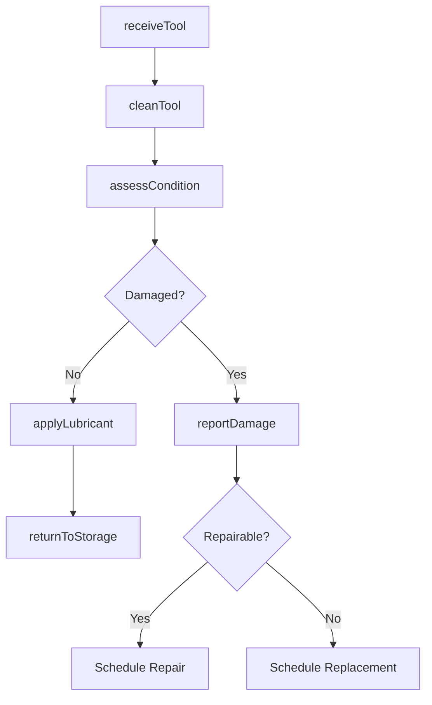
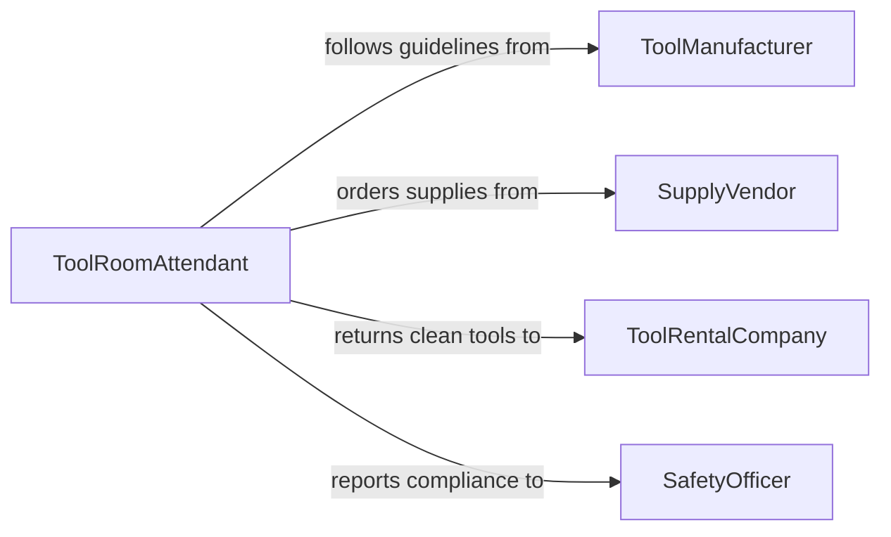

# Clean Tools and Equipment

> Business-as-Code definition for cleaning hand tools, power tools, and portable equipment to maintain performance, safety, and longevity.

## Overview

Tool and equipment cleaning involves the routine removal of dirt, grease, paint, adhesives, and other residues from hand tools, power tools, and portable equipment after use. This definition models the post-use cleaning workflow from tool return through inspection, cleaning method application, condition assessment, and storage readiness certification.

## Actors

| Actor | Description |
|-------|-------------|
| ToolManufacturer | Provides cleaning guidelines and approved maintenance methods |
| SupplyVendor | Delivers cleaning solvents, lubricants, and wipes |
| ToolRentalCompany | Requires tools returned in clean condition per agreement |
| SafetyOfficer | Enforces proper tool maintenance as a safety requirement |

## Roles

| Role | Description |
|------|-------------|
| ToolRoomAttendant | Manages tool inventory, cleaning, and storage |
| Tradesperson | Returns tools and performs basic post-use cleaning |
| MaintenanceTechnician | Handles deep cleaning and reconditioning of tools |
| InventoryManager | Tracks tool condition and replacement schedules |

## Entities

| Entity | Description |
|--------|-------------|
| Tool | A hand tool, power tool, or portable equipment item |
| CleaningRecord | A log of cleaning performed on a specific tool |
| ConditionAssessment | An evaluation of tool condition after cleaning |
| CleaningKit | A set of solvents, brushes, and wipes for tool care |
| StorageLocation | A designated space for clean tool storage |
| DamageReport | Documentation of tool wear or damage found during cleaning |

## Actions

| Action | Description |
|--------|-------------|
| receiveTool | Accept a returned tool and log its condition |
| cleanTool | Perform cleaning using the appropriate method |
| assessCondition | Evaluate tool condition after cleaning |
| applyLubricant | Apply protective oil or lubricant to prevent corrosion |
| returnToStorage | Place cleaned tool in its designated storage location |
| reportDamage | Document tool damage found during cleaning |

## Events

| Event | Description |
|-------|-------------|
| toolReceived | A tool has been returned for cleaning |
| toolCleaned | A tool has been cleaned and is ready for assessment |
| conditionAssessed | Tool condition has been evaluated |
| lubricantApplied | Protective treatment has been applied to the tool |
| toolStored | Tool has been returned to its storage location |
| damageReported | Tool damage has been documented for repair or replacement |

## Searches

| Search | Description |
|--------|-------------|
| findToolsByStatus | List tools by cleaning status or storage location |
| getCleaningHistory | Retrieve cleaning records for a specific tool |
| findDamagedTools | Locate tools flagged with damage reports |
| getToolInventory | Check tool inventory by type, status, or location |

## Workflow



## Actor Relationships



## Usage

### Calling Actions

```typescript
import { cleanToolsEquipment } from '@headlessly/clean-tools-equipment'

const tools = cleanToolsEquipment()

// Receive and clean a returned tool
const receipt = await tools.receiveTool({
  toolId: 'DRILL-042',
  returnedBy: 'TP-019',
  condition: 'soiled-with-concrete'
})

await tools.cleanTool({
  toolId: 'DRILL-042',
  method: 'solvent-wipe',
  agent: 'mineral-spirits'
})

// Assess and store
const assessment = await tools.assessCondition({ toolId: 'DRILL-042' })

if (assessment.status === 'good') {
  await tools.applyLubricant({ toolId: 'DRILL-042', type: 'light-machine-oil' })
  await tools.returnToStorage({ toolId: 'DRILL-042', location: 'RACK-B3' })
}
```

### Event-Driven Automation

```typescript
// Auto-notify inventory when tools are damaged
tools.damageReported(async ({ toolId, damage }) => {
  await notify({
    to: 'inventory-manager',
    message: `Tool ${toolId} damaged: ${damage.description}. Replacement needed: ${damage.severity === 'critical'}`
  })
})

// Track cleaning frequency for maintenance scheduling
tools.toolCleaned(async ({ toolId, cleanedAt }) => {
  const history = await tools.getCleaningHistory({ toolId, limit: 10 })
  if (history.length >= 50) {
    await notify({
      to: 'maintenance-tech',
      message: `Tool ${toolId} has reached 50 cleaning cycles - schedule reconditioning`
    })
  }
})
```
