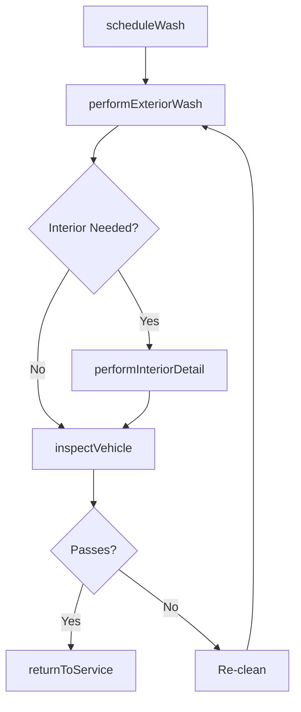
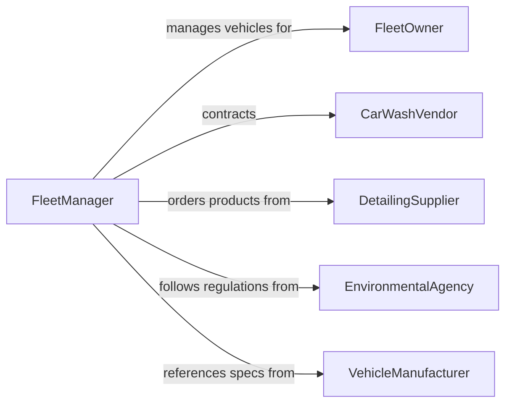

# Clean Vehicles and Vehicle Components

> Business-as-Code definition for cleaning vehicles and their components including exterior washing, interior detailing, engine degreasing, and fleet maintenance cleaning.

## Overview

Vehicle and component cleaning covers the washing, detailing, and decontamination of cars, trucks, buses, heavy equipment, and their subassemblies. This definition models vehicle intake, cleaning service selection, execution of wash and detail procedures, quality inspection, and fleet-wide cleaning schedule management for commercial and institutional vehicle operations.

## Actors

| Actor | Description |
|-------|-------------|
| FleetOwner | Operates vehicles and sets cleaning frequency requirements |
| CarWashVendor | Provides automated or manual vehicle washing services |
| DetailingSupplier | Delivers waxes, polishes, and interior cleaning products |
| EnvironmentalAgency | Regulates wash water runoff and chemical discharge |
| VehicleManufacturer | Specifies approved cleaning methods for vehicle surfaces |

## Roles

| Role | Description |
|------|-------------|
| FleetManager | Schedules and tracks vehicle cleaning across the fleet |
| WashTechnician | Performs exterior washing and rinsing operations |
| DetailTechnician | Handles interior cleaning, polishing, and surface treatment |
| QualityChecker | Inspects cleaned vehicles before return to service |

## Entities

| Entity | Description |
|--------|-------------|
| Vehicle | A car, truck, bus, or piece of mobile equipment |
| CleaningOrder | A request to clean a specific vehicle or component |
| ServicePackage | A defined set of cleaning tasks such as wash, wax, or detail |
| WashBay | A physical location equipped for vehicle cleaning |
| InspectionReport | A quality check documenting cleaning results |
| WasteWaterRecord | Documentation of wash water disposal and treatment |

## Actions

| Action | Description |
|--------|-------------|
| scheduleWash | Create a cleaning appointment for a vehicle |
| performExteriorWash | Execute exterior cleaning including rinse, soap, and dry |
| performInteriorDetail | Clean vehicle interior surfaces, upholstery, and carpets |
| degreaseEngine | Remove grease and grime from engine compartment |
| inspectVehicle | Verify cleaning quality meets standards |
| returnToService | Mark vehicle as clean and available for dispatch |

## Events

| Event | Description |
|-------|-------------|
| washScheduled | A vehicle cleaning appointment has been created |
| exteriorWashCompleted | Exterior cleaning has been finished |
| interiorDetailCompleted | Interior detailing has been finished |
| engineDegreased | Engine compartment has been cleaned |
| vehicleInspected | Post-cleaning quality check has been conducted |
| vehicleReturnedToService | Vehicle has been marked clean and available |

## Searches

| Search | Description |
|--------|-------------|
| findVehiclesDueForWash | List vehicles approaching their cleaning schedule |
| getCleaningHistory | Retrieve wash and detail records for a vehicle |
| findAvailableWashBays | Locate open wash bay slots for scheduling |
| getFleetCleaningStatus | View cleaning status across the entire fleet |

## Workflow



## Actor Relationships



## Usage

### Calling Actions

```typescript
import { cleanVehiclesVehicleComponents } from '@headlessly/clean-vehicles-vehicle-components'

const vehicles = cleanVehiclesVehicleComponents()

// Schedule a fleet wash
const order = await vehicles.scheduleWash({
  vehicleId: 'TRUCK-2247',
  servicePackage: 'full-detail',
  washBayId: 'BAY-3',
  scheduledTime: '2026-02-06T08:00:00Z'
})

// Execute cleaning steps
await vehicles.performExteriorWash({ orderId: order.id, method: 'touchless-auto' })
await vehicles.performInteriorDetail({ orderId: order.id, tasks: ['vacuum', 'wipe-surfaces', 'clean-glass'] })

// Inspect and return to service
const inspection = await vehicles.inspectVehicle({ orderId: order.id })
if (inspection.passed) {
  await vehicles.returnToService({ vehicleId: 'TRUCK-2247' })
}
```

### Event-Driven Automation

```typescript
// Notify dispatch when vehicles are ready
vehicles.vehicleReturnedToService(async ({ vehicleId }) => {
  await notify({
    to: 'dispatch',
    message: `Vehicle ${vehicleId} is clean and available for assignment`
  })
})

// Auto-schedule next wash based on mileage
vehicles.vehicleReturnedToService(async ({ vehicleId, mileage }) => {
  await vehicles.scheduleWash({
    vehicleId,
    triggerMileage: mileage + 5000,
    servicePackage: 'standard-wash'
  })
})
```
