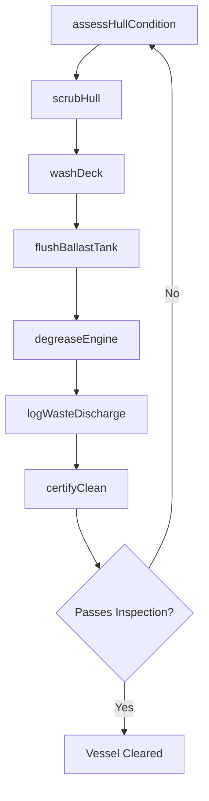
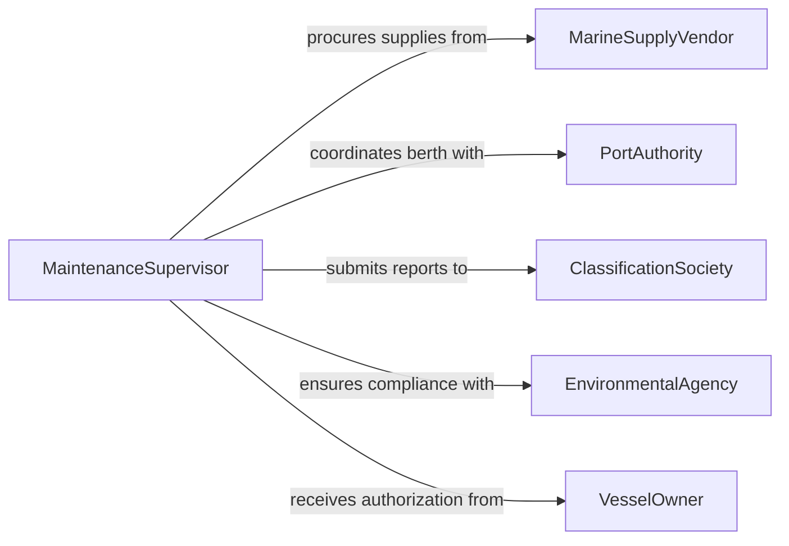

# Clean Vessels Marine Equipment

> Business-as-Code definition for cleaning vessels and marine equipment. Models the maintenance cleaning processes for hulls, decks, tanks, engines, and onboard systems to ensure seaworthiness and regulatory compliance.

## Overview

Cleaning vessels and marine equipment involves removing marine growth, salt deposits, fuel residues, and corrosion from boat hulls, deck surfaces, ballast tanks, and mechanical systems. This activity is essential for maintaining vessel performance, preventing biofouling, and meeting maritime environmental regulations. The definition covers hull scrubbing, tank washing, deck pressure washing, and engine degreasing across commercial and recreational marine operations.

## Actors

| Actor | Description |
|-------|-------------|
| PortAuthority | Enforces environmental discharge and cleaning standards in harbors |
| MarineSupplyVendor | Provides anti-fouling agents, marine-grade cleaners, and equipment |
| ClassificationSociety | Sets vessel maintenance and cleanliness certification standards |
| EnvironmentalAgency | Regulates wastewater discharge and biofouling management |
| VesselOwner | Commissions cleaning services and approves maintenance schedules |

## Roles

| Role | Description |
|------|-------------|
| MarineTechnician | Performs hands-on cleaning of hulls, decks, and mechanical systems |
| BoatswainMate | Supervises deck cleaning crews and maintains cleaning equipment |
| MaintenanceSupervisor | Plans and coordinates vessel cleaning schedules and dry dock work |
| EnvironmentalOfficer | Ensures cleaning operations comply with discharge regulations |

## Entities

| Entity | Description |
|--------|-------------|
| Vessel | A boat or ship requiring cleaning and maintenance |
| CleaningWorkOrder | A documented request specifying cleaning scope and requirements |
| HullConditionReport | Assessment of biofouling level and hull coating integrity |
| BallastTank | An onboard tank that requires periodic flushing and sediment removal |
| WasteDischargeLog | Record of cleaning effluent handling and disposal |
| MaintenanceSchedule | Recurring timeline for vessel cleaning activities |

## Actions

| Action | Description |
|--------|-------------|
| assessHullCondition | Inspect the hull to determine fouling level and cleaning method |
| scrubHull | Remove marine growth and deposits from the vessel hull |
| washDeck | Pressure wash deck surfaces to remove salt, grime, and debris |
| flushBallastTank | Circulate clean water through ballast tanks to remove sediment |
| degreaseEngine | Clean engine compartments and mechanical systems of oil and grime |
| logWasteDischarge | Document the handling and disposal of cleaning effluent |
| certifyClean | Confirm the vessel meets cleanliness standards for operation |

## Events

| Event | Description |
|-------|-------------|
| hullAssessed | Hull condition has been inspected and fouling level documented |
| hullScrubbed | Marine growth has been removed from the hull surface |
| deckWashed | Deck surfaces have been pressure washed and cleared |
| ballastTankFlushed | Ballast tanks have been cleaned and sediment removed |
| engineDegreased | Engine compartment has been cleaned of oil and residue |
| cleaningCertified | Vessel has passed cleanliness inspection for return to service |
| dischargeViolationFlagged | Cleaning effluent has exceeded allowable discharge limits |

## Searches

| Search | Description |
|--------|-------------|
| findWorkOrders | List cleaning work orders by vessel, status, or scheduled date |
| getHullReports | Retrieve hull condition assessments and fouling history |
| getDischargeRecords | Access waste discharge logs for compliance auditing |
| getMaintenanceSchedule | View upcoming cleaning activities for a fleet or vessel |

## Workflow



## Actor Relationships



## Usage

### Calling Actions

```typescript
import { cleanVesselsMarineEquipment } from '@headlessly/clean-vessels-marine-equipment'

const marine = cleanVesselsMarineEquipment()

// Assess hull fouling before dry dock cleaning
const assessment = await marine.assessHullCondition({
  vesselId: 'MV-PACIFIC-STAR',
  inspectionMethod: 'underwater-camera',
  foulingScale: 'naval-ships-technical-manual'
})

// Scrub the hull using appropriate technique
await marine.scrubHull({
  vesselId: 'MV-PACIFIC-STAR',
  method: 'rotary-brush',
  antiFoulingCoating: 'copper-based',
  area: { from: 'waterline', to: 'keel' }
})

// Certify the vessel for return to service
const cert = await marine.certifyClean({
  vesselId: 'MV-PACIFIC-STAR',
  standard: 'IMO-biofouling-guidelines'
})
```

### Event-Driven Automation

```typescript
// Notify port authority on discharge violations
marine.dischargeViolationFlagged(async ({ vesselId, effluent, limit }) => {
  await notify({
    to: 'environmental-officer',
    message: `Vessel ${vesselId} discharge of ${effluent} exceeded limit: ${limit}`
  })
})

// Schedule next hull cleaning based on fouling assessment
marine.hullAssessed(async ({ vesselId, foulingLevel }) => {
  if (foulingLevel >= 3) {
    await marine.scrubHull({
      vesselId,
      method: 'high-pressure',
      priority: 'urgent'
    })
  }
})
```
