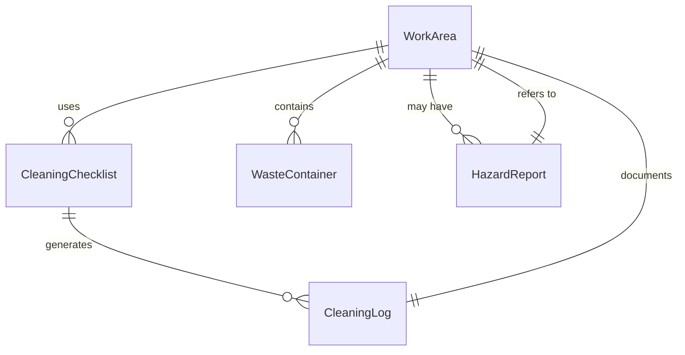
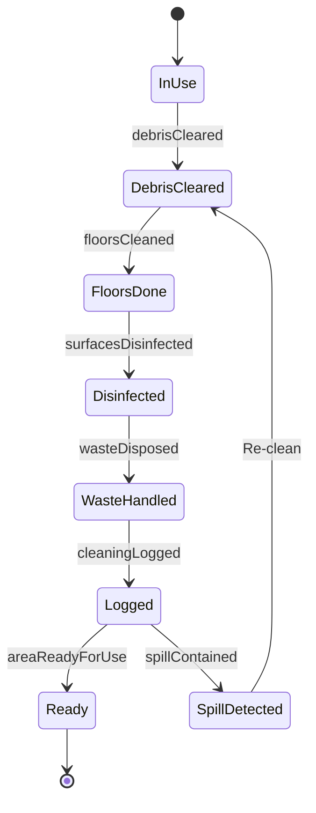
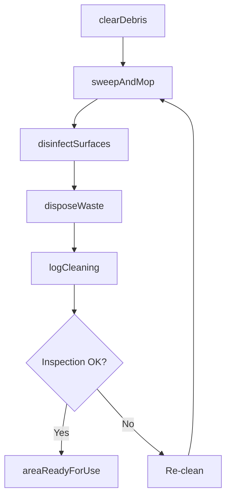
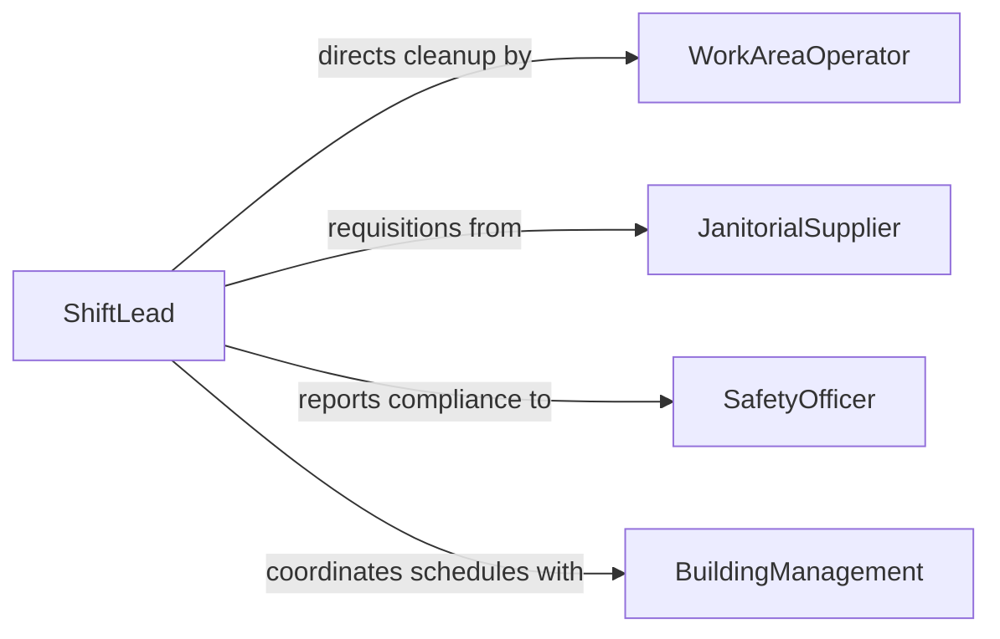

# Clean Work Areas

> Business-as-Code definition for cleaning work areas. Models the routine and on-demand cleaning of workstations, shop floors, laboratories, and shared operational spaces to maintain safety and productivity.

## Overview

Cleaning work areas involves maintaining organized, sanitary, and hazard-free workspaces across offices, manufacturing floors, laboratories, and service environments. This includes clearing debris, sweeping, mopping, disinfecting surfaces, and properly disposing of waste generated during work activities. The definition supports scheduled cleaning routines, incident-triggered cleanups, and 5S workplace organization practices.

## Actors

| Actor | Description |
|-------|-------------|
| SafetyOfficer | Enforces workplace cleanliness and hazard prevention standards |
| JanitorialSupplier | Provides cleaning products, mops, brooms, and waste bags |
| BuildingManagement | Coordinates cleaning schedules across shared facility spaces |
| EnvironmentalConsultant | Advises on proper handling and disposal of hazardous cleaning waste |

## Roles

| Role | Description |
|------|-------------|
| WorkAreaOperator | Maintains personal workstation cleanliness during and after shifts |
| Custodian | Performs scheduled cleaning of shared work areas and corridors |
| ShiftLead | Ensures end-of-shift cleanup procedures are followed by the team |
| SafetyCoordinator | Verifies that work areas meet cleanliness and safety standards |

## Entities

| Entity | Description |
|--------|-------------|
| WorkArea | A designated space where work activities are performed |
| CleaningChecklist | A list of required cleaning tasks for a specific work area |
| WasteContainer | A receptacle for collecting debris, scraps, or hazardous materials |
| CleaningLog | A record of completed cleaning activities with timestamps |
| HazardReport | Documentation of spills or contamination requiring special cleanup |

## Actions

| Action | Description |
|--------|-------------|
| clearDebris | Remove scraps, shavings, and loose materials from the work area |
| sweepAndMop | Clean floors using appropriate methods for the surface type |
| disinfectSurfaces | Apply sanitizing agents to work surfaces and high-touch points |
| disposeWaste | Empty waste containers and sort materials for proper disposal |
| logCleaning | Record completed cleaning tasks on the area checklist |
| handleSpill | Contain and clean up chemical or material spills safely |

## Events

| Event | Description |
|-------|-------------|
| debrisCleared | Loose materials and scraps have been removed from the area |
| floorsCleaned | Work area floors have been swept and mopped |
| surfacesDisinfected | Work surfaces have been sanitized |
| wasteDisposed | Waste containers have been emptied and materials sorted |
| cleaningLogged | Cleaning activities have been documented on the log |
| spillContained | A spill has been safely contained and cleaned |
| areaReadyForUse | The work area has been fully cleaned and cleared for operations |

## Searches

| Search | Description |
|--------|-------------|
| findCleaningTasks | List pending or completed cleaning tasks by area or shift |
| getCleaningLogs | Retrieve historical cleaning records for audit or review |
| getHazardReports | Access spill and contamination cleanup documentation |

## Entity Relationships



## State Diagram



## Workflow



## Actor Relationships



## Usage

### Calling Actions

```typescript
import { cleanWorkAreas } from '@headlessly/clean-work-areas'

const workAreas = cleanWorkAreas()

// Clear end-of-shift debris from the machine shop floor
await workAreas.clearDebris({
  areaId: 'machine-shop-b',
  debrisType: 'metal-shavings',
  method: 'industrial-vacuum'
})

// Disinfect shared lab benches
await workAreas.disinfectSurfaces({
  areaId: 'chemistry-lab-2',
  agent: 'isopropyl-alcohol-70',
  surfaces: ['bench-tops', 'fume-hood-sashes', 'door-handles']
})

// Log the completed cleaning
await workAreas.logCleaning({
  areaId: 'machine-shop-b',
  shift: 'second',
  completedBy: 'operator-45',
  tasks: ['debris-cleared', 'floors-swept', 'waste-disposed']
})
```

### Event-Driven Automation

```typescript
// Trigger hazmat response for chemical spills
workAreas.spillContained(async ({ areaId, substance, severity }) => {
  if (severity === 'high') {
    await notify({
      to: 'safety-coordinator',
      message: `Hazardous spill of ${substance} in ${areaId} requires follow-up inspection`
    })
  }
})

// Auto-generate cleaning checklists at shift start
workAreas.areaReadyForUse(async ({ areaId, shift }) => {
  await workAreas.logCleaning({
    areaId,
    shift,
    status: 'verified-clean'
  })
})
```
