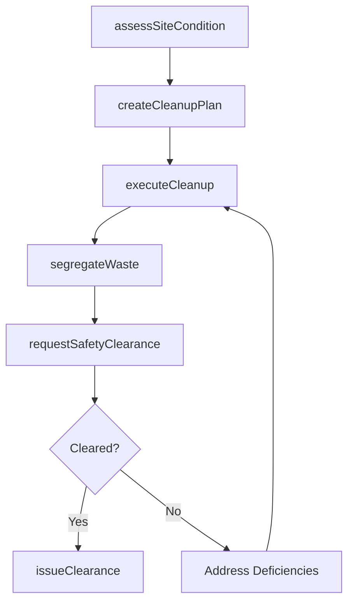
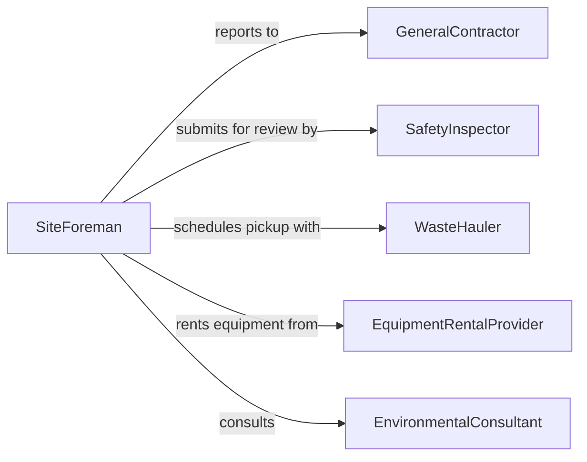

# Clean Work Sites

> Business-as-Code definition for cleaning construction, industrial, and field work sites to maintain safety standards and prepare areas for subsequent operations.

## Overview

Work site cleaning addresses the removal of debris, dust, and hazardous residue from active construction zones, manufacturing floors, and field operations areas. This definition models the assessment of site conditions, execution of cleaning procedures adapted to site type, waste segregation, and safety clearance verification required before resuming work activities.

## Actors

| Actor | Description |
|-------|-------------|
| GeneralContractor | Oversees site operations and sets cleanliness expectations |
| SafetyInspector | Verifies site cleanliness meets occupational safety codes |
| WasteHauler | Removes construction debris and segregated waste materials |
| EquipmentRentalProvider | Supplies specialized cleaning machinery for site use |
| EnvironmentalConsultant | Advises on disposal of regulated materials found on site |

## Roles

| Role | Description |
|------|-------------|
| SiteForeman | Coordinates cleaning activities around active work schedules |
| CleanupCrewLead | Directs the cleaning team and prioritizes task sequences |
| Laborer | Performs physical cleaning, sweeping, and debris removal |
| SafetyCoordinator | Ensures cleaning practices meet site safety requirements |

## Entities

| Entity | Description |
|--------|-------------|
| WorkSite | A defined location where construction or field work occurs |
| CleanupPlan | A documented approach for site cleaning activities |
| DebrisManifest | An inventory of waste types and volumes collected |
| SafetyClearance | A certification that the site is safe for work to resume |
| CleaningEquipment | Machinery and tools used for site cleaning operations |
| HazardFlag | A marker for areas requiring special cleaning attention |

## Actions

| Action | Description |
|--------|-------------|
| assessSiteCondition | Evaluate current state of the work site before cleaning |
| createCleanupPlan | Develop a cleaning approach based on site assessment |
| executeCleanup | Perform debris removal, sweeping, and washing |
| segregateWaste | Separate collected materials by disposal category |
| requestSafetyClearance | Submit cleaned site for safety inspection |
| issueClearance | Certify site as clean and safe for work resumption |

## Events

| Event | Description |
|-------|-------------|
| siteAssessed | Work site condition has been evaluated |
| cleanupPlanCreated | A cleaning approach has been documented |
| cleanupExecuted | Debris removal and cleaning has been completed |
| wasteSegregated | Collected waste has been sorted by disposal category |
| clearanceRequested | Site has been submitted for safety clearance |
| clearanceIssued | Site has been certified clean and safe |

## Searches

| Search | Description |
|--------|-------------|
| findSitesByStatus | List work sites by their current cleaning status |
| getDebrisManifests | Retrieve waste collection records for a site |
| getPendingClearances | List sites awaiting safety clearance approval |
| getCleanupHistory | Pull historical cleaning records for a work site |

## Workflow



## Actor Relationships



## Usage

### Calling Actions

```typescript
import { cleanWorkSites } from '@headlessly/clean-work-sites'

const sites = cleanWorkSites()

// Assess and plan cleanup for a construction site
const assessment = await sites.assessSiteCondition({
  siteId: 'SITE-2240',
  hazards: ['concrete-dust', 'scrap-metal'],
  area: { sqft: 15000 }
})

const plan = await sites.createCleanupPlan({
  siteId: 'SITE-2240',
  assessmentId: assessment.id,
  methods: ['mechanical-sweeping', 'pressure-wash'],
  crewSize: 6
})

// Execute cleanup and request clearance
await sites.executeCleanup({ planId: plan.id })
await sites.requestSafetyClearance({ siteId: 'SITE-2240' })
```

### Event-Driven Automation

```typescript
// Notify general contractor when site is cleared
sites.clearanceIssued(async ({ siteId, clearedAt }) => {
  await notify({
    to: 'general-contractor',
    message: `Site ${siteId} cleared for work as of ${clearedAt}`
  })
})

// Auto-schedule waste hauler after segregation
sites.wasteSegregated(async ({ siteId, manifest }) => {
  await schedulePickup({
    hauler: 'waste-hauler',
    siteId,
    categories: manifest.categories,
    volume: manifest.totalVolume
  })
})
```
