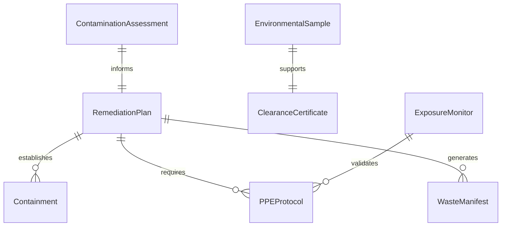
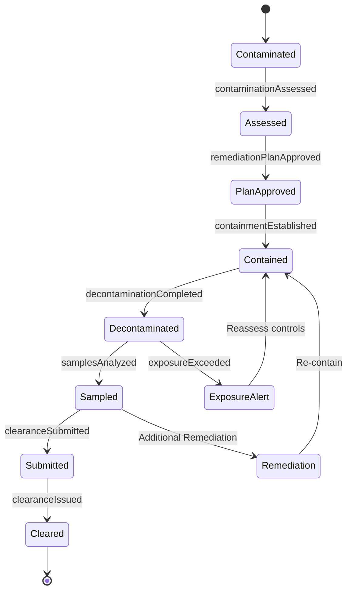
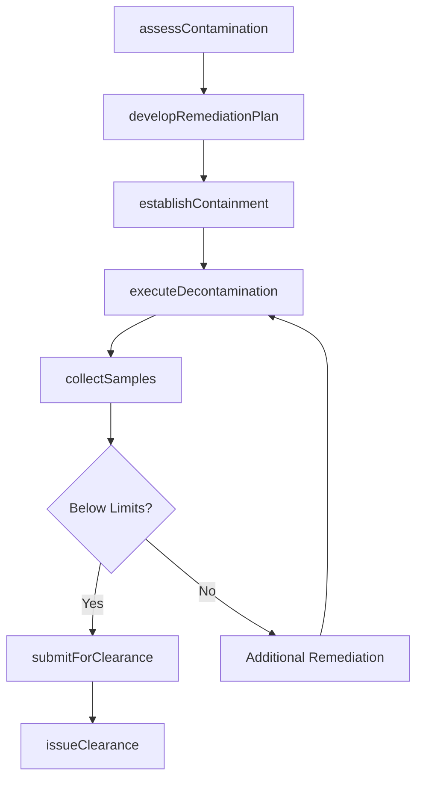
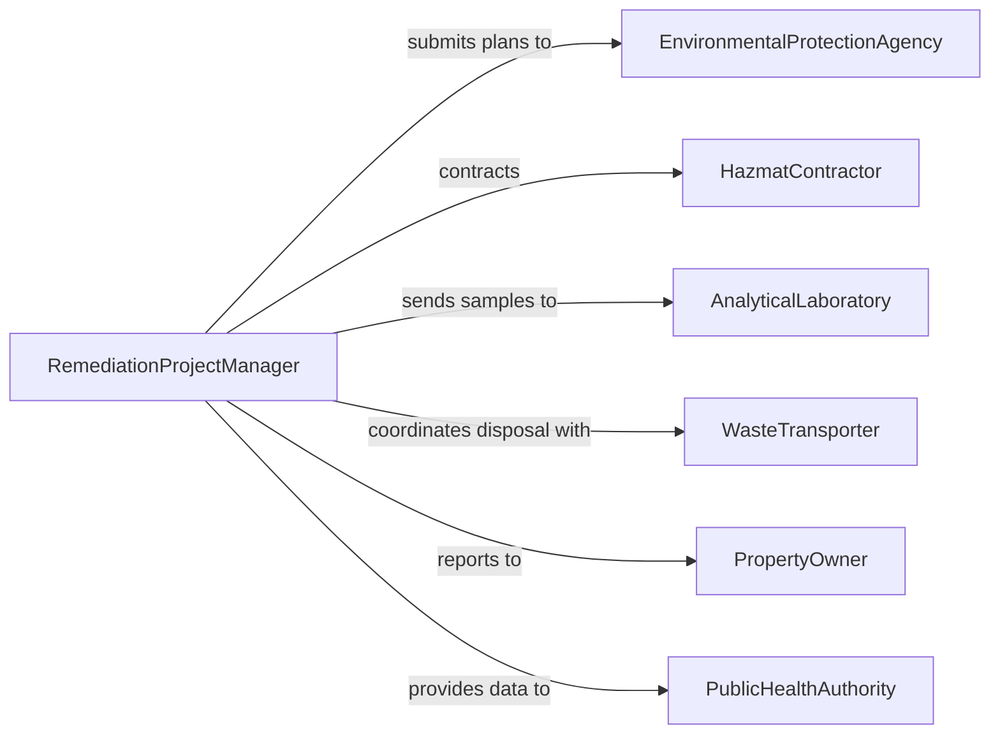

# Decontaminate Equipment and Sites to Remove Hazardous Substances

> Business-as-Code definition for decontaminating equipment and sites by safely removing hazardous, toxic, or radiological substances in compliance with environmental and safety regulations.

## Overview

Equipment and site decontamination addresses the identification, containment, removal, and verification of hazardous or toxic substances from machinery, structures, and land. This definition models the full remediation lifecycle from hazard assessment through containment planning, decontamination execution, environmental sampling, and regulatory clearance certification.

## Actors

| Actor | Description |
|-------|-------------|
| EnvironmentalProtectionAgency | Sets decontamination standards and issues clearance |
| HazmatContractor | Provides specialized hazardous materials removal services |
| AnalyticalLaboratory | Performs environmental sampling and substance analysis |
| WasteTransporter | Moves hazardous waste to licensed disposal facilities |
| PropertyOwner | Authorizes decontamination work and funds remediation |
| PublicHealthAuthority | Monitors community exposure risks during remediation |

## Roles

| Role | Description |
|------|-------------|
| RemediationProjectManager | Plans and oversees the decontamination project |
| HazmatTechnician | Performs hands-on decontamination procedures |
| IndustrialHygienist | Assesses exposure levels and recommends controls |
| EnvironmentalEngineer | Designs remediation plans and validates results |
| SafetyOfficer | Ensures worker protection during decontamination |

## Entities

| Entity | Description |
|--------|-------------|
| ContaminationAssessment | An evaluation of hazardous substances present |
| RemediationPlan | A documented strategy for decontamination activities |
| Containment | Physical barriers preventing contaminant spread |
| EnvironmentalSample | A specimen collected for laboratory analysis |
| WasteManifest | Tracking documentation for hazardous waste disposal |
| ClearanceCertificate | Regulatory approval confirming successful decontamination |
| PPEProtocol | Personal protective equipment requirements for workers |
| ExposureMonitor | A device or record tracking worker exposure levels |

## Actions

| Action | Description |
|--------|-------------|
| assessContamination | Evaluate the type and extent of hazardous substances |
| developRemediationPlan | Create a decontamination strategy and timeline |
| establishContainment | Set up physical barriers to prevent contaminant migration |
| executeDecontamination | Perform the hazardous substance removal procedures |
| collectSamples | Gather environmental samples for laboratory analysis |
| submitForClearance | Request regulatory review of decontamination results |
| issueClearance | Certify the site or equipment as decontaminated |

## Events

| Event | Description |
|-------|-------------|
| contaminationAssessed | Hazardous substances have been identified and quantified |
| remediationPlanApproved | Decontamination strategy has been approved |
| containmentEstablished | Physical barriers have been put in place |
| decontaminationCompleted | Hazardous substance removal has been finished |
| samplesAnalyzed | Laboratory results for environmental samples are available |
| clearanceSubmitted | Decontamination results submitted for regulatory review |
| clearanceIssued | Site or equipment certified as decontaminated |
| exposureExceeded | Worker exposure levels have exceeded safety thresholds |

## Searches

| Search | Description |
|--------|-------------|
| findActiveSites | List sites with ongoing decontamination projects |
| getSampleResults | Retrieve laboratory analysis results by site or date |
| getWasteManifests | Pull hazardous waste tracking records |
| findPendingClearances | Locate sites awaiting regulatory clearance |
| getExposureRecords | Retrieve worker exposure monitoring data |

## Entity Relationships



## State Diagram



## Workflow



## Actor Relationships



## Usage

### Calling Actions

```typescript
import { decontaminateEquipmentSitesRemoveHazardous } from '@headlessly/decontaminate-equipment-sites-remove-hazardous'

const decon = decontaminateEquipmentSitesRemoveHazardous()

// Assess contamination at an industrial site
const assessment = await decon.assessContamination({
  siteId: 'PLANT-EAST-7',
  substances: ['lead-paint', 'asbestos', 'PCBs'],
  area: { sqft: 50000 }
})

// Develop and execute remediation
const plan = await decon.developRemediationPlan({
  assessmentId: assessment.id,
  methods: ['encapsulation', 'abatement', 'soil-removal'],
  timeline: { weeks: 12 }
})

await decon.executeDecontamination({ planId: plan.id })

// Collect verification samples
const samples = await decon.collectSamples({
  siteId: 'PLANT-EAST-7',
  locations: ['building-interior', 'soil-perimeter', 'groundwater'],
  analytes: ['lead', 'asbestos-fibers', 'PCB-congeners']
})
```

### Event-Driven Automation

```typescript
// Alert safety when exposure limits exceeded
decon.exposureExceeded(async ({ workerId, substance, level }) => {
  await notify({
    to: 'safety-officer',
    message: `Worker ${workerId} exceeded ${substance} exposure limit: ${level}`
  })
})

// Notify property owner when clearance is issued
decon.clearanceIssued(async ({ siteId, certificateId }) => {
  await notify({
    to: 'property-owner',
    message: `Site ${siteId} has been cleared. Certificate: ${certificateId}`
  })
})
```
