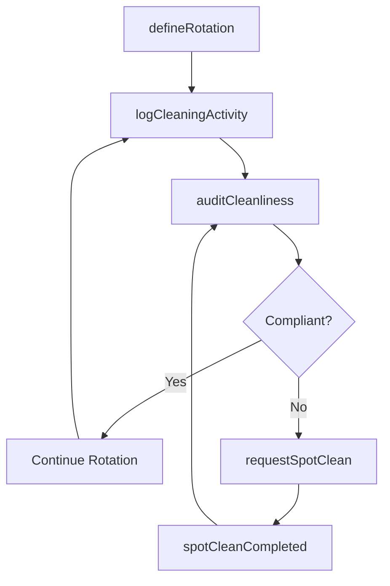
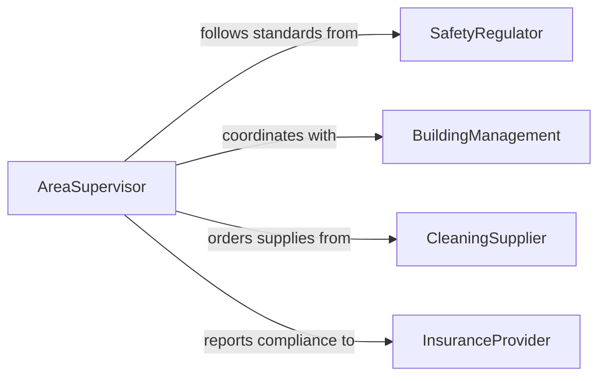

# Maintain Clean Work Areas

> Business-as-Code definition for the ongoing maintenance of clean and organized work areas to support operational efficiency and workplace safety.

## Overview

Maintaining clean work areas involves continuous upkeep of workstations, production floors, and shared spaces throughout operational hours. This definition models the proactive cleaning routines, spot-cleaning responses, and housekeeping standards that keep work environments safe, orderly, and compliant with occupational health regulations on an ongoing basis.

## Actors

| Actor | Description |
|-------|-------------|
| SafetyRegulator | Establishes workplace cleanliness and safety requirements |
| BuildingManagement | Provides facility infrastructure and maintenance support |
| CleaningSupplier | Delivers cleaning products and restocking materials |
| InsuranceProvider | Sets cleanliness standards tied to liability coverage |

## Roles

| Role | Description |
|------|-------------|
| AreaSupervisor | Monitors ongoing cleanliness and assigns spot-cleaning tasks |
| WorkAreaAttendant | Performs continuous cleaning and tidying throughout shifts |
| SafetyOfficer | Audits work areas for compliance with cleanliness standards |
| ShiftLead | Coordinates cleaning rotations among team members |

## Entities

| Entity | Description |
|--------|-------------|
| WorkArea | A defined workspace with assigned cleanliness standards |
| CleaningRotation | A scheduled cycle of cleaning responsibilities |
| SpotCleanRequest | An ad-hoc request to address a localized mess or spill |
| HousekeepingLog | A running record of cleaning activities and times |
| ComplianceStandard | A documented cleanliness requirement for an area type |
| SupplyStation | A stocked location with cleaning materials for quick access |

## Actions

| Action | Description |
|--------|-------------|
| defineRotation | Establish cleaning rotation assignments for a work area |
| logCleaningActivity | Record a completed cleaning task with timestamp |
| requestSpotClean | Submit an ad-hoc cleaning request for an area |
| auditCleanliness | Perform a compliance check against housekeeping standards |
| restockStation | Replenish a cleaning supply station |
| reportHazard | Flag a cleanliness issue that poses a safety risk |

## Events

| Event | Description |
|-------|-------------|
| rotationDefined | Cleaning rotation assignments have been set |
| activityLogged | A cleaning task has been recorded |
| spotCleanRequested | An ad-hoc cleaning need has been submitted |
| spotCleanCompleted | An ad-hoc cleaning request has been fulfilled |
| auditPassed | Work area meets cleanliness compliance standards |
| auditFailed | Work area does not meet required cleanliness levels |
| hazardReported | A cleanliness-related safety hazard has been flagged |

## Searches

| Search | Description |
|--------|-------------|
| findOpenSpotRequests | List pending ad-hoc cleaning requests |
| getAreaStatus | Retrieve current cleanliness status for a work area |
| getAuditHistory | Pull compliance audit results over a date range |
| getRotationSchedule | View current cleaning rotation assignments |

## Workflow



## Actor Relationships



## Usage

### Calling Actions

```typescript
import { maintainCleanWorkAreas } from '@headlessly/maintain-clean-work-areas'

const areas = maintainCleanWorkAreas()

// Define cleaning rotation for a production floor
const rotation = await areas.defineRotation({
  areaId: 'PROD-FLOOR-A',
  shifts: ['morning', 'afternoon', 'night'],
  tasks: ['sweep-floors', 'wipe-surfaces', 'empty-bins'],
  intervalMinutes: 120
})

// Log a completed cleaning activity
await areas.logCleaningActivity({
  areaId: 'PROD-FLOOR-A',
  task: 'sweep-floors',
  attendantId: 'ATT-012',
  completedAt: '2026-02-05T10:15:00Z'
})

// Request spot clean for a spill
await areas.requestSpotClean({
  areaId: 'PROD-FLOOR-A',
  description: 'Oil spill near station 4',
  priority: 'urgent'
})
```

### Event-Driven Automation

```typescript
// Auto-assign spot clean requests to nearest attendant
areas.spotCleanRequested(async ({ areaId, priority }) => {
  const available = await areas.getRotationSchedule({ areaId })
  await notify({
    to: available.currentAttendant,
    message: `Spot clean needed in ${areaId} - priority: ${priority}`
  })
})

// Escalate repeated audit failures
areas.auditFailed(async ({ areaId, failureCount }) => {
  if (failureCount >= 3) {
    await notify({
      to: 'safety-officer',
      message: `Recurring cleanliness failures in ${areaId} - immediate review required`
    })
  }
})
```
