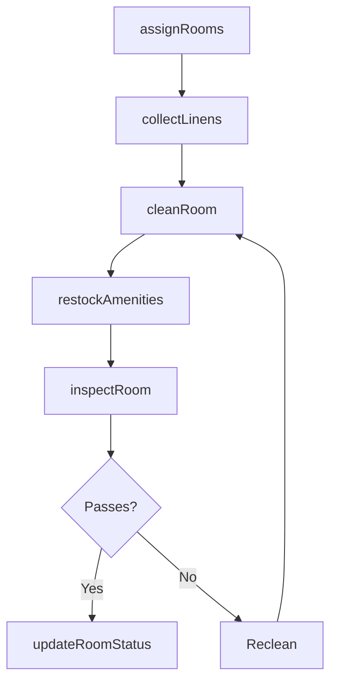
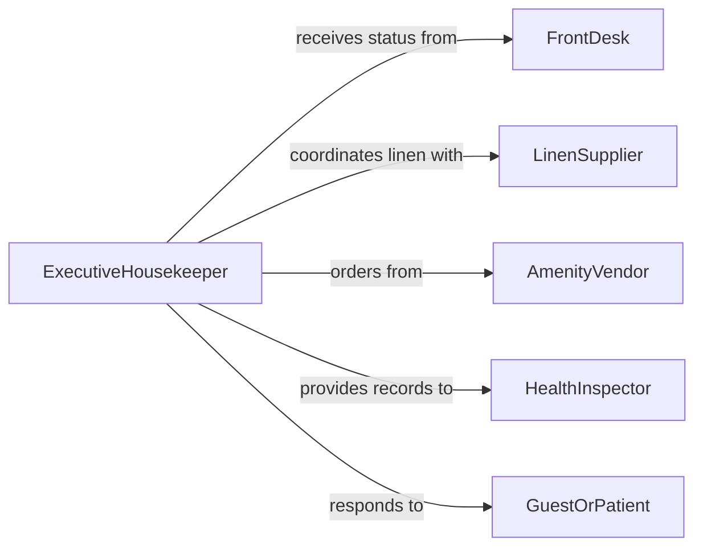

# Perform Housekeeping Duties

> Business-as-Code definition for performing general housekeeping duties including room turnover, linen management, and guest amenity replenishment in hospitality and institutional settings.

## Overview

Housekeeping duties encompass the full range of room cleaning, bed making, linen replacement, amenity restocking, and common area maintenance performed in hotels, hospitals, dormitories, and similar facilities. This definition models task assignment, room status tracking, supply management, and quality verification workflows that ensure consistent service delivery.

## Actors

| Actor | Description |
|-------|-------------|
| GuestOrPatient | Occupies rooms and provides feedback on cleanliness |
| LinenSupplier | Delivers fresh linens and launders soiled items |
| AmenityVendor | Provides toiletries, refreshments, and room supplies |
| HealthInspector | Audits housekeeping practices for regulatory compliance |
| FrontDesk | Communicates room status and guest requests |

## Roles

| Role | Description |
|------|-------------|
| ExecutiveHousekeeper | Manages housekeeping department operations and standards |
| RoomAttendant | Performs room cleaning, bed making, and restocking |
| LaundryAttendant | Manages linen collection, washing, and distribution |
| HousekeepingInspector | Conducts room inspections and quality checks |

## Entities

| Entity | Description |
|--------|-------------|
| Room | A guest room, patient room, or residential unit |
| HousekeepingTask | A specific cleaning or maintenance assignment |
| LinenInventory | Stock levels of sheets, towels, and other linens |
| AmenityKit | A set of toiletries and supplies for room restocking |
| RoomStatus | Current state of a room in the turnover workflow |
| InspectionChecklist | A list of quality items to verify after cleaning |
| GuestRequest | A special housekeeping request from an occupant |

## Actions

| Action | Description |
|--------|-------------|
| assignRooms | Distribute room assignments to housekeeping staff |
| cleanRoom | Perform standard room cleaning and bed making |
| restockAmenities | Replenish toiletries, towels, and room supplies |
| collectLinens | Gather soiled linens for laundering |
| inspectRoom | Conduct quality check after room has been cleaned |
| updateRoomStatus | Change room status in the property management system |
| fulfillGuestRequest | Complete a special housekeeping request |

## Events

| Event | Description |
|-------|-------------|
| roomsAssigned | Room assignments have been distributed to staff |
| roomCleaned | Standard cleaning and bed making has been completed |
| amenitiesRestocked | Room supplies have been replenished |
| linensCollected | Soiled linens have been gathered for laundering |
| roomInspected | Post-cleaning quality check has been completed |
| roomStatusUpdated | Room status has changed in the management system |
| guestRequestFulfilled | A special housekeeping request has been completed |

## Searches

| Search | Description |
|--------|-------------|
| findDirtyRooms | List rooms requiring cleaning |
| getRoomStatus | Retrieve current status for a room or floor |
| getLinenLevels | Check current linen inventory by type |
| findPendingRequests | List unfulfilled guest housekeeping requests |
| getInspectionScores | Pull quality scores by room, attendant, or date |

## Workflow



## Actor Relationships



## Usage

### Calling Actions

```typescript
import { performHousekeepingDuties } from '@headlessly/perform-housekeeping-duties'

const housekeeping = performHousekeepingDuties()

// Assign morning room block
const assignments = await housekeeping.assignRooms({
  attendantId: 'RA-023',
  rooms: ['301', '302', '305', '307', '310'],
  priority: 'checkout-first'
})

// Clean and restock a room
await housekeeping.cleanRoom({ roomId: '301', type: 'checkout-deep-clean' })
await housekeeping.restockAmenities({
  roomId: '301',
  items: ['bath-towels', 'shampoo', 'coffee-pods']
})

// Inspect and update status
const inspection = await housekeeping.inspectRoom({ roomId: '301' })
if (inspection.passed) {
  await housekeeping.updateRoomStatus({ roomId: '301', status: 'clean-inspected' })
}
```

### Event-Driven Automation

```typescript
// Notify front desk when rooms are ready
housekeeping.roomStatusUpdated(async ({ roomId, status }) => {
  if (status === 'clean-inspected') {
    await notify({
      to: 'front-desk',
      message: `Room ${roomId} is ready for guest check-in`
    })
  }
})

// Auto-reorder linens when inventory drops
housekeeping.linensCollected(async ({ type, quantity }) => {
  const levels = await housekeeping.getLinenLevels({ type })
  if (levels.available < levels.parLevel) {
    await notify({
      to: 'linen-supplier',
      message: `Reorder needed: ${type} - current: ${levels.available}, par: ${levels.parLevel}`
    })
  }
})
```
