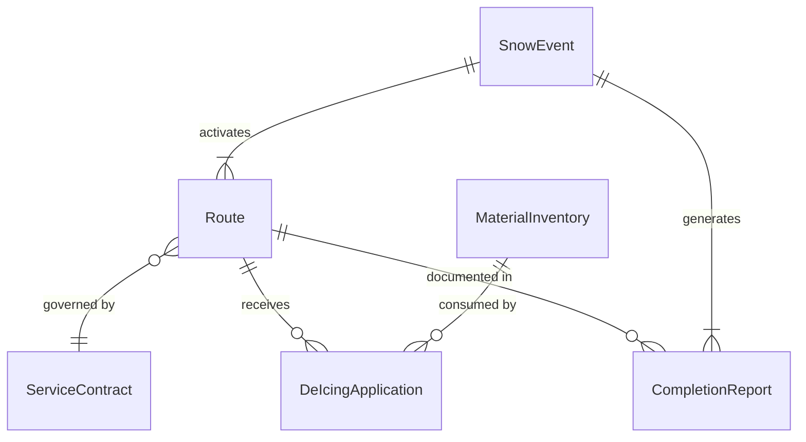
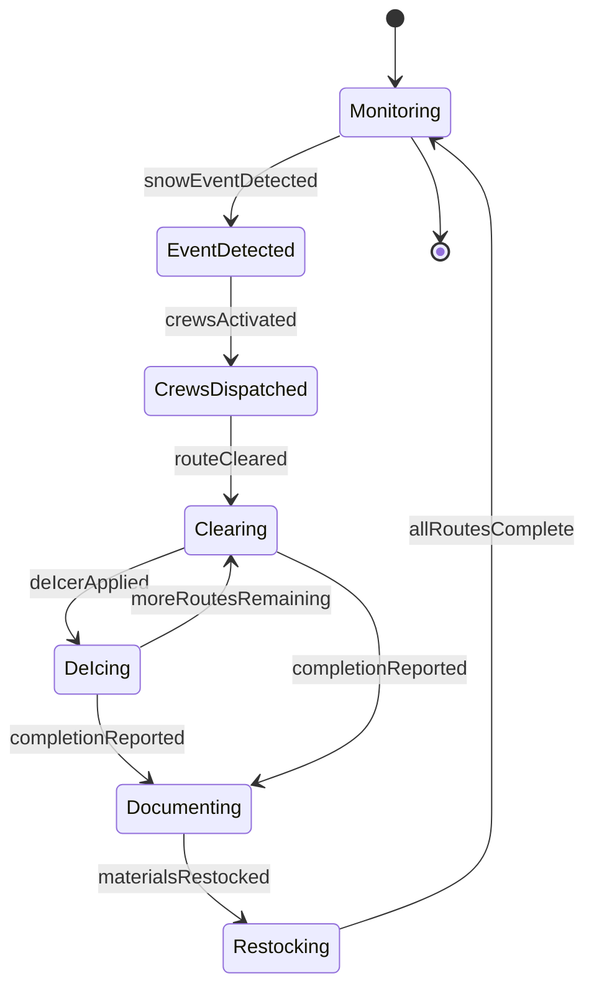
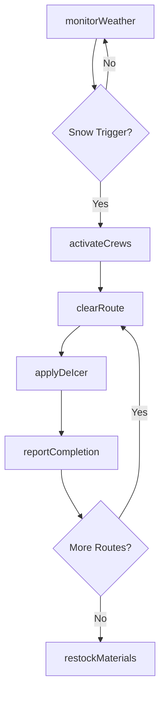
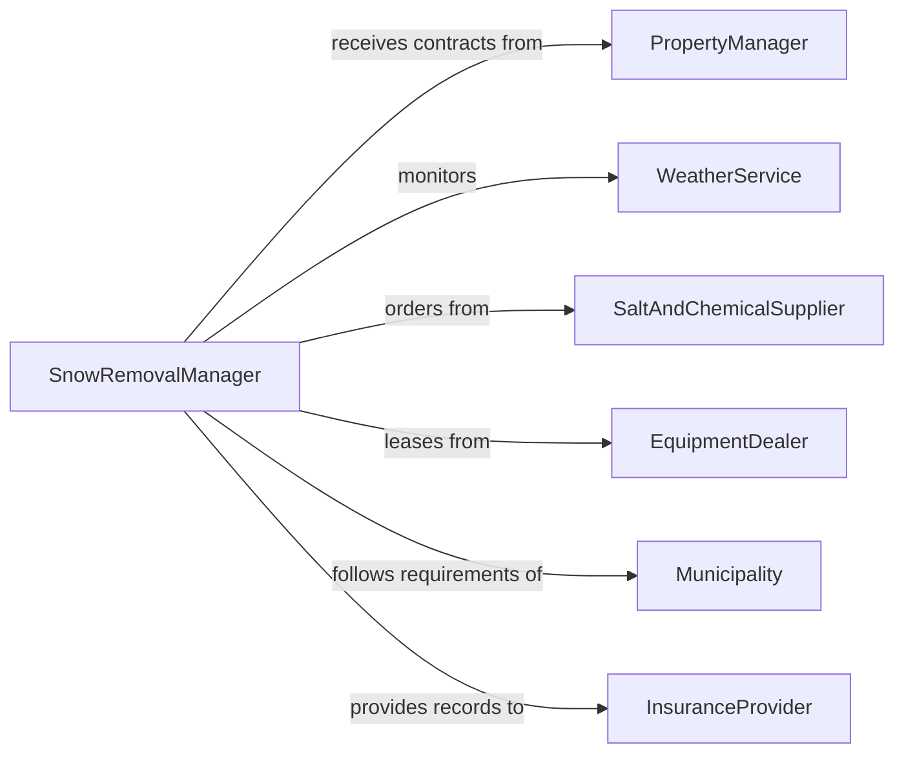

# Remove Snow

> Business-as-Code definition for snow removal operations including plowing, shoveling, de-icing, and winter maintenance of roads, walkways, and parking areas.

## Overview

Snow removal encompasses the clearing of snow and ice from roadways, sidewalks, parking lots, building entrances, and other surfaces to maintain safe access and mobility. This definition models weather monitoring, crew dispatching, route-based plowing operations, de-icing material application, and completion verification across commercial and municipal snow removal programs.

## Actors

| Actor | Description |
|-------|-------------|
| PropertyManager | Contracts snow removal services and defines priorities |
| WeatherService | Provides forecasts and storm alerts for planning |
| SaltAndChemicalSupplier | Delivers de-icing materials and brine solutions |
| EquipmentDealer | Provides plows, spreaders, and snow blowing machinery |
| Municipality | Sets public right-of-way clearing requirements |
| InsuranceProvider | Requires documented snow removal for liability coverage |

## Roles

| Role | Description |
|------|-------------|
| SnowRemovalManager | Plans routes, dispatches crews, and manages operations |
| PlowOperator | Drives plow trucks and clears roadways and parking lots |
| ShovelerOrLaborer | Clears sidewalks, stairs, and areas inaccessible to equipment |
| SaltSpreaderOperator | Applies de-icing materials to treated surfaces |

## Entities

| Entity | Description |
|--------|-------------|
| SnowEvent | A weather event triggering snow removal operations |
| Route | A defined path of properties or roads to be cleared |
| ServiceContract | An agreement specifying snow removal scope and triggers |
| DeIcingApplication | A record of salt or chemical applied to a surface |
| CompletionReport | Documentation of cleared areas with timestamps |
| MaterialInventory | Stock levels of salt, brine, and other de-icing supplies |

## Actions

| Action | Description |
|--------|-------------|
| monitorWeather | Track forecast data to anticipate snow removal needs |
| activateCrews | Dispatch snow removal teams based on storm triggers |
| clearRoute | Plow and shovel a designated route of properties |
| applyDeIcer | Spread salt or chemical de-icing material on surfaces |
| reportCompletion | Document cleared areas with timestamps and photos |
| restockMaterials | Replenish de-icing material inventories after events |

## Events

| Event | Description |
|-------|-------------|
| snowEventDetected | A weather event requiring snow removal has been identified |
| crewsActivated | Snow removal crews have been dispatched |
| routeCleared | A designated route has been plowed and shoveled |
| deIcerApplied | De-icing material has been spread on surfaces |
| completionReported | Cleared areas have been documented |
| materialsRestocked | De-icing supply inventories have been replenished |

## Searches

| Search | Description |
|--------|-------------|
| findActiveEvents | List current snow events and their status |
| getRouteStatus | Retrieve clearing progress for a specific route |
| getMaterialLevels | Check current de-icing material inventory |
| getCompletionReports | Pull clearing documentation by event or property |

## Entity Relationships



## State Diagram



## Workflow



## Actor Relationships



## Usage

### Calling Actions

```typescript
import { removeSnow } from '@headlessly/remove-snow'

const snow = removeSnow()

// Monitor weather and activate when triggered
const event = await snow.monitorWeather({
  region: 'northeast-corridor',
  trigger: { accumulation: 2, unit: 'inches' }
})

// Dispatch crews
await snow.activateCrews({
  eventId: event.id,
  routes: ['commercial-lot-A', 'sidewalk-loop-1', 'main-road'],
  crewIds: ['PLOW-01', 'PLOW-02', 'SHOVEL-TEAM-A']
})

// Clear and treat a route
await snow.clearRoute({
  routeId: 'commercial-lot-A',
  operatorId: 'PLOW-01',
  method: 'full-plow-with-pushback'
})

await snow.applyDeIcer({
  routeId: 'commercial-lot-A',
  material: 'rock-salt',
  rate: '40-lbs-per-1000-sqft'
})
```

### Event-Driven Automation

```typescript
// Auto-activate crews when snow threshold is reached
snow.snowEventDetected(async ({ region, accumulation }) => {
  if (accumulation >= 2) {
    await snow.activateCrews({
      region,
      priority: 'all-routes'
    })
  }
})

// Reorder materials when inventory drops after event
snow.completionReported(async ({ eventId }) => {
  const levels = await snow.getMaterialLevels({})
  for (const item of levels.filter(m => m.quantity < m.reorderPoint)) {
    await snow.restockMaterials({ materialId: item.id, quantity: item.reorderQuantity })
  }
})
```
