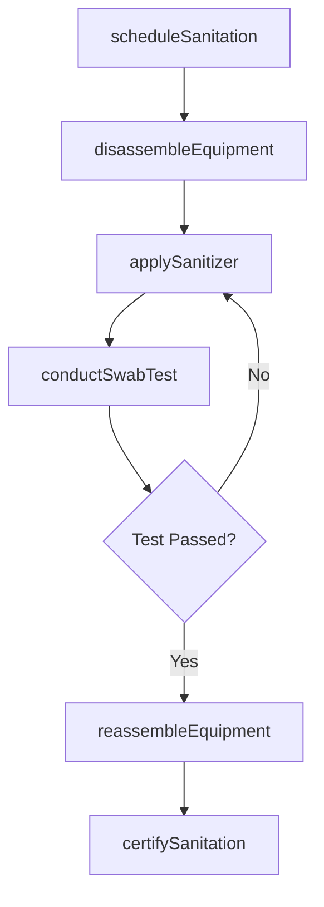
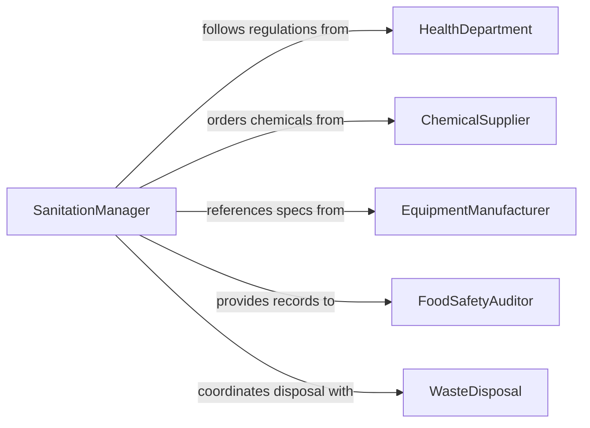

# Sterilize Food Cooking and Processing Equipment

> Business-as-Code definition for sterilizing food preparation, cooking, and processing equipment to maintain food safety standards and prevent contamination.

## Overview

Food equipment sterilization involves the systematic cleaning, sanitizing, and verification of cooking and processing machinery to meet food safety regulations. This definition models the complete sanitation cycle from pre-rinse through chemical or thermal treatment, drying, and compliance documentation required by health authorities.

## Actors

| Actor | Description |
|-------|-------------|
| HealthDepartment | Enforces food safety regulations and conducts inspections |
| ChemicalSupplier | Provides food-grade sanitizers and cleaning compounds |
| EquipmentManufacturer | Specifies cleaning procedures for equipment models |
| FoodSafetyAuditor | Conducts third-party sanitation verification audits |
| WasteDisposal | Handles wastewater and chemical disposal |

## Roles

| Role | Description |
|------|-------------|
| SanitationManager | Oversees equipment sterilization schedules and compliance |
| SanitationTechnician | Performs hands-on equipment cleaning and sterilization |
| QualityAssuranceSpecialist | Verifies sanitation effectiveness through testing |
| ShiftSupervisor | Ensures sterilization is completed before production runs |

## Entities

| Entity | Description |
|--------|-------------|
| SanitationOrder | A scheduled or triggered request to sterilize equipment |
| Equipment | A cooking or processing machine requiring sterilization |
| SanitationProtocol | Documented procedure for a specific equipment type |
| ChemicalSolution | A food-grade sanitizer with concentration specifications |
| SwabTest | A microbial test verifying sterilization effectiveness |
| ComplianceLog | A record of completed sanitation with sign-off |
| MaintenanceAlert | A flag indicating equipment needs repair before sanitation |

## Actions

| Action | Description |
|--------|-------------|
| scheduleSanitation | Create a sterilization order for equipment on a set cadence |
| disassembleEquipment | Break down equipment components for thorough cleaning |
| applySanitizer | Apply chemical or thermal sterilization treatment |
| conductSwabTest | Perform microbial testing to verify sanitation levels |
| reassembleEquipment | Reassemble equipment after sanitation and drying |
| certifySanitation | Log completion and sign off on compliance documentation |
| flagEquipmentIssue | Report equipment damage discovered during sanitation |

## Events

| Event | Description |
|-------|-------------|
| sanitationScheduled | A sterilization order has been created |
| equipmentDisassembled | Equipment has been broken down for cleaning |
| sanitizerApplied | Chemical or thermal treatment has been completed |
| swabTestPassed | Microbial test confirmed acceptable sanitation levels |
| swabTestFailed | Microbial test showed unacceptable contamination levels |
| sanitationCertified | Equipment sterilization has been documented and signed off |
| equipmentIssueFlagged | Damage or wear discovered during sanitation process |

## Searches

| Search | Description |
|--------|-------------|
| findPendingSanitation | List equipment due for sterilization |
| getSwabResults | Retrieve microbial test results by equipment or date |
| getComplianceLogs | Pull sanitation records for audit review |
| findFailedTests | Locate equipment with recent failed swab tests |
| getChemicalUsage | Track sanitizer consumption and reorder needs |

## Workflow



## Actor Relationships



## Usage

### Calling Actions

```typescript
import { sterilizeFoodCookingProcessingEquipment } from '@headlessly/sterilize-food-cooking-processing-equipment'

const sanitation = sterilizeFoodCookingProcessingEquipment()

// Schedule end-of-shift sanitation
const order = await sanitation.scheduleSanitation({
  equipmentId: 'MIXER-003',
  protocol: 'high-temperature-rinse',
  scheduledTime: '2026-02-05T22:00:00Z'
})

// Perform swab test after sanitizing
const result = await sanitation.conductSwabTest({
  orderId: order.id,
  testPoints: ['blade-assembly', 'mixing-bowl', 'discharge-valve'],
  threshold: { coliformCFU: 0, aerobicCFU: 100 }
})

// Certify completion
await sanitation.certifySanitation({
  orderId: order.id,
  technicianId: 'SAN-019',
  swabTestId: result.id
})
```

### Event-Driven Automation

```typescript
// Re-sanitize on failed swab test
sanitation.swabTestFailed(async ({ orderId, equipmentId, results }) => {
  await sanitation.applySanitizer({
    orderId,
    method: 'extended-chemical-soak',
    duration: 30
  })
})

// Notify maintenance on equipment issues
sanitation.equipmentIssueFlagged(async ({ equipmentId, issue }) => {
  await notify({
    to: 'maintenance-team',
    message: `Equipment ${equipmentId} needs repair: ${issue.description}`
  })
})
```
