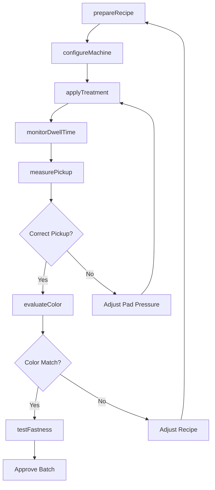
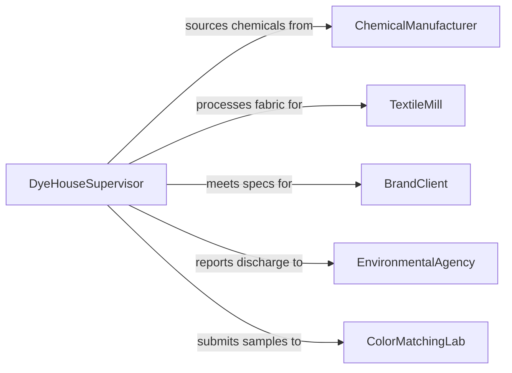

# Apply Water or Solutions to Fabrics or Apparel

> Business-as-Code definition for applying water, dye solutions, bleaching agents, fabric treatments, sizing compounds, and finishing chemicals to textiles and garments during manufacturing, treatment, and restoration processes.

## Overview

Applying water or solutions to fabrics and apparel involves measuring and mixing chemical treatments, setting application equipment parameters, applying solutions through spraying, padding, dipping, or immersion methods, controlling dwell time and temperature, and verifying uniform coverage. This definition models solution preparation, application method selection, treatment execution, quality measurement, and process documentation for textile dyeing, bleaching, waterproofing, flame retardant treatment, and garment finishing operations.

## Actors

| Actor | Description |
|-------|-------------|
| ChemicalManufacturer | Produces dyes, bleaches, sizing agents, and finishing chemicals |
| TextileMill | Provides greige goods and specifies treatment requirements |
| BrandClient | Specifies color standards, hand feel, and performance properties |
| EnvironmentalAgency | Regulates wastewater discharge and chemical usage limits |
| ColorMatchingLab | Provides spectrophotometric analysis and shade approval |

## Roles

| Role | Description |
|------|-------------|
| DyeHouseSupervisor | Plans treatment schedules and monitors chemical bath conditions |
| PadOperator | Runs padding machines that apply solutions to fabric rolls |
| DyeingTechnician | Manages immersion dye baths, jet machines, and beam dyeing equipment |
| QualityColorist | Measures color accuracy, fastness, and hand properties |

## Entities

| Entity | Description |
|--------|-------------|
| TreatmentRecipe | A formula specifying chemicals, concentrations, temperature, and time |
| DyeBath | A prepared solution in a vessel for immersion dyeing or treatment |
| PadPickup | The percentage of solution retained by fabric after padding and squeezing |
| ColorStandard | A reference swatch or spectral data defining the target shade |
| FastnessTest | A laboratory test measuring resistance to washing, light, or rubbing |
| WastewaterSample | An effluent sample tested for pH, BOD, and chemical content |
| TreatmentLog | A record of batch parameters, chemical quantities, and process times |

## Actions

| Action | Description |
|--------|-------------|
| prepareRecipe | Measure and mix chemicals according to the treatment formula |
| configureMachine | Set temperature, speed, pressure, and liquor ratio on the application equipment |
| applyTreatment | Run fabric through the padding, spraying, or immersion process |
| monitorDwellTime | Track the duration of chemical contact with the fabric |
| measurePickup | Test the percentage of solution absorbed by the fabric |
| evaluateColor | Compare treated fabric to the color standard using spectrophotometer |
| testFastness | Perform wash, light, or crocking fastness tests on treated samples |

## Events

| Event | Description |
|-------|-------------|
| recipePrepared | Chemical treatment solution has been mixed and verified |
| machineConfigured | Equipment parameters have been set for the treatment run |
| treatmentApplied | Fabric has passed through the application process |
| dwellTimeCompleted | Chemical contact time has reached the specified duration |
| pickupMeasured | Solution absorption percentage has been tested |
| colorEvaluated | Spectrophotometric comparison to standard has been completed |
| fastnessTestCompleted | Wash, light, or rub fastness results have been recorded |

## Searches

| Search | Description |
|--------|-------------|
| findActiveBatches | List fabric batches currently in treatment or awaiting processing |
| getRecipeHistory | Retrieve treatment formulas by fabric type, color, or customer |
| getColorData | Pull spectrophotometric readings by batch or shade reference |
| getFastnessResults | Locate fastness test records by batch, customer, or test type |

## Workflow



## Actor Relationships



## Usage

### Calling Actions

```typescript
import { applyWaterSolutionsFabricsApparel } from '@headlessly/apply-water-solutions-fabrics-apparel'

const treatment = applyWaterSolutionsFabricsApparel()

// Prepare a reactive dye recipe for cotton jersey
await treatment.prepareRecipe({
  batchId: 'DYE-2026-0441',
  fabric: 'cotton-jersey-180gsm',
  recipe: 'reactive-navy-RB-133',
  chemicals: [
    { name: 'Reactive Navy Blue RB', gPerLiter: 30 },
    { name: 'sodium-carbonate', gPerLiter: 20 },
    { name: 'sodium-sulfate', gPerLiter: 50 }
  ],
  bathVolume: { liters: 800 }
})

// Configure and apply
await treatment.configureMachine({
  machineId: 'JET-DYEING-04',
  temperature: { celsius: 60 },
  liquorRatio: '1:8',
  rampRate: { degreesPerMinute: 2 }
})

await treatment.applyTreatment({
  batchId: 'DYE-2026-0441',
  machineId: 'JET-DYEING-04',
  method: 'jet-immersion',
  fabricWeight: { kg: 100 }
})

// Evaluate results
await treatment.evaluateColor({
  batchId: 'DYE-2026-0441',
  standard: 'PANTONE-19-3933-TCX',
  instrument: 'spectrophotometer-D65',
  deltaETolerance: 1.0
})

await treatment.testFastness({
  batchId: 'DYE-2026-0441',
  tests: ['wash-ISO-105-C06', 'light-ISO-105-B02', 'crocking-AATCC-8']
})
```

### Event-Driven Automation

```typescript
// Auto-evaluate color when treatment completes
treatment.treatmentApplied(async ({ batchId, fabric }) => {
  await treatment.evaluateColor({ batchId, standard: 'per-customer-spec' })
})

// Alert on color mismatch
treatment.colorEvaluated(async ({ batchId, deltaE, tolerance }) => {
  if (deltaE > tolerance) {
    await notify({
      to: 'dye-house-supervisor',
      message: `Batch ${batchId} deltaE ${deltaE} exceeds tolerance ${tolerance} - recipe adjustment needed`
    })
  }
})
```
