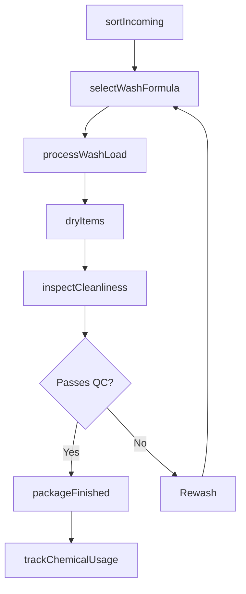
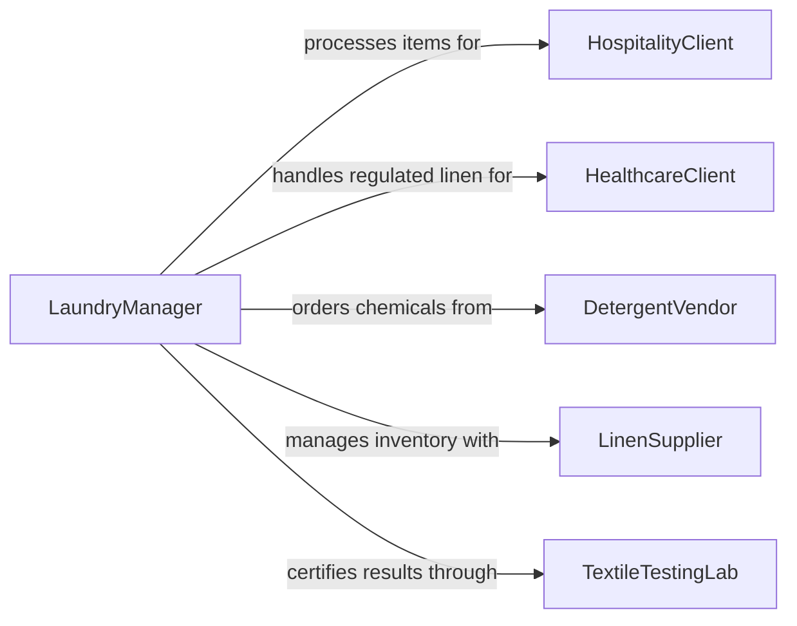

# Clean Fabrics or Apparel

> Business-as-Code definition for washing, dry cleaning, and laundering fabrics, textiles, uniforms, linens, and apparel using commercial and industrial cleaning processes.

## Overview

Cleaning fabrics and apparel involves sorting items by fabric type and soil level, selecting the appropriate wash or dry clean program, processing through commercial washers and extractors, drying, folding or hanging, and performing quality checks. This definition models garment intake, sorting, wash formula selection, machine processing, drying, inspection, and packaging for commercial laundries, linen services, uniform rental companies, and hospitality operations.

## Actors

| Actor | Description |
|-------|-------------|
| LinenSupplier | Provides rental linens and uniforms requiring regular cleaning |
| DetergentVendor | Supplies wash chemicals, softeners, and specialty cleaning agents |
| HospitalityClient | Hotels, restaurants, and venues that outsource laundry processing |
| HealthcareClient | Hospitals and clinics requiring infection-controlled linen processing |
| TextileTestingLab | Certifies cleanliness standards and chemical residue levels |

## Roles

| Role | Description |
|------|-------------|
| LaundryManager | Plans wash schedules, staffing, and chemical usage |
| SortingOperator | Classifies incoming items by fabric, color, and soil level |
| WashOperator | Programs and runs commercial washers and extractors |
| FinishingAttendant | Dries, irons, folds, and packages cleaned items |

## Entities

| Entity | Description |
|--------|-------------|
| WashFormula | A chemical dosing program matched to fabric type and soil classification |
| SortCategory | A classification group based on color, fabric, and contamination level |
| WashLoad | A batch of items processed together in a single machine cycle |
| DryingProgram | Temperature and tumble settings for a specific fabric category |
| QualityCheck | An inspection confirming stain removal, whiteness, and fabric integrity |
| PackagingSpec | Folding, wrapping, or hanging requirements for the finished product |
| ChemicalInventory | Stock levels of detergents, bleach, softeners, and specialty agents |

## Actions

| Action | Description |
|--------|-------------|
| sortIncoming | Classify items by fabric, color, soil level, and contamination risk |
| selectWashFormula | Choose the chemical program and cycle parameters for the load |
| processWashLoad | Run the load through the washer with the selected formula |
| dryItems | Transfer cleaned items to dryers or flatwork ironers |
| inspectCleanliness | Check items for remaining stains, odors, or damage |
| packageFinished | Fold, hang, or wrap items per customer specifications |
| trackChemicalUsage | Record detergent and chemical consumption per load |

## Events

| Event | Description |
|-------|-------------|
| incomingSorted | Items have been classified and placed in sort bins |
| washFormulaSelected | Chemical program and cycle parameters have been set |
| washLoadProcessed | Items have completed the wash and extraction cycle |
| itemsDried | Cleaned items have been dried to the specified moisture level |
| cleanlinessInspected | Quality check has confirmed items meet cleanliness standards |
| finishedPackaged | Items have been folded, hung, or wrapped for delivery |
| chemicalUsageTracked | Detergent and chemical consumption has been logged |

## Searches

| Search | Description |
|--------|-------------|
| findActiveLoads | List wash loads currently in process by machine or stage |
| getWashHistory | Retrieve processing records by customer, date, or formula |
| getChemicalLevels | Check current stock of detergents and cleaning agents |
| getQualityMetrics | Pull rejection rates and rewash percentages by period |

## Workflow



## Actor Relationships



## Usage

### Calling Actions

```typescript
import { cleanFabricsApparel } from '@headlessly/clean-fabrics-apparel'

const laundry = cleanFabricsApparel()

// Sort incoming hotel linen delivery
await laundry.sortIncoming({
  clientId: 'GRAND-HOTEL-DOWNTOWN',
  items: [
    { type: 'king-sheets', quantity: 200, soil: 'normal' },
    { type: 'bath-towels', quantity: 350, soil: 'heavy' },
    { type: 'table-linens', quantity: 80, soil: 'stained' }
  ]
})

// Select formula and process
await laundry.selectWashFormula({
  loadId: 'LOAD-2026-0205-014',
  category: 'heavy-soil-white-cotton',
  formula: 'alkaline-break-bleach-sour',
  temperature: { fahrenheit: 160 }
})

await laundry.processWashLoad({
  loadId: 'LOAD-2026-0205-014',
  machineId: 'WASHER-EXTRACTOR-06',
  weight: { pounds: 120 }
})

// Dry and inspect
await laundry.dryItems({
  loadId: 'LOAD-2026-0205-014',
  method: 'tumble-dry-high',
  duration: { minutes: 45 }
})

await laundry.inspectCleanliness({
  loadId: 'LOAD-2026-0205-014',
  checks: ['stain-free', 'whiteness-level', 'fabric-integrity']
})
```

### Event-Driven Automation

```typescript
// Auto-rewash loads that fail inspection
laundry.cleanlinessInspected(async ({ loadId, passed, failures }) => {
  if (!passed) {
    await laundry.selectWashFormula({
      loadId,
      category: 'rewash-targeted',
      formula: failures.includes('stain') ? 'enzyme-presoak-rewash' : 'standard-rewash'
    })
  }
})

// Alert on high chemical consumption
laundry.chemicalUsageTracked(async ({ chemical, gallonsUsed, expectedGallons }) => {
  if (gallonsUsed > expectedGallons * 1.2) {
    await notify({
      to: 'laundry-manager',
      message: `${chemical} usage ${gallonsUsed} gal exceeds expected ${expectedGallons} gal by 20%+`
    })
  }
})
```
