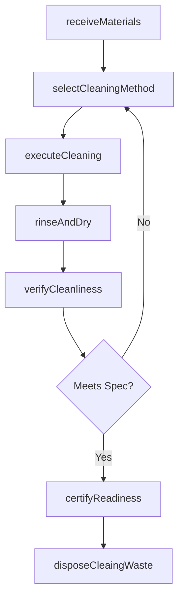
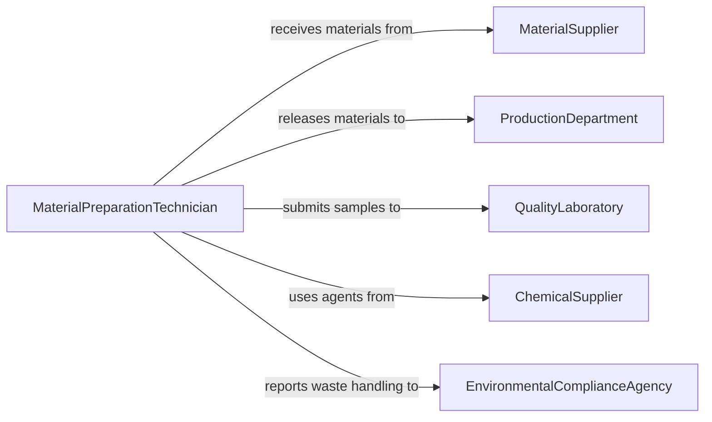

# Clean Materials Prepare Them Production

> Business-as-Code definition for cleaning materials in preparation for production. Models the pre-production material cleaning lifecycle including surface preparation, contaminant removal, and readiness verification.

## Overview

Cleaning materials to prepare them for production involves removing oils, debris, oxidation, coatings, and other contaminants from raw materials and components before they enter manufacturing processes. This definition exposes actions for intake, cleaning method selection, treatment execution, and quality verification, along with events for tracking material readiness and searches for production scheduling.

## Actors

| Actor | Description |
|-------|-------------|
| MaterialSupplier | Delivers raw materials and components requiring pre-production cleaning |
| ProductionDepartment | Receives cleaned materials and integrates them into manufacturing workflows |
| QualityLaboratory | Tests material surfaces for contamination levels and cleaning effectiveness |
| ChemicalSupplier | Provides solvents, degreasers, and cleaning agents for material treatment |
| EnvironmentalComplianceAgency | Regulates chemical usage, waste disposal, and emissions from cleaning processes |

## Roles

| Role | Description |
|------|-------------|
| MaterialPreparationTechnician | Performs cleaning operations on raw materials and components |
| ProcessEngineer | Specifies cleaning methods, parameters, and acceptance criteria |
| QualityControlInspector | Verifies material cleanliness against production specifications |
| ProductionScheduler | Coordinates cleaning schedules with manufacturing timelines |

## Entities

| Entity | Description |
|--------|-------------|
| MaterialBatch | A group of raw materials or components processed together |
| CleaningMethod | A defined procedure for removing contaminants (solvent, abrasive, ultrasonic) |
| SurfaceSpecification | Required cleanliness level for a material entering production |
| CleaningAgent | Chemical solution or abrasive media used to treat materials |
| ContaminationReport | Documentation of contaminant types and levels found on materials |
| ReadinessCertificate | Confirmation that cleaned materials meet production specifications |

## Actions

| Action | Description |
|--------|-------------|
| receiveMaterials | Log incoming materials and assess initial contamination levels |
| selectCleaningMethod | Determine the appropriate cleaning process based on material and contaminant type |
| executeCleaning | Perform the cleaning operation using the selected method and agents |
| rinseAndDry | Remove residual cleaning agents and moisture from treated materials |
| verifyCleanliness | Test material surfaces to confirm they meet production specifications |
| certifyReadiness | Issue a readiness certificate for materials passing cleanliness verification |
| disposeCleaingWaste | Handle used solvents, abrasives, and contaminated rinse water per regulations |

## Events

| Event | Description |
|-------|-------------|
| materialsReceived | Raw materials have been logged and initial assessment completed |
| cleaningMethodSelected | Appropriate cleaning process has been determined for the batch |
| cleaningExecuted | Materials have been treated with the selected cleaning process |
| materialsRinsed | Residual agents have been removed and materials dried |
| cleanlinessVerified | Surface testing confirms materials meet production specifications |
| readinessCertified | Materials have been formally cleared for production use |
| cleaningWasteDisposed | Used cleaning agents and waste have been properly handled |

## Searches

| Search | Description |
|--------|-------------|
| findMaterialBatches | Locate material batches by status, type, or production order |
| getCleaningHistory | Retrieve cleaning records for a specific material or batch |
| getSpecificationByMaterial | Look up cleanliness requirements for a given material type |
| findPendingBatches | List batches awaiting cleaning or verification |

## Workflow



## Actor Relationships



## Usage

### Calling Actions

```typescript
import { cleanMaterialsPrepareThemProduction } from '@headlessly/clean-materials-prepare-them-production'

const prep = cleanMaterialsPrepareThemProduction()

// Receive a batch of aluminum sheet stock
const batch = await prep.receiveMaterials({
  batchId: 'BATCH-AL-2026-0339',
  materialType: 'aluminum-6061',
  quantity: 500,
  unit: 'sheets',
  contaminants: ['machining-oil', 'surface-oxidation']
})

// Select and execute cleaning
await prep.selectCleaningMethod({
  batchId: batch.id,
  method: 'alkaline-degrease',
  agent: 'sodium-hydroxide-solution'
})

await prep.executeCleaning({
  batchId: batch.id,
  temperatureCelsius: 60,
  immersionMinutes: 15
})

// Verify and certify
const result = await prep.verifyCleanliness({
  batchId: batch.id,
  testMethod: 'water-break-test'
})
```

### Event-Driven Automation

```typescript
// Route failed cleanliness checks for re-cleaning
prep.cleanlinessVerified(async ({ batchId, passed, contaminantsRemaining }) => {
  if (!passed) {
    await prep.selectCleaningMethod({
      batchId,
      method: 'ultrasonic',
      reason: `residual contaminants: ${contaminantsRemaining.join(', ')}`
    })
  }
})

// Notify production when materials are certified
prep.readinessCertified(async ({ batchId, materialType }) => {
  await notify({
    to: 'production-scheduling',
    message: `Batch ${batchId} (${materialType}) cleaned and ready for production`
  })
})
```
