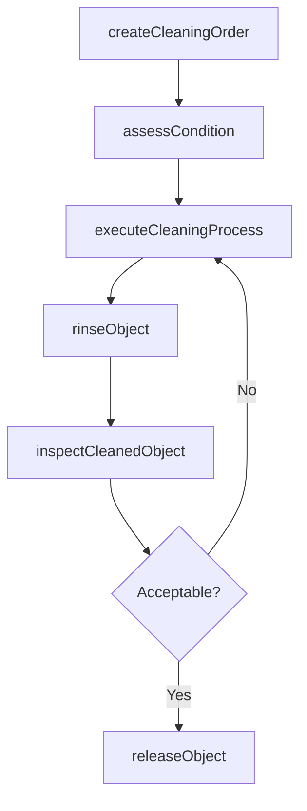
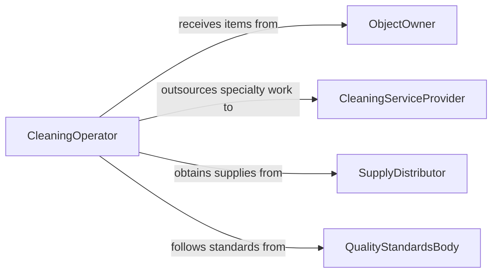

# Clean Objects

> Business-as-Code definition for cleaning objects such as workpieces, finished products, and general items. Models the intake, cleaning, inspection, and release of objects across industrial, commercial, and service contexts.

## Overview

Cleaning objects involves removing dirt, residue, grease, dust, and other contaminants from workpieces, finished goods, tools, and general items to restore or maintain their condition. This definition exposes actions for assessing cleaning needs, executing cleaning methods, verifying results, and tracking object status through the cleaning lifecycle.

## Actors

| Actor | Description |
|-------|-------------|
| ObjectOwner | Submits items for cleaning and receives them upon completion |
| CleaningServiceProvider | External vendor providing specialized cleaning for difficult or high-value items |
| SupplyDistributor | Provides cleaning solutions, cloths, solvents, and equipment |
| QualityStandardsBody | Defines cleanliness benchmarks for specific industries or product types |

## Roles

| Role | Description |
|------|-------------|
| CleaningOperator | Performs hands-on cleaning of objects using appropriate methods |
| CleaningSupervisor | Assigns work, monitors quality, and ensures throughput targets |
| InspectionTechnician | Examines cleaned objects to verify they meet cleanliness standards |
| InventoryClerk | Tracks objects through the cleaning process and manages handoffs |

## Entities

| Entity | Description |
|--------|-------------|
| CleaningOrder | A request to clean one or more objects with specified requirements |
| CleanableObject | An item submitted for cleaning with its type and condition details |
| CleaningMethod | A procedure defining technique, agents, and duration for cleaning |
| CleaningSolution | Chemical or solvent used during the cleaning process |
| InspectionRecord | Documentation of post-cleaning inspection results |
| CleaningStation | A designated work area equipped for specific cleaning operations |

## Actions

| Action | Description |
|--------|-------------|
| createCleaningOrder | Register objects for cleaning with method and priority specifications |
| assessCondition | Evaluate the object to determine appropriate cleaning approach |
| executeCleaningProcess | Apply the selected cleaning method to the object |
| rinseObject | Remove residual cleaning agents from the object surface |
| inspectCleanedObject | Verify the object meets cleanliness standards after treatment |
| releaseObject | Return the cleaned and inspected object to its owner or next process |

## Events

| Event | Description |
|-------|-------------|
| cleaningOrderCreated | A new cleaning request has been registered |
| conditionAssessed | Object condition has been evaluated and cleaning method determined |
| cleaningProcessExecuted | The object has been cleaned using the selected method |
| objectRinsed | Residual cleaning agents have been removed from the object |
| objectInspected | Post-cleaning inspection has been completed |
| objectReleased | The cleaned object has been returned or forwarded |

## Searches

| Search | Description |
|--------|-------------|
| findCleaningOrders | List cleaning orders by status, priority, or date range |
| getObjectHistory | Retrieve cleaning history for a specific object |
| findObjectsByStation | Locate objects currently assigned to a cleaning station |
| getPendingInspections | List cleaned objects awaiting quality inspection |

## Workflow



## Actor Relationships



## Usage

### Calling Actions

```typescript
import { cleanObjects } from '@headlessly/clean-objects'

const cleaning = cleanObjects()

// Create a cleaning order for a batch of machined parts
const order = await cleaning.createCleaningOrder({
  objects: [
    { objectId: 'PART-7721', type: 'machined-housing', contaminants: ['cutting-fluid', 'metal-chips'] },
    { objectId: 'PART-7722', type: 'machined-housing', contaminants: ['cutting-fluid'] }
  ],
  priority: 'standard',
  requiredBy: '2026-03-10'
})

// Assess condition and clean
await cleaning.assessCondition({ orderId: order.id, objectId: 'PART-7721' })

await cleaning.executeCleaningProcess({
  objectId: 'PART-7721',
  method: 'ultrasonic',
  solution: 'aqueous-degreaser',
  durationMinutes: 12
})
```

### Event-Driven Automation

```typescript
// Auto-schedule inspection after cleaning completes
cleaning.cleaningProcessExecuted(async ({ objectId, orderId }) => {
  await cleaning.rinseObject({ objectId })
  await cleaning.inspectCleanedObject({ objectId, method: 'visual' })
})

// Notify owner when objects are released
cleaning.objectReleased(async ({ objectId, orderId }) => {
  await notify({
    to: 'object-owner',
    message: `Object ${objectId} from order ${orderId} is cleaned and ready for pickup`
  })
})
```
