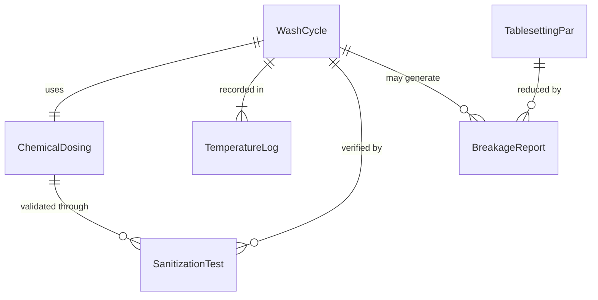
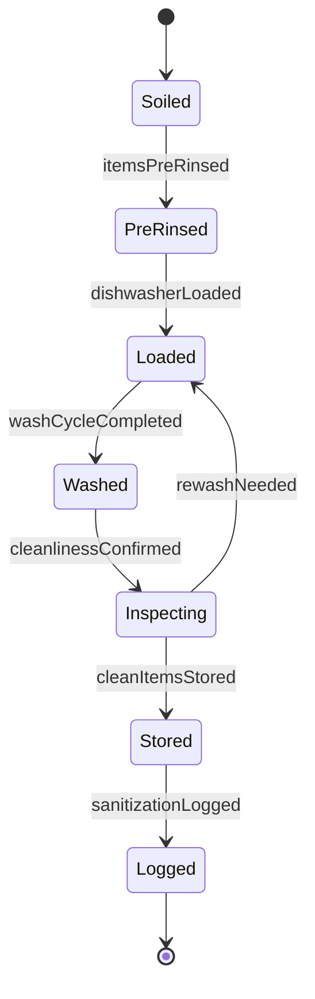
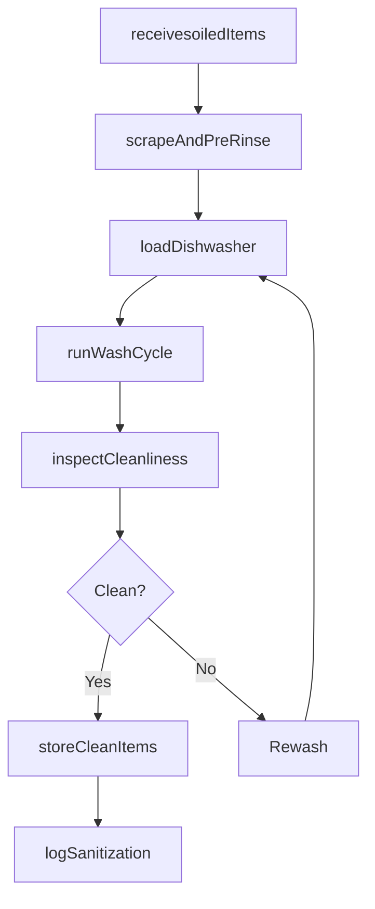
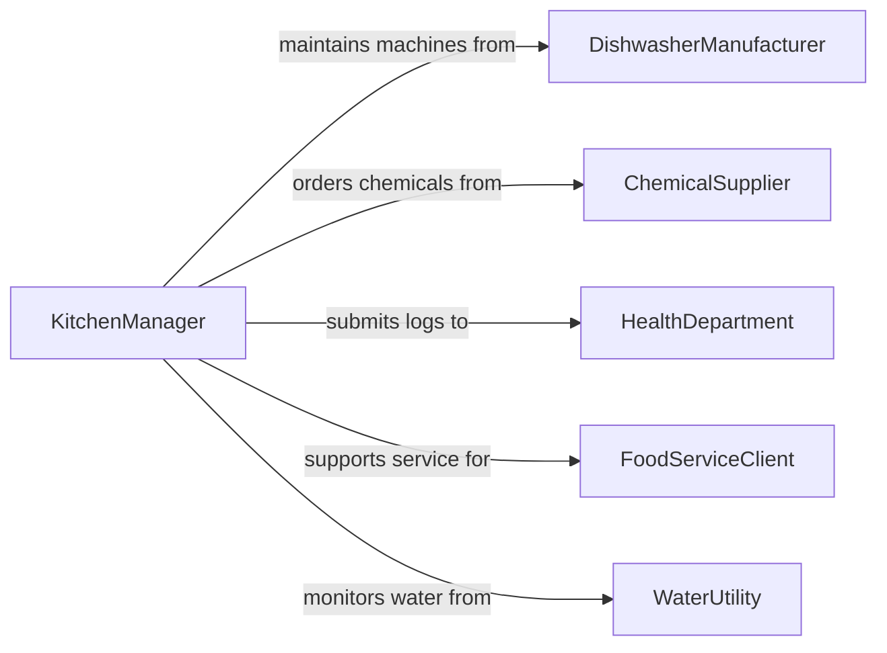

# Clean Tableware

> Business-as-Code definition for washing, sanitizing, and drying dishes, glassware, flatware, pots, and serving ware in commercial kitchens, restaurants, catering operations, and institutional dining facilities.

## Overview

Cleaning tableware involves scraping and pre-rinsing soiled items, loading commercial dishwashers or three-compartment sinks, running wash and sanitize cycles at required temperatures, inspecting for cleanliness, and storing items in designated areas. This definition models bussing intake, pre-wash preparation, machine or manual washing, sanitizing, drying, inspection, and storage for restaurants, hotels, hospitals, school cafeterias, and event catering operations.

## Actors

| Actor | Description |
|-------|-------------|
| DishwasherManufacturer | Provides commercial warewashing machines and parts |
| ChemicalSupplier | Delivers detergent, rinse aid, and sanitizer concentrates |
| HealthDepartment | Inspects sanitation practices and enforces food safety codes |
| FoodServiceClient | The restaurant, hotel, or institution generating soiled tableware |
| WaterUtility | Provides water meeting temperature and quality requirements |

## Roles

| Role | Description |
|------|-------------|
| KitchenManager | Schedules dishwashing shifts and oversees sanitation compliance |
| Dishwasher | Operates warewashing equipment and performs manual cleaning |
| BussingAttendant | Collects soiled tableware from dining areas and delivers to dish pit |
| SanitationInspector | Tests water temperature, chemical concentration, and cleanliness |

## Entities

| Entity | Description |
|--------|-------------|
| WashCycle | A programmed sequence of pre-rinse, wash, rinse, and sanitize phases |
| ChemicalDosing | Concentration settings for detergent, rinse aid, and sanitizer |
| TemperatureLog | Recorded wash and rinse water temperatures for health code compliance |
| TablesettingPar | The target quantity of clean items needed to support service |
| BreakageReport | Documentation of chipped, cracked, or broken items requiring replacement |
| SanitizationTest | A chemical strip or thermometer reading confirming sanitization effectiveness |

## Actions

| Action | Description |
|--------|-------------|
| receivesoiledItems | Accept bussed tableware at the dish pit and sort by type |
| scrapeAndPreRinse | Remove food debris and pre-rinse items before machine loading |
| loadDishwasher | Rack items and load into the commercial warewashing machine |
| runWashCycle | Start the machine cycle and monitor temperature and chemical levels |
| inspectCleanliness | Check washed items for food residue, spots, or damage |
| storeCleanItems | Place inspected items in designated storage racks or shelving |
| logSanitization | Record water temperatures, chemical concentrations, and test strip results |

## Events

| Event | Description |
|-------|-------------|
| soiledItemsReceived | Bussed tableware has arrived at the dish pit |
| itemsPreRinsed | Food debris has been removed and items are ready for washing |
| dishwasherLoaded | Racks have been filled and placed in the machine |
| washCycleCompleted | The warewashing machine has finished all phases |
| cleanlinessConfirmed | Inspection has verified items are free of residue and damage |
| cleanItemsStored | Washed items have been placed in their designated locations |
| sanitizationLogged | Temperature and chemical readings have been documented |

## Searches

| Search | Description |
|--------|-------------|
| findActiveRacks | List racks currently in the machine or awaiting processing |
| getTemperatureLogs | Retrieve wash and rinse temperature records by date or shift |
| getBreakageData | Pull breakage counts by item type or period |
| getParLevels | Check current clean inventory against tablesetting par requirements |

## Entity Relationships



## State Diagram



## Workflow



## Actor Relationships



## Usage

### Calling Actions

```typescript
import { cleanTableware } from '@headlessly/clean-tableware'

const dishpit = cleanTableware()

// Receive bussed items from dinner service
await dishpit.receivesoiledItems({
  shift: 'dinner',
  items: [
    { type: 'dinner-plates', quantity: 85 },
    { type: 'wine-glasses', quantity: 40 },
    { type: 'flatware-sets', quantity: 85 },
    { type: 'saute-pans', quantity: 12 }
  ]
})

// Pre-rinse and load
await dishpit.scrapeAndPreRinse({
  rackId: 'RACK-2026-0205-042',
  items: ['dinner-plates'],
  method: 'spray-rinse'
})

await dishpit.loadDishwasher({
  machineId: 'HOBART-CL44E',
  rackId: 'RACK-2026-0205-042',
  rackType: 'peg-rack-plates'
})

await dishpit.runWashCycle({
  machineId: 'HOBART-CL44E',
  cycle: 'high-temp-sanitize',
  washTemp: { fahrenheit: 150 },
  rinseTemp: { fahrenheit: 180 }
})

// Inspect and store
await dishpit.inspectCleanliness({
  rackId: 'RACK-2026-0205-042',
  checks: ['food-residue', 'spots', 'chips']
})

await dishpit.logSanitization({
  machineId: 'HOBART-CL44E',
  washTemp: { fahrenheit: 152 },
  rinseTemp: { fahrenheit: 182 },
  sanitizerPPM: 50,
  testMethod: 'chemical-test-strip'
})
```

### Event-Driven Automation

```typescript
// Alert when sanitization temps fall below code requirements
dishpit.sanitizationLogged(async ({ machineId, rinseTemp, sanitizerPPM }) => {
  if (rinseTemp.fahrenheit < 180 && sanitizerPPM < 50) {
    await notify({
      to: 'kitchen-manager',
      message: `Machine ${machineId} rinse at ${rinseTemp.fahrenheit}F and ${sanitizerPPM} PPM - below health code minimums`
    })
  }
})

// Track breakage trends
dishpit.cleanlinessConfirmed(async ({ rackId, brokenItems }) => {
  if (brokenItems.length > 0) {
    await notify({
      to: 'kitchen-manager',
      message: `Rack ${rackId} had ${brokenItems.length} broken items: ${brokenItems.map(i => i.type).join(', ')}`
    })
  }
})
```
