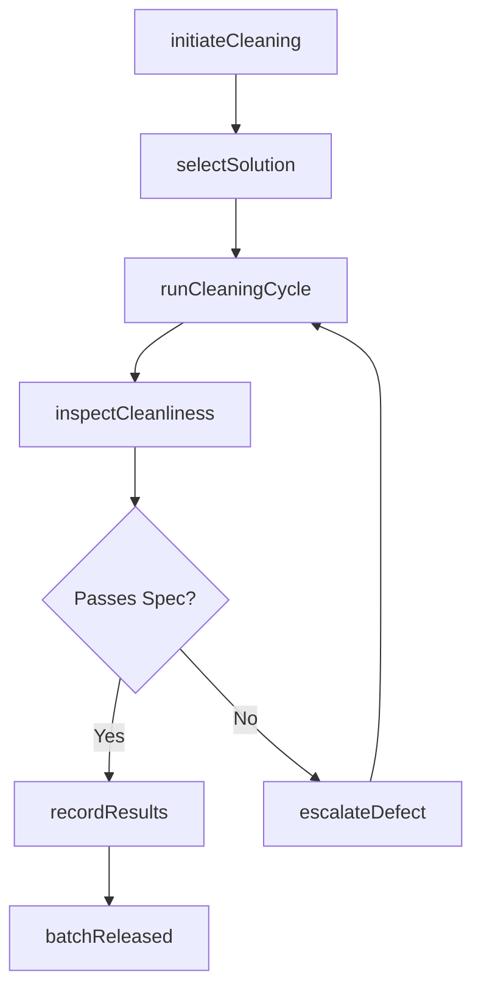
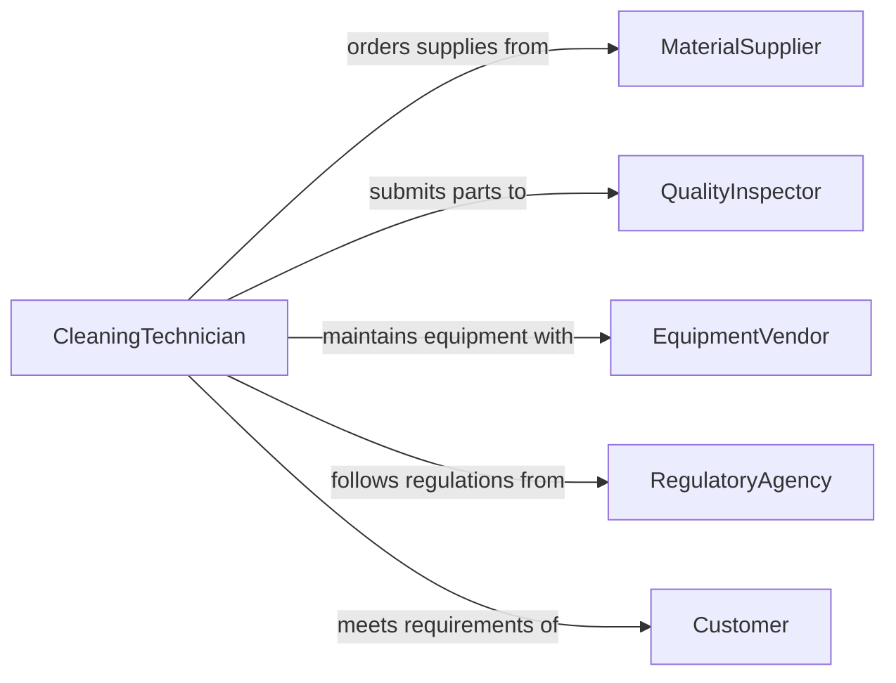

# Clean Workpieces Finished Products

> Business-as-Code definition for cleaning workpieces and finished products. Models the process of removing debris, residues, and contaminants from manufactured parts and completed goods to meet quality and safety standards.

## Overview

Cleaning workpieces and finished products involves removing metal shavings, oils, chemical residues, and other contaminants generated during manufacturing processes. This activity ensures parts meet surface finish specifications, prevents corrosion, and prepares items for subsequent operations such as painting, assembly, or packaging. The definition covers solvent cleaning, ultrasonic baths, pressure washing, and manual deburring across production environments.

## Actors

| Actor | Description |
|-------|-------------|
| MaterialSupplier | Provides cleaning solvents, abrasives, and consumables |
| QualityInspector | Verifies cleanliness standards are met before release |
| EquipmentVendor | Supplies and services cleaning machinery such as ultrasonic baths |
| RegulatoryAgency | Sets environmental and safety standards for cleaning chemicals |
| Customer | Specifies cleanliness requirements for delivered products |

## Roles

| Role | Description |
|------|-------------|
| ProductionOperator | Performs hands-on cleaning of workpieces between operations |
| CleaningTechnician | Operates specialized cleaning equipment and manages chemical baths |
| QualityController | Inspects cleaned parts for residue and surface defects |
| ShiftSupervisor | Oversees cleaning schedules and ensures throughput targets are met |

## Entities

| Entity | Description |
|--------|-------------|
| Workpiece | A part or component undergoing manufacturing operations |
| CleaningBatch | A group of items processed together in a cleaning cycle |
| CleaningSolution | The chemical agent or solvent used to remove contaminants |
| CleanlinessSpec | Surface cleanliness requirements defined by engineering |
| InspectionRecord | Documentation of post-cleaning quality verification |
| CleaningEquipment | Machinery used for cleaning such as ultrasonic tanks or wash stations |

## Actions

| Action | Description |
|--------|-------------|
| initiateCleaning | Begin a cleaning cycle for a batch of workpieces |
| selectSolution | Choose the appropriate cleaning agent based on material and contaminant |
| runCleaningCycle | Execute the cleaning process using the designated method |
| inspectCleanliness | Verify that parts meet surface cleanliness specifications |
| recordResults | Log cleaning parameters and inspection outcomes |
| disposeSolution | Properly handle spent cleaning chemicals per environmental regulations |
| escalateDefect | Flag parts that fail cleanliness inspection for rework |

## Events

| Event | Description |
|-------|-------------|
| cleaningInitiated | A new cleaning batch has been started |
| cycleCompleted | The cleaning equipment has finished its programmed cycle |
| cleanlinessVerified | Parts have passed post-cleaning inspection |
| defectDetected | A workpiece failed to meet cleanliness specifications |
| solutionReplaced | A cleaning chemical bath has been refreshed or changed |
| batchReleased | Cleaned parts have been approved for the next production step |
| wasteDisposed | Spent cleaning chemicals have been properly disposed |

## Searches

| Search | Description |
|--------|-------------|
| findCleaningBatches | List cleaning batches by status, date, or equipment used |
| getInspectionResults | Retrieve cleanliness inspection records for specific parts or batches |
| getSolutionUsage | Track cleaning chemical consumption and replacement schedules |

## Workflow



## Actor Relationships



## Usage

### Calling Actions

```typescript
import { cleanWorkpiecesFinishedProducts } from '@headlessly/clean-workpieces-finished-products'

const cleaning = cleanWorkpiecesFinishedProducts()

// Start a cleaning batch for machined aluminum parts
const batch = await cleaning.initiateCleaning({
  workpieces: ['WP-4401', 'WP-4402', 'WP-4403'],
  contaminantType: 'cutting-oil',
  material: 'aluminum-6061'
})

// Run the ultrasonic cleaning cycle
await cleaning.runCleaningCycle({
  batchId: batch.id,
  method: 'ultrasonic',
  duration: 600,
  temperature: 55
})

// Inspect and release
const result = await cleaning.inspectCleanliness({
  batchId: batch.id,
  spec: 'MIL-STD-1246C-Level-300'
})
```

### Event-Driven Automation

```typescript
// Alert quality team when defects are detected
cleaning.defectDetected(async ({ batchId, workpieceId, reason }) => {
  await notify({
    to: 'quality-team',
    message: `Workpiece ${workpieceId} in batch ${batchId} failed cleanliness: ${reason}`
  })
})

// Schedule solution replacement based on cycle count
cleaning.cycleCompleted(async ({ equipmentId, cycleCount }) => {
  if (cycleCount % 50 === 0) {
    await cleaning.disposeSolution({ equipmentId })
  }
})
```
