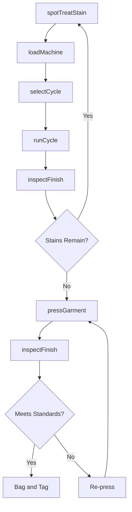
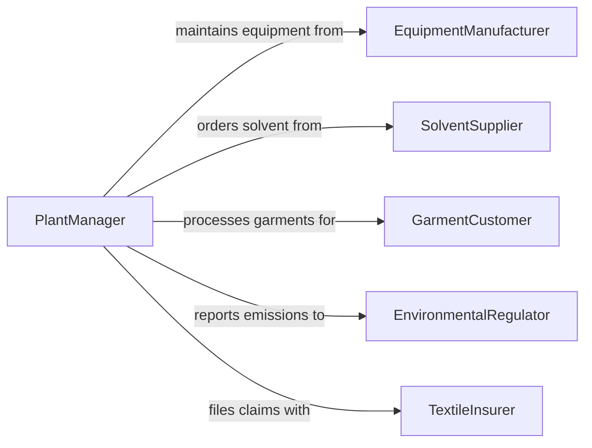

# Operate Garment Treatment Equipment

> Business-as-Code definition for running dry cleaning machines, pressing equipment, steam tunnels, spotting stations, and finishing systems used in commercial laundry and garment care operations.

## Overview

Operating garment treatment equipment involves loading garments into dry cleaning machines, selecting solvent cycles or wet cleaning programs, running steam presses and finishing tables, operating spotting stations for stain removal, and maintaining equipment logs. This definition models machine setup, cycle selection, garment processing, pressing and finishing, quality inspection, and equipment maintenance for dry cleaners, hotel laundries, uniform services, and textile restoration facilities.

## Actors

| Actor | Description |
|-------|-------------|
| EquipmentManufacturer | Provides dry cleaning machines, presses, and finishing systems |
| SolventSupplier | Delivers perchloroethylene, hydrocarbon, or GreenEarth solvents |
| GarmentCustomer | Drops off clothing and specifies care preferences |
| EnvironmentalRegulator | Enforces solvent emission limits and waste disposal rules |
| TextileInsurer | Covers garment damage claims arising from treatment errors |

## Roles

| Role | Description |
|------|-------------|
| PlantManager | Oversees equipment operations, scheduling, and maintenance |
| MachineOperator | Loads, programs, and runs dry cleaning and wet cleaning machines |
| Presser | Operates steam presses, form finishers, and utility presses |
| Spotter | Treats stains at the spotting board before or after machine cleaning |

## Entities

| Entity | Description |
|--------|-------------|
| CleaningCycle | A programmed sequence of solvent wash, rinse, and extraction phases |
| SolventCharge | A measured quantity of cleaning solvent loaded into the machine |
| SpottingFormula | A chemical treatment matched to a specific stain and fabric type |
| PressProgram | Temperature, steam, and vacuum settings for a garment category |
| GarmentTag | A tracking tag linking a garment to its customer order and care instructions |
| MaintenanceLog | A record of equipment service, solvent tests, and filter changes |
| EmissionReport | Documentation of solvent usage and atmospheric release for regulatory compliance |

## Actions

| Action | Description |
|--------|-------------|
| loadMachine | Place sorted garments into the cleaning drum and secure the door |
| selectCycle | Choose the appropriate cleaning program based on fabric and soil level |
| runCycle | Start the cleaning machine and monitor cycle progression |
| spotTreatStain | Apply chemical agents to specific stains at the spotting station |
| pressGarment | Run the garment through steam press or form finisher |
| inspectFinish | Check the garment for remaining stains, wrinkles, or damage |
| logMaintenance | Record solvent levels, filter condition, and equipment service actions |

## Events

| Event | Description |
|-------|-------------|
| machineLoaded | Garments have been placed in the drum and the door is secured |
| cycleSelected | The cleaning program has been chosen for the load |
| cycleCompleted | The cleaning machine has finished wash, rinse, and extraction |
| stainSpotTreated | Chemical spotting treatment has been applied to a stain |
| garmentPressed | The garment has been pressed and shaped on finishing equipment |
| finishInspected | Quality check has confirmed the garment meets standards |
| maintenanceLogged | Equipment service and solvent data have been recorded |

## Searches

| Search | Description |
|--------|-------------|
| findActiveLoads | List garment loads currently in machine or awaiting processing |
| getMachineStatus | Check operating status and cycle progress for each machine |
| getSpottingHistory | Retrieve stain treatment records by garment tag or formula |
| getMaintenanceDue | Find equipment with upcoming or overdue service requirements |

## Workflow



## Actor Relationships



## Usage

### Calling Actions

```typescript
import { operateGarmentTreatmentEquipment } from '@headlessly/operate-garment-treatment-equipment'

const equipment = operateGarmentTreatmentEquipment()

// Spot treat a wine stain on silk before machine cleaning
await equipment.spotTreatStain({
  garmentTag: 'ORD-2026-4421-03',
  stainType: 'red-wine',
  fabric: 'silk-charmeuse',
  formula: 'protein-tannin-two-step',
  station: 'spotting-board-2'
})

// Load and run a dry cleaning cycle
await equipment.loadMachine({
  machineId: 'DC-MACHINE-03',
  garmentTags: ['ORD-2026-4421-01', 'ORD-2026-4421-02', 'ORD-2026-4421-03'],
  totalWeight: { pounds: 35 }
})

await equipment.selectCycle({
  machineId: 'DC-MACHINE-03',
  cycle: 'delicate-hydrocarbon',
  washTime: { minutes: 8 },
  rinses: 2
})

await equipment.runCycle({ machineId: 'DC-MACHINE-03' })

// Press finished garments
await equipment.pressGarment({
  garmentTag: 'ORD-2026-4421-01',
  equipment: 'utility-press',
  steamTemp: { fahrenheit: 300 },
  vacuumHold: { seconds: 5 }
})
```

### Event-Driven Automation

```typescript
// Auto-queue pressing when cleaning cycle completes
equipment.cycleCompleted(async ({ machineId, garmentTags }) => {
  for (const tag of garmentTags) {
    await equipment.inspectFinish({ garmentTag: tag })
  }
})

// Alert on maintenance due
equipment.maintenanceLogged(async ({ machineId, solventLevel, filterHours }) => {
  if (filterHours > 200) {
    await notify({
      to: 'plant-manager',
      message: `Machine ${machineId} filter at ${filterHours} hours - replacement due`
    })
  }
})
```
