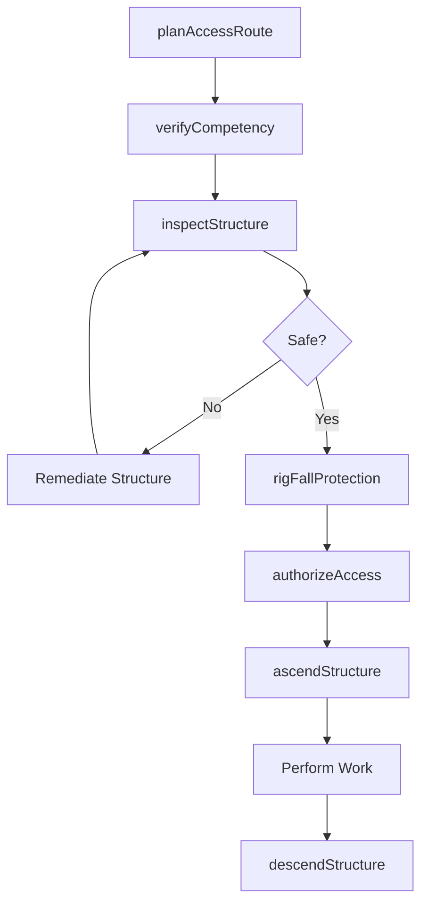
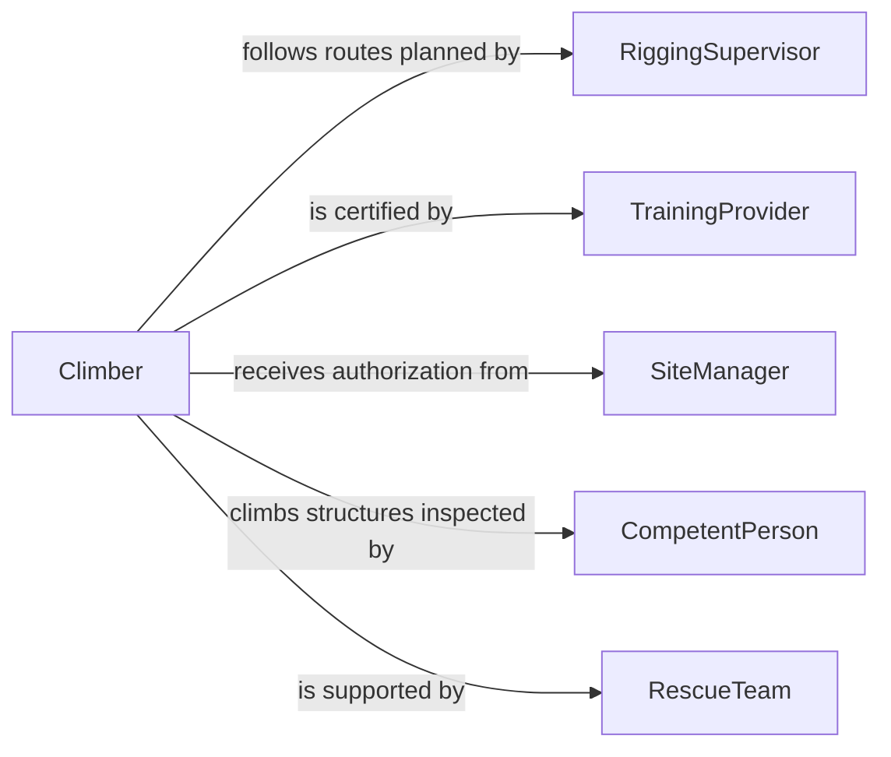

# Climb Equipment Structures Access Work

> Business-as-Code definition for climbing scaffolding, towers, structural steel, and heavy equipment to access elevated or confined work areas. Models the access planning, safety authorization, and ascent-descent lifecycle for structural climbing in construction and industrial settings.

## Overview

Climbing equipment or structures to access work areas encompasses ascending scaffolding, communication towers, wind turbines, structural steel, cranes, and industrial machinery to reach locations where maintenance, installation, or inspection must be performed. This definition standardizes the access route planning, fall protection rigging, competency verification, and real-time monitoring required for workers who must physically climb fixed structures or large equipment to reach their workstations.

## Actors

| Actor | Description |
|-------|-------------|
| StructureOwner | Owns or operates the tower, building, or equipment being accessed |
| SafetyRegulator | Enforces fall protection, confined space, and structural access regulations |
| ScaffoldingContractor | Erects and certifies scaffolding and temporary access structures |
| RescueTeam | Stands by to perform emergency retrieval from elevated positions |
| TrainingProvider | Certifies workers in tower climbing, fall arrest, and rescue procedures |

## Roles

| Role | Description |
|------|-------------|
| Climber | Ascends structures to perform assigned work at elevated positions |
| RiggingSupervisor | Plans access routes and installs fall protection anchor points |
| CompetentPerson | Inspects scaffolding and structures for safe climbing conditions |
| SiteManager | Authorizes access and coordinates crews at the work location |

## Entities

| Entity | Description |
|--------|-------------|
| Structure | A tower, scaffold, building frame, or equipment requiring climbing access |
| AccessRoute | A documented path from ground level to the work area |
| FallArrestSystem | Anchors, lifelines, harnesses, and connectors for fall prevention |
| ClimbingCertification | Documentation of a worker's training and competency for structural climbing |
| AccessPermit | Authorization to climb a specific structure during a defined period |
| RescuePlan | Documented procedures for retrieving a worker in distress |
| InspectionTag | A dated tag certifying a scaffold or structure is safe for climbing |

## Actions

| Action | Description |
|--------|-------------|
| planAccessRoute | Determine the safest path from ground to the elevated work area |
| verifyCompetency | Confirm the climber holds valid certifications for the structure type |
| inspectStructure | Evaluate structural integrity and condition of climbing surfaces |
| rigFallProtection | Install anchors, lifelines, and tie-off points along the access route |
| authorizeAccess | Issue the access permit after all safety requirements are met |
| ascendStructure | Climb the planned route to reach the work area |
| descendStructure | Return to ground level following the approved descent procedure |

## Events

| Event | Description |
|-------|-------------|
| accessRoutePlanned | The climbing path and fall protection points have been mapped |
| competencyVerified | Worker certifications have been confirmed as current and valid |
| structureInspected | Structural condition has been assessed and certified safe |
| fallProtectionRigged | All anchors and lifelines are installed and tested |
| accessAuthorized | The access permit has been issued for the climbing operation |
| ascentCompleted | The worker has reached the elevated work area safely |
| descentCompleted | The worker has returned to ground level without incident |

## Searches

| Search | Description |
|--------|-------------|
| findAccessRoutes | Look up documented climbing routes for a specific structure |
| getCertifications | Retrieve climbing certifications for a worker or crew |
| getInspectionStatus | Check the current inspection tag and structural condition |
| getActivePermits | List all active access permits for a structure or site |

## Workflow



## Actor Relationships



## Usage

### Calling Actions

```typescript
import { climbEquipmentStructuresAccessWork } from '@headlessly/climb-equipment-structures-access-work'

const access = climbEquipmentStructuresAccessWork()

// Plan access route for a communication tower
const route = await access.planAccessRoute({
  structureId: 'TOWER-MW-0091',
  structureType: 'communication-tower',
  targetHeight: { value: 180, unit: 'feet' },
  workArea: 'antenna-platform'
})

// Verify worker certifications
await access.verifyCompetency({
  workerId: 'W-2044',
  requiredCerts: ['tower-climbing', 'fall-arrest', 'rescue-at-height']
})

// Inspect and authorize
await access.inspectStructure({
  structureId: 'TOWER-MW-0091',
  checkpoints: ['base-bolts', 'climbing-pegs', 'safety-cable', 'platform-grating']
})

const permit = await access.authorizeAccess({
  structureId: 'TOWER-MW-0091',
  workerId: 'W-2044',
  routeId: route.id,
  duration: { hours: 6 }
})
```

### Event-Driven Automation

```typescript
// Notify rescue team when a climber begins ascent
access.ascentCompleted(async ({ workerId, structureId, permitId }) => {
  await rescueTeam.standby({
    structureId,
    workerId,
    permitId,
    status: 'worker-at-height'
  })
})

// Block access when certifications expire
access.competencyVerified(async ({ workerId, expired }) => {
  if (expired.length > 0) {
    await notify({
      to: 'site-manager',
      message: `Worker ${workerId} has expired certs: ${expired.join(', ')} - access denied`
    })
  }
})
```
