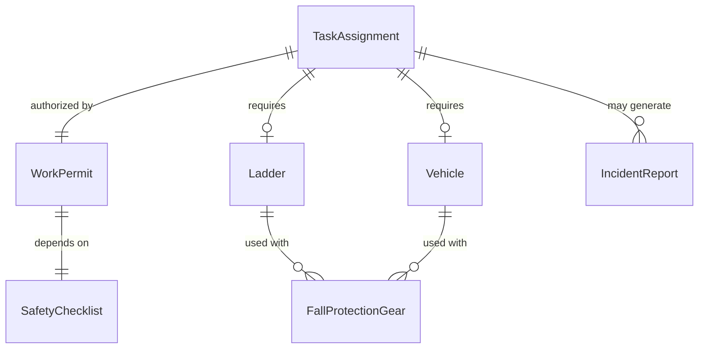
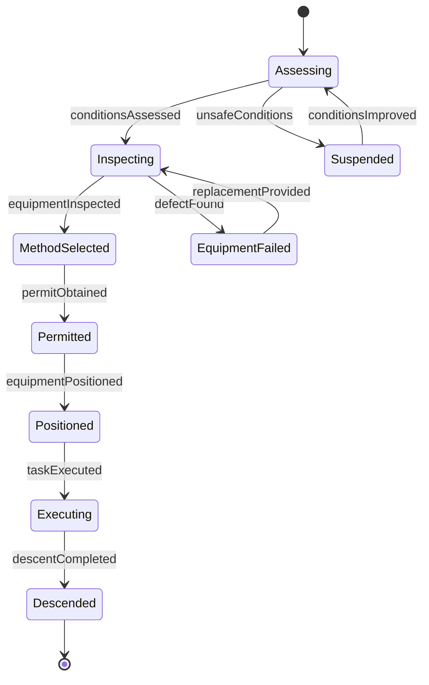
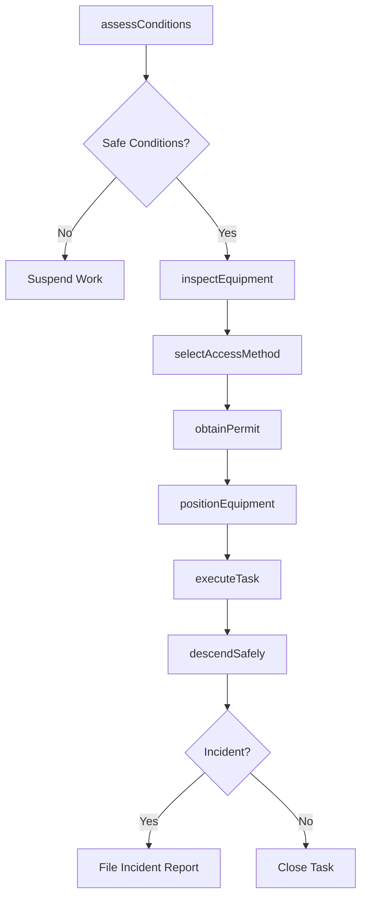
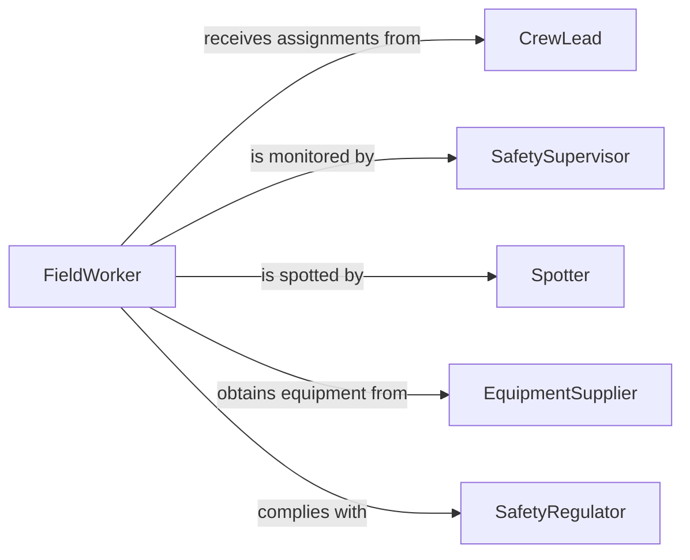

# Climb Ladders Vehicles Perform Duties

> Business-as-Code definition for climbing ladders, vehicles, and elevated platforms to perform maintenance, inspection, delivery, and service duties. Models the safety assessment, access planning, and task execution lifecycle for elevated work from mobile access points.

## Overview

Climbing ladders or vehicles to perform duties includes ascending extension ladders for building maintenance, climbing onto truck beds for cargo handling, using step ladders for inventory access, and mounting vehicle-mounted platforms for utility work. This definition standardizes the safety pre-check, equipment selection, ascent authorization, task execution, and descent verification process required when workers access elevated positions using portable or vehicle-based equipment.

## Actors

| Actor | Description |
|-------|-------------|
| FacilityOwner | Requests maintenance or service work requiring elevated access |
| SafetyRegulator | Enforces OSHA fall protection and ladder safety standards |
| EquipmentSupplier | Provides ladders, harnesses, and vehicle-mounted platforms |
| FleetManager | Maintains vehicles used as elevated work platforms |
| InsuranceProvider | Underwrites liability coverage for elevated work activities |

## Roles

| Role | Description |
|------|-------------|
| FieldWorker | Climbs ladders or vehicles to perform assigned duties |
| SafetySupervisor | Conducts pre-task safety briefings and monitors compliance |
| Spotter | Maintains visual contact and stabilizes ladders during ascent |
| CrewLead | Plans task sequence and assigns elevated work to qualified personnel |

## Entities

| Entity | Description |
|--------|-------------|
| Ladder | A portable climbing device rated for specific weight and height |
| Vehicle | A truck, van, or utility vehicle used as an elevated access point |
| FallProtectionGear | Harnesses, lanyards, and anchor points for fall arrest |
| WorkPermit | Authorization document for elevated or hazardous work |
| SafetyChecklist | Pre-climb inspection form for equipment and conditions |
| TaskAssignment | A specific duty to be performed at the elevated position |
| IncidentReport | Documentation of any fall, near-miss, or equipment failure |

## Actions

| Action | Description |
|--------|-------------|
| assessConditions | Evaluate weather, surface, and environmental factors for safe climbing |
| inspectEquipment | Check ladder integrity, vehicle stability, and fall protection gear |
| selectAccessMethod | Choose the appropriate ladder type or vehicle position for the task |
| obtainPermit | Secure work authorization for elevated duties |
| positionEquipment | Set up ladder or park vehicle at the correct location and angle |
| executeTask | Perform the assigned duty at the elevated position |
| descendSafely | Complete the task and return to ground level following safety protocol |

## Events

| Event | Description |
|-------|-------------|
| conditionsAssessed | Environmental conditions have been evaluated for safe climbing |
| equipmentInspected | Ladder, vehicle, and fall protection gear have passed inspection |
| accessMethodSelected | The climbing approach and equipment have been determined |
| permitObtained | Work authorization has been secured for the elevated task |
| equipmentPositioned | Ladder or vehicle is set up and stabilized at the work location |
| taskExecuted | The assigned duty has been completed at the elevated position |
| descentCompleted | Worker has safely returned to ground level |

## Searches

| Search | Description |
|--------|-------------|
| findPermits | Look up active work permits by site, date, or worker |
| getEquipmentStatus | Check inspection status and availability of ladders and gear |
| getIncidentHistory | Retrieve past safety incidents for a site or equipment type |
| getTaskAssignments | List elevated work tasks assigned to a crew or worker |

## Entity Relationships



## State Diagram



## Workflow



## Actor Relationships



## Usage

### Calling Actions

```typescript
import { climbLaddersVehiclesPerformDuties } from '@headlessly/climb-ladders-vehicles-perform-duties'

const climbing = climbLaddersVehiclesPerformDuties()

// Assess conditions for gutter cleaning at a two-story building
const conditions = await climbing.assessConditions({
  siteId: 'SITE-2026-0044',
  taskType: 'gutter-cleaning',
  height: { value: 24, unit: 'feet' },
  weather: { wind: 8, precipitation: false }
})

// Inspect equipment and obtain permit
await climbing.inspectEquipment({
  equipmentId: 'EXT-LADDER-28FT',
  checklistItems: ['rung-integrity', 'feet-pads', 'locks', 'weight-rating']
})

const permit = await climbing.obtainPermit({
  siteId: 'SITE-2026-0044',
  workerId: 'W-1042',
  taskDescription: 'Clean gutters at 24ft height',
  duration: { hours: 3 }
})

// Execute the elevated task
await climbing.executeTask({
  permitId: permit.id,
  taskAssignmentId: 'TA-2026-0331'
})
```

### Event-Driven Automation

```typescript
// Alert safety supervisor when high-wind conditions are detected
climbing.conditionsAssessed(async ({ siteId, weather }) => {
  if (weather.wind > 20) {
    await notify({
      to: 'safety-supervisor',
      message: `High winds (${weather.wind} mph) at ${siteId} - elevated work suspended`
    })
  }
})

// Auto-schedule equipment re-inspection after use
climbing.descentCompleted(async ({ equipmentId, taskId }) => {
  await maintenanceSchedule.create({
    equipmentId,
    inspectionType: 'post-use',
    triggeredBy: taskId
  })
})
```
